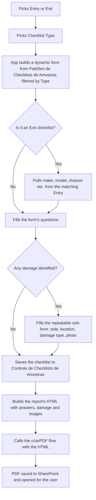
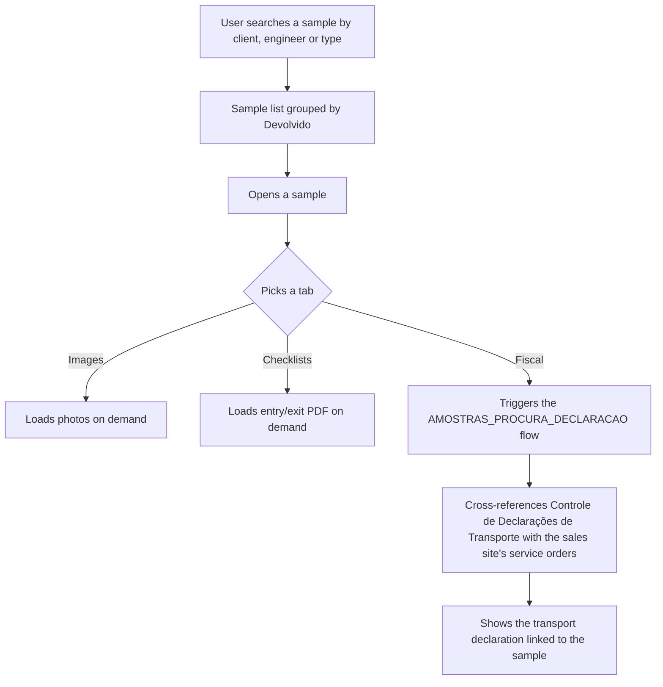
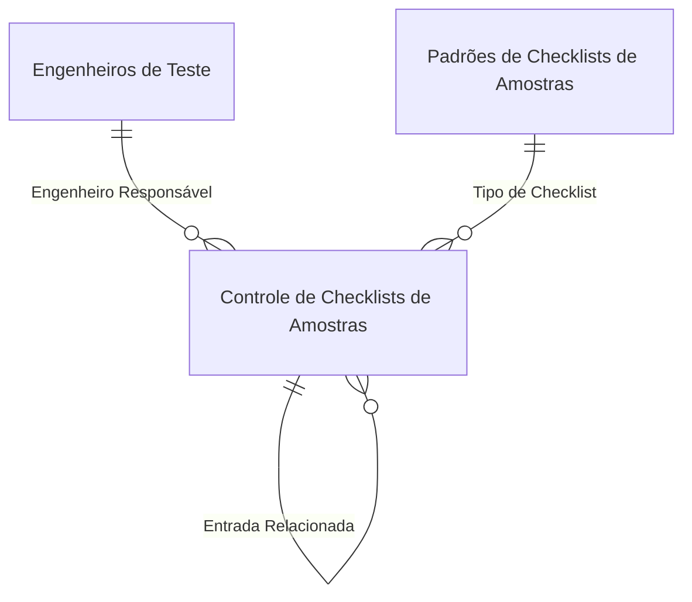

<!-- English version of pt.md. SharePoint list/column names kept in Portuguese
     (real identifiers); prose translated. Keep the two files in sync. -->

At CTR, every sample received from a client — a body, chassis, whole vehicle (bus, truck, tractor, car) or just a part — needs an entry checklist and an exit checklist. Both apps share the same data list (`Controle de Checklists de Amostras`): **Checklists** is the app logistics uses to fill it in; **Amostras** is the panel engineering and sales use to look it up.

## Checklists

Dynamic entry/exit checklist for a sample, with PDF generation of the filled-in checklist.

- Opening an **Exit** checklist already pulls the matching Entry's data (make, model, chassis) so nothing gets retyped.
- Questions aren't fixed: they come from a **Padrões de Checklists de Amostras** table, filtered by the chosen `Tipo de Checklist`. Each question carries its own type (boolean, text, number, slider) and whether it's required — adding a new checklist type doesn't require touching the app.
- **Damage** is a repeatable sub-form (side, location, damage type, photo), serialized as JSON into the `Inspeção de Danos` column.
- A sample can be flagged `Sigilo` (confidential): only Management/Coordination, the responsible Engineer and the Logistics Operator see its details and images.
- On completion, the app builds the report's HTML and calls the `criarPDF` flow, which generates the official PDF in SharePoint.



**Metadata-driven form.** Picking a `Tipo de Checklist` filters `Padrões de Checklists de Amostras` for the applicable questions and stores each one in a local collection, which the screen renders as one UI row per question type.

```powerfx
ClearCollect(
    CLResponse,
    ForAll(
        Filter('Padrões de Checklists de Amostras', Gallery6.Selected.Título in 'Checklist Aplicável'.Value),
        {
            ID: ID, Title: Title, Subtitle: Descrição,
            DefaultValues: 'Opções da Escolha', Type: 'Tipo de Pergunta'.Value,
            Required: Obrigatório, TextValue: "", NumberValue: Blank()
        }
    )
)
```

**Sample identifier.** For an Exit checklist, it reuses the identifier from the related Entry; for a new Entry, it builds the checklist type's initials plus the next available sequential number for that type.

```powerfx
If(FormChecklists.Mode = FormMode.Edit, Parent.Default,
If(And(DataCardValue2.Selected.Value <> Blank(), Gallery1.Selected.Value = "Saída"),
    LookUp(tableChecklists, ID = DataCardValue2.Selected.Id).'Identificador da Amostra',
    With(
        {
            tipoAmostra: Gallery6.Selected.Sigla,
            lastNumber: If(IsEmpty(Filter(tableChecklists, 'Tipo de Checklist'.Value = DataCardValue9.Selected.Value)), 0,
                Max(Filter(tableChecklists, 'Tipo de Checklist'.Value = DataCardValue9.Selected.Value), Value(Mid('Identificador da Amostra', Len('Identificador da Amostra') - 1, 2))))
        },
        $"{tipoAmostra}-{Text(lastNumber + 1, "00000")}"
    )
))
```

## Amostras

Consolidated lookup panel: gathers a sample's images, entry/exit checklists and fiscal/logistics paperwork in one place.

- The home screen lists samples (grouping entry and exit through the calculated `Devolvido` field), searchable by client, responsible engineer and type.
- Inside a sample, three tabs load **on demand** (only when clicked, to avoid processing everything at once): **Images**, **Checklists** (entry/exit PDF), and **Fiscal** (invoice and transport declaration).
- Fiscal data comes from two lists on different sites — `Controle de Declarações de Transporte` and the sales site's service-order list — cross-referenced by a flow (`AMOSTRAS_PROCURA_DECLARACAO`), since the data doesn't live in a single list.
- Downloading an image also goes through a flow (`AMOSTRAS_DOWNLOAD_IMAGE`), which resolves the attachment's real name before building the direct SharePoint download URL.



**Each tab only builds its collection the first time it's clicked**, controlled by an `Acessed` field on a local collection — to avoid generating base64 images or running flows unnecessarily.

```powerfx
Switch(
    Self.Selected.Label,
    "Imagens",
        If(Self.Selected.Acessed = false, Select(GENERATE_IMAGES));
        Patch(tabs, Self.Selected, {Acessed: true}),
    "Checklists",
        If(Self.Selected.Acessed = false, Select(GENERATE_CHECKLISTS));
        Patch(tabs, Self.Selected, {Acessed: true}),
    "Fiscal",
        If(Self.Selected.Acessed = false, Select(GENERATE_FISCAL));
        Patch(tabs, Self.Selected, {Acessed: true})
)
```

## Shared data model



| List                                                       | Role                                                                        |
| ------------------------------------------------------------ | --------------------------------------------------------------------------- |
| `Controle de Checklists de Amostras`                       | Central list: each row is an Entry or Exit checklist for a sample           |
| `Padrões de Checklists de Amostras`                        | Metadata for the dynamic form's questions, filtered by `Tipo de Checklist`  |
| `Tipos de Checklists`                                       | Registry of possible sample types, icon and identifier initials             |
| `Controle de Declarações de Transporte [FO-110 Rev.01]`    | Invoices and transport declarations for the sample                          |
| `Banco de Dados Comercial`                                  | Service orders, matched to the sample for commercial context                |

**`Controle de Checklists de Amostras`** (main fields)

| Column                            | Type    | Description                                                            |
| ------------------------------------ | ------- | ---------------------------------------------------------------------- |
| `Identificador da Amostra`        | Text    | Unique code: type initials + sequential number                        |
| `Operação` / `Status`             | Choice  | Entry, Exit, Entry and Exit or Internal Transfer; current step         |
| `Entrada Relacionada`             | Lookup  | Links the Exit checklist to its matching Entry                          |
| `Sigilo`                          | Boolean | Restricts visibility to Management, the Engineer and Logistics Operator |
| `Respostas`                       | Text    | JSON with the dynamic form's answers                                    |
| `Inspeção de Danos`               | Text    | JSON with the list of damage (side, location, damage type, photo)       |
| `Engenheiro Responsável`          | Lookup  | Engineer assigned to follow the sample                                  |

## Architecture decisions

- **One doc, two entry points.** `Checklists` and `Amostras` are effectively the same base seen by two audiences: logistics fills it in, engineering and sales look it up.
- **Metadata-driven form.** Questions come from a table (`Padrões de Checklists de Amostras`), not a fixed screen per sample type — adding a new type doesn't require touching the app. In exchange, damage ends up as JSON in a text column, simpler to implement but without native SharePoint filtering.
- **On-demand loading per tab.** Images, checklists and fiscal data only process when the user clicks the tab, a performance decision so nothing (including base64 images) gets generated the moment a sample opens.
- **A flow to cross-reference lists across sites.** The invoice/declaration lookup goes through `AMOSTRAS_PROCURA_DECLARACAO` because the data lives in two SharePoint lists on different sites, and Power Apps can't do that cross-reference client-side performantly.
