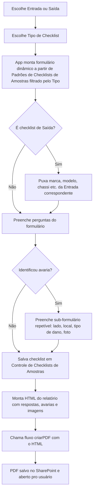
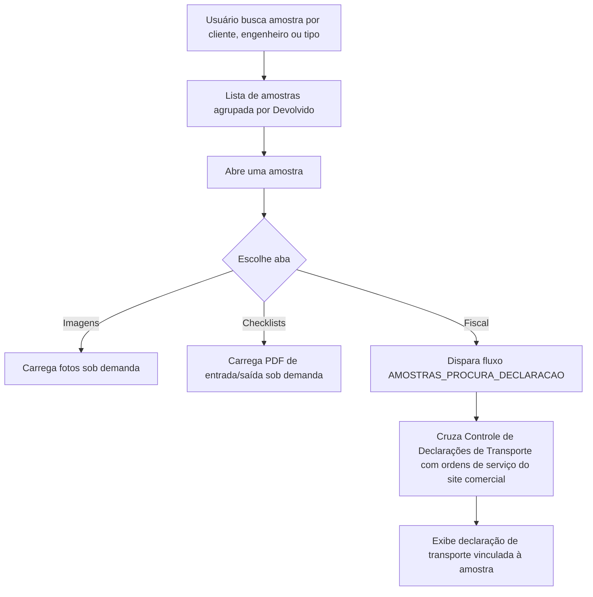
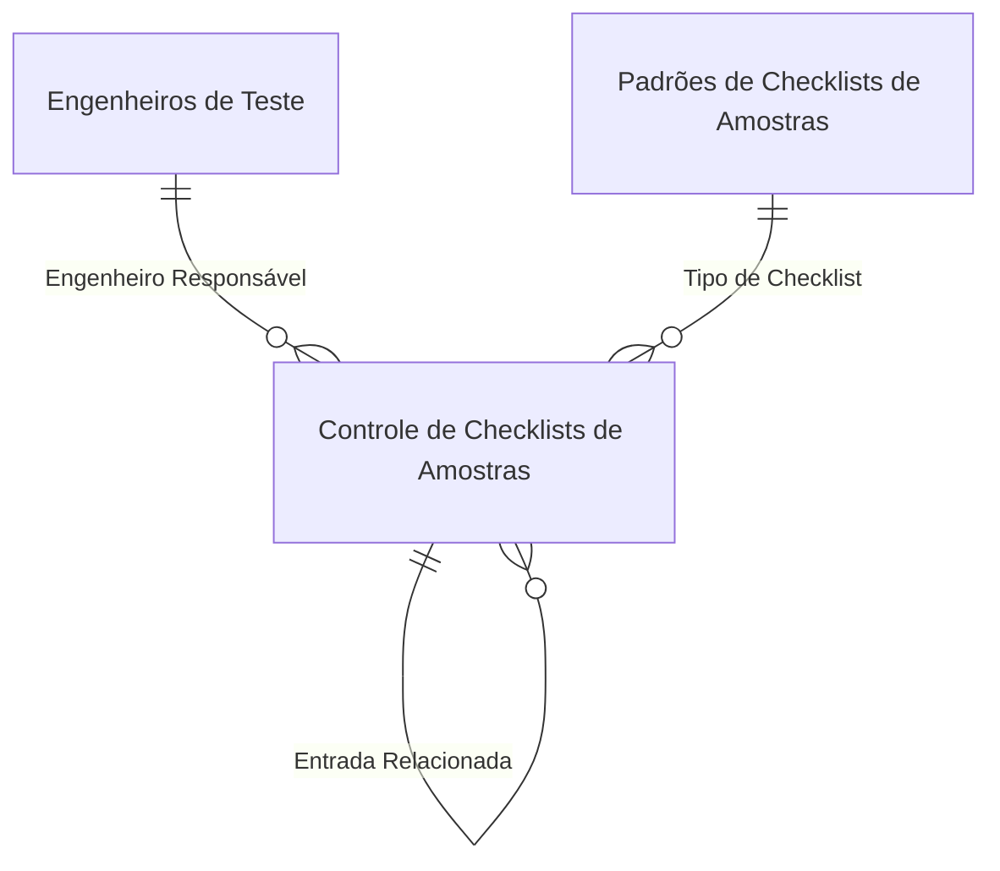

<!-- Post de portfólio (flagship), 2 apps num doc só (mesma base de dados,
     públicos diferentes). Molde do bello-ecosystems pra estrutura de
     seções por app. Fonte: .todo/ctr/entregas/{amostras,checklists}-relatorio-final.md.
     Sem imagens ainda (sem acesso ao ambiente real do CTR). -->

No CTR, toda amostra recebida de um cliente — carroceria, chassi, veículo inteiro (ônibus, caminhão, trator, carro) ou só uma peça — precisa de um checklist de entrada e um de saída. Os dois apps compartilham a mesma lista de dados (`Controle de Checklists de Amostras`): **Checklists** é o app que a logística usa pra preencher; **Amostras** é o painel que engenharia e comercial usam pra consultar.

## Checklists

Formulário dinâmico de entrada/saída de amostra, com geração de PDF do checklist preenchido.

- Ao abrir o checklist de **Saída**, o app já puxa os dados da Entrada correspondente (marca, modelo, chassi) pra não redigitar.
- As perguntas não são fixas: vêm de uma tabela de **Padrões de Checklists de Amostras**, filtrada pelo `Tipo de Checklist` escolhido. Cada pergunta carrega seu próprio tipo (booleano, texto, número, slider) e obrigatoriedade — adicionar um tipo de checklist novo não exige alterar o app.
- **Avarias** são um sub-formulário repetível (lado, local, tipo de dano, foto), serializado como JSON na coluna `Inspeção de Danos`.
- Uma amostra pode ser marcada `Sigilo`: nesse caso, só Gestão/Coordenação, o Engenheiro Responsável e o Operador Logístico enxergam os detalhes e as imagens.
- Ao concluir, o app monta o HTML do relatório e chama o fluxo `criarPDF`, que gera o PDF oficial no SharePoint.



**Formulário dirigido por metadado.** Ao escolher o `Tipo de Checklist`, filtra `Padrões de Checklists de Amostras` pelas perguntas aplicáveis e guarda cada uma numa coleção local, que a tela renderiza uma linha de UI por tipo de pergunta.

```powerfx
ClearCollect(
    CLResponse,
    ForAll(
        Filter('Padrões de Checklists de Amostras', Gallery6.Selected.Título in 'Checklist Aplicável'.Value),
        {
            ID: ID, Title: Title, Subtitle: Descrição,
            DefaultValues: 'Opções da Escolha', Type: 'Tipo de Pergunta'.Value,
            Required: Obrigatório, TextValue: "", NumberValue: Blank()
        }
    )
)
```

**Identificador da amostra.** Se for checklist de Saída, reaproveita o identificador da Entrada relacionada; se for Entrada nova, monta a sigla do tipo de checklist mais o próximo número sequencial disponível pra aquele tipo.

```powerfx
If(FormChecklists.Mode = FormMode.Edit, Parent.Default,
If(And(DataCardValue2.Selected.Value <> Blank(), Gallery1.Selected.Value = "Saída"),
    LookUp(tableChecklists, ID = DataCardValue2.Selected.Id).'Identificador da Amostra',
    With(
        {
            tipoAmostra: Gallery6.Selected.Sigla,
            lastNumber: If(IsEmpty(Filter(tableChecklists, 'Tipo de Checklist'.Value = DataCardValue9.Selected.Value)), 0,
                Max(Filter(tableChecklists, 'Tipo de Checklist'.Value = DataCardValue9.Selected.Value), Value(Mid('Identificador da Amostra', Len('Identificador da Amostra') - 1, 2))))
        },
        $"{tipoAmostra}-{Text(lastNumber + 1, "00000")}"
    )
))
```

## Amostras

Painel de consulta consolidada: reúne, por amostra, imagens, checklists de entrada/saída e documentação fiscal/logística.

- A tela inicial lista as amostras (agrupando entrada e saída pelo campo calculado `Devolvido`), com busca por cliente, engenheiro responsável e tipo.
- Dentro de uma amostra, três abas carregam **sob demanda** (só ao clicar, pra não processar tudo de uma vez): **Imagens**, **Checklists** (PDF de entrada/saída) e **Fiscal** (nota fiscal e declaração de transporte).
- O dado fiscal vem de duas listas de sites diferentes — `Controle de Declarações de Transporte` e a lista de ordens de serviço do site comercial — cruzadas por um fluxo (`AMOSTRAS_PROCURA_DECLARACAO`), porque o dado não está numa lista só.
- O download de uma imagem também passa por fluxo (`AMOSTRAS_DOWNLOAD_IMAGE`), que resolve o nome real do anexo antes de montar a URL de download direto no SharePoint.



**Cada aba só monta sua coleção na primeira vez que é clicada**, controlado pelo campo `Acessed` de uma coleção local — pra não gerar imagens em base64 nem rodar fluxos sem necessidade.

```powerfx
Switch(
    Self.Selected.Label,
    "Imagens",
        If(Self.Selected.Acessed = false, Select(GENERATE_IMAGES));
        Patch(tabs, Self.Selected, {Acessed: true}),
    "Checklists",
        If(Self.Selected.Acessed = false, Select(GENERATE_CHECKLISTS));
        Patch(tabs, Self.Selected, {Acessed: true}),
    "Fiscal",
        If(Self.Selected.Acessed = false, Select(GENERATE_FISCAL));
        Patch(tabs, Self.Selected, {Acessed: true})
)
```

## Modelo de dados compartilhado



| Lista                                                    | Papel                                                                        |
| ---------------------------------------------------------- | -------------------------------------------------------------------------------- |
| `Controle de Checklists de Amostras`                     | Lista central: cada linha é um checklist de Entrada ou Saída de uma amostra     |
| `Padrões de Checklists de Amostras`                      | Metadado das perguntas do formulário dinâmico, filtrado por `Tipo de Checklist` |
| `Tipos de Checklists`                                     | Cadastro dos tipos de amostra possíveis, ícone e sigla do identificador          |
| `Controle de Declarações de Transporte [FO-110 Rev.01]`  | Notas fiscais e declarações de transporte da amostra                            |
| `Banco de Dados Comercial`                                | Ordens de serviço, casadas com a amostra pra dar contexto comercial              |

**`Controle de Checklists de Amostras`** (campos principais)

| Coluna                          | Tipo    | Descrição                                                          |
| --------------------------------- | ------- | ---------------------------------------------------------------------- |
| `Identificador da Amostra`      | Text    | Código único: sigla do tipo + sequencial                              |
| `Operação` / `Status`           | Choice  | Entrada, Saída, Entrada e Saída ou Transferência Interna; etapa atual |
| `Entrada Relacionada`           | Lookup  | Liga o checklist de Saída à Entrada correspondente                     |
| `Sigilo`                        | Boolean | Restringe visualização a Gestão, Eng. Responsável e Operador Logístico |
| `Respostas`                     | Text    | JSON com as respostas do formulário dinâmico                          |
| `Inspeção de Danos`             | Text    | JSON com a lista de avarias (lado, local, tipo de dano, foto)          |
| `Engenheiro Responsável`        | Lookup  | Engenheiro designado para acompanhar a amostra                         |

## Decisões de arquitetura

- **Um doc, duas telas de entrada.** `Checklists` e `Amostras` são efetivamente a mesma base vista por dois públicos: logística preenche, engenharia e comercial consultam.
- **Formulário dirigido por metadado.** Perguntas vêm de uma tabela (`Padrões de Checklists de Amostras`), não de uma tela fixa por tipo de amostra — adicionar um tipo novo não exige alterar o app. Em troca, avarias ficam como JSON numa coluna de texto, mais simples de implementar mas sem filtro nativo do SharePoint.
- **Carregamento sob demanda por aba.** Imagens, checklists e fiscal só processam quando o usuário clica na aba, decisão de performance pra não gerar tudo (inclusive imagens em base64) assim que a amostra abre.
- **Fluxo pra cruzar listas de sites diferentes.** A busca de nota fiscal/declaração passa por `AMOSTRAS_PROCURA_DECLARACAO` porque o dado mora em duas listas SharePoint de sites diferentes, e Power Apps não faz esse cruzamento client-side de forma performática.
