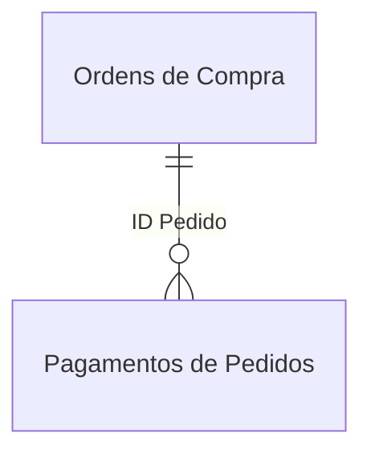
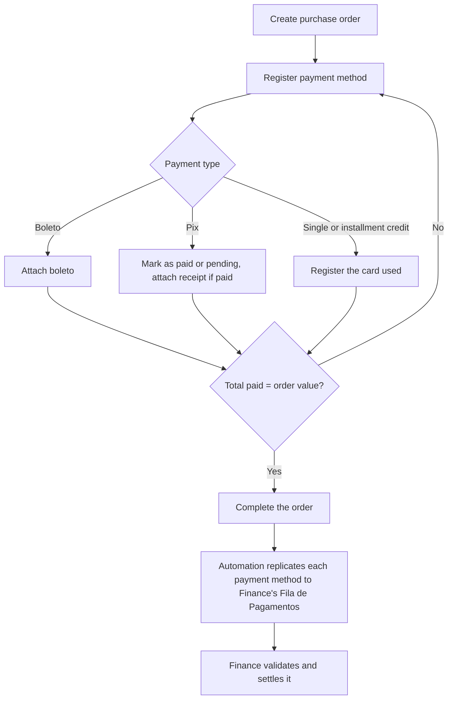

# Purchasing

Internal app for Bello Aramados' Purchasing sector: **supplier registration**, **purchase order creation and tracking**, and **payment method control** through confirmation with the finance sector.

## Context

Before this app, Bello Aramados' Purchasing sector **had no structured control**. Every purchase was registered manually, with no dedicated system, and the process had been assembled from tools borrowed from other companies in different industries than Bello's. There was no simple, direct way to track orders in progress and the status of each payment.

## Solution

The app covers the full cycle of a purchase within the sector: **supplier registration**, **order creation and editing**, and **payment control**.

Each order can have several payment methods attached to it (for example, half by boleto and half by card). Behavior changes depending on the method chosen: **boleto** requires attaching the file for finance to process, **pix** can be marked as paid (with a receipt attached) or pending, and **card** payments require the card used. When it's **installment credit**, the analyst enters the number of installments: each installment becomes its own row in the finance sector's `Fila de Pagamentos` (Payment Queue) list (via automation), but within Purchasing the record stays a single row.

An order is only marked as **completed** once the total paid matches the order's total value. Supporting documents (invoices, boletos) stay attached to the corresponding order.

This app does **not** cover the purchase request itself or contact with the supplier: it exists to register purchases that have already been made or are already in progress.

## Demo

The demo video walks through the app's main flow, using a fictional dataset already loaded (identical structure to the real one, fully invented data).

<figure>
  
  <figcaption>Order listing, with filters by year, month, status, unit, due date and payment method.</figcaption>
</figure>

A new order is created by filling in the description, date, supplier, cost center, purchase category and total value.

<figure>
  
  <figcaption>Order creation form, ready to submit.</figcaption>
</figure>

Once created, the order receives a payment method (in the example, installment credit). The system tracks the **percentage paid** until it reaches 100%, and only then can the order be completed.

<figure>
  
  <figcaption>Payment method registered, with 100% of the order's value covered.</figcaption>
</figure>

Supplier registration follows the same logic: a listing with the main data and a creation form.

<figure>
  
  <figcaption>Supplier listing, with tax ID, address, email, phone and materials/services.</figcaption>
</figure>

<figure>
  
  <figcaption>Supplier creation form.</figcaption>
</figure>

Finally, filtering by payment method confirms that the listing correctly reflects the registered data.

<figure>
  
  <figcaption>Order listing filtered by "Installment Credit".</figcaption>
</figure>

## Technical architecture

### Technologies

**Power Apps** (Canvas App) as the frontend, with **SharePoint Online** as the database. Replicating each installment to the finance sector's `Fila de Pagamentos` happens via **Power Automate**.

### Data structure

**`Fornecedores`** (Suppliers)

| Column       | Type | Description                                           |
| ------------ | ---- | ----------------------------------------------------- |
| `Title`      | Text | Internal row identifier, not used as a business field |
| `Fornecedor` | Text | Supplier name                                         |
| `CNPJ`       | Text | Supplier's tax ID (CNPJ)                              |
| `E-mail`     | Text | Contact email                                         |
| `Tel`        | Text | Contact phone                                         |
| `Endereço`   | Text | Supplier's address                                    |

**`Ordens de Compra`** (Purchase Orders)

| Column                | Type     | Description                                                                  |
| --------------------- | -------- | ---------------------------------------------------------------------------- |
| `Title`               | Text     | Internal row identifier, not used as a business field                        |
| `Status`              | Choice   | Order's current stage (Awaiting, In progress, Completed, Cancelled, Deleted) |
| `Data Solicitação`    | DateTime | Date the order was registered                                                |
| `Unidade`             | Choice   | Business unit/branch that made the request                                   |
| `Centro de Custos`    | Text     | Cost center responsible for the purchase                                     |
| `Categoria de Compra` | Text     | Purchase category                                                            |
| `Descrição da Compra` | Text     | Free-text description of what's being purchased                              |
| `Fornecedor`          | Text     | Supplier linked to the order                                                 |
| `Valor Total`         | Number   | Order's total value                                                          |
| `NFs`                 | Text     | Reference to attached invoices                                               |
| `Observações`         | Text     | Free-text notes about the order                                              |
| `Link do Comprovante` | Text     | Link to the payment receipt, when applicable                                 |
| `Banco`               | Text     | Bank used for payment, when applicable                                       |

**`Pagamentos de Pedidos`** (Order Payments)

| Column                | Type      | Description                                                                                    |
| --------------------- | --------- | ---------------------------------------------------------------------------------------------- |
| `Title`               | Text      | Internal row identifier, not used as a business field                                          |
| `Status de Envio`     | Choice    | Status of sending the information to finance                                                   |
| `Situação`            | Choice    | Whether this payment method has already been paid or is pending                                |
| `ID Pedido`           | Text      | Reference to the originating order, in`Ordens de Compra`                                       |
| `Descrição Breve`     | Text      | Description inherited from the originating order                                               |
| `Fornecedor`          | Text      | Supplier inherited from the originating order                                                  |
| `Fornecedor CNPJ`     | Text      | Tax ID inherited from the supplier                                                             |
| `Banco`               | Text      | Bank used, when payment is by card                                                             |
| `Forma de Pagamento`  | Choice    | Boleto, pix, single-payment credit, installment credit, or debit                               |
| `Valor Total Pedido`  | Number    | Total value of the originating order                                                           |
| `Valor Pago`          | Number    | Amount covered by this specific payment method                                                 |
| `Número de Parcelas`  | Number    | Number of installments, when installment credit                                                |
| `Data de Vencimento`  | DateTime  | Due date for this payment method                                                               |
| `Link do Arquivo`     | Hyperlink | Link to the boleto or related attachment                                                       |
| `Arquivado?`          | Boolean   | Indicates whether the originating order was deleted                                            |
| `Link do Comprovante` | Text      | Link to the payment receipt (pix)                                                              |
| `EnviadoFinanceiro`   | Boolean   | Indicates whether the information has already been replicated to finance's`Fila de Pagamentos` |

**`Categorias de Compra`** (Purchase Categories, shared with the Finance sector)

| Column           | Type        | Description                                                                   |
| ---------------- | ----------- | ----------------------------------------------------------------------------- |
| `Title`          | Text        | Purchase category name                                                        |
| `Movimento`      | Choice      | Type of financial movement associated with the category                       |
| `Tipo de Conta`  | Text        | Accounting classification of the category                                     |
| `Natureza`       | Choice      | Nature of the account (expense, revenue, etc.)                                |
| `Setor`          | MultiChoice | Sectors allowed to use this category, filters which ones appear in Purchasing |
| `Palavras-Chave` | Text        | Search terms associated with the category                                     |

**`Centros de Custo`** (Cost Centers, shared with the Finance sector)

| Column      | Type   | Description                                     |
| ----------- | ------ | ----------------------------------------------- |
| `Title`     | Text   | Cost center name                                |
| `Código`    | Text   | Internal cost center code                       |
| `Unidade`   | Choice | Business unit/branch the cost center belongs to |
| `Sigla`     | Text   | Short cost center abbreviation                  |
| `Descrição` | Text   | Detailed cost center description                |

**`Documentos`** (Documents)

| Column  | Type | Description                                                  |
| ------- | ---- | ------------------------------------------------------------ |
| `Title` | Text | Identifier of the attached file (invoice, boleto or receipt) |

### Relationships

The `Pagamentos de Pedidos` list stores the **originating order's ID** in `Ordens de Compra`. It's not a native SharePoint Lookup: the relationship is resolved within the app itself, by comparing `ID Pedido` against the corresponding row's ID.



### Main flow



### Main formulas

The order listing concentrates **all the search and filter logic** into a single formula, combining free-text search with the side panel's filters (year, month, unit, status, due date and payment method):

```powerfx
Sort(
    Filter(
        colPedidosAgregado,
        Status.Value <> "Excluído",
        If(ANO_SELECT.Selected.Value = Blank(), true, ANO_SELECT.Selected.Value = Year(Created)),
        If(UNIDADE_SELECT.Selected.Value = "Todas", true, UNIDADE_SELECT.Selected.Value = Unidade.Value),
        If(STATUS_SELECT.Selected.Value = "Todos", true, STATUS_SELECT.Selected.Value = Status.Value),
        If(SEARCH_BAR.Text = "" || SEARCH_BAR.Text = Blank(), true,
            Upper(SEARCH_BAR.Text) in Upper(Fornecedor)
            || Upper(SEARCH_BAR.Text) in Upper(ID)
            || Upper(SEARCH_BAR.Text) in Upper('Descrição da Compra')
        )
        // remaining filters (month, due date, payment method) follow the same pattern
    ),
    Created,
    SortOrder.Descending
)
```

Creating an order is a simple `SubmitForm`, but the post-processing changes depending on the form's mode: if it's a **new order**, it resets the auxiliary fields and keeps editing the same record; if it's an **edit**, it goes back to the listing:

```powerfx
SubmitForm(OC_FORM);

If(OC_FORM.Mode = FormMode.New,
    Notify("PEDIDO CRIADO COM SUCESSO!", NotificationType.Success);
    Set(currentPedido, Last('Ordens de Compra'));
    Clear(colAnexos);
    EditForm(OC_FORM),

    Notify("PEDIDO EDITADO COM SUCESSO!", NotificationType.Success);
    Navigate(PEDIDOS_PAGE, ScreenTransition.Fade);
)
```

Registering a payment method is the app's **densest** formula: it decides the payment's status (paid or pending) based on the type chosen, inherits data from the originating order (supplier, tax ID, description, value) and, for boleto or pix, also triggers sending the attachment to finance:

```powerfx
Set(currentIDPagamento, Patch('Pagamentos de Pedidos',
    Defaults('Pagamentos de Pedidos'),
    {
        Situação: {Value:
            If(FRMPAG_TIPO.Selected.Value = "Boleto", "Pendente",
                If(FRMPAG_TIPO.Selected.Value = "Pix", FRMPAG_PAGO.Selected.Key, "Pago")
            )
        },
        'Forma de Pagamento': {Value: FRMPAG_TIPO.Selected.Value},
        'Número de Parcelas': If(FRMPAG_TIPO.Selected.Value = "Crédito Parcelado", FRMPAG_PARCELAS.Value, 1),
        'ID Pedido': currentPedido.ID,
        Fornecedor: currentPedido.Fornecedor,
        'Fornecedor CNPJ': LookUp(Fornecedores, Fornecedor = currentPedido.Fornecedor).CNPJ,
        'Valor Pago': currentNewPagmentoValor,
        Banco: If("Crédito" in FRMPAG_TIPO.Selected.Value || FRMPAG_TIPO.Selected.Value = "Débito", FRMPAG_BANCO.Selected.Value, Blank())
    }
));
```

Completing an order marks **all associated payment methods** as sent and updates the order's status in a single action:

```powerfx
ClearCollect(colPagamentosPraAtt, Filter('Pagamentos de Pedidos', 'ID Pedido' = currentPedido.ID));

ForAll(
    colPagamentosPraAtt As Pg,
    Patch('Pagamentos de Pedidos', Pg, {'Status de Envio': {Value: "Concluído"}})
);

Patch('Ordens de Compra', currentPedido, {Status: {Value: "Concluído"}});
```

## Architecture decisions

The `Pagamentos de Pedidos` list keeps **one record per row** (not one per installment), which gives more granularity to track each payment method separately, even when one of them is installment-based.

It's kept centralized in the Purchasing sector's SharePoint site, separate from the Finance sector's `Fila de Pagamentos` list. That separation exists because SharePoint **doesn't support per-column permissions**: unifying the two lists would expose information to Purchasing that should stay restricted to Finance. The two feed each other through an automation (Power Automate, running under a Bello IT service account), without being merged.

In practice, the Purchasing sector only sees `Pagamentos de Pedidos` data and receives specific information from `Fila de Pagamentos` only when Finance sends it over.

> _Demo version with fictional data; structure and logic preserve the original app._
