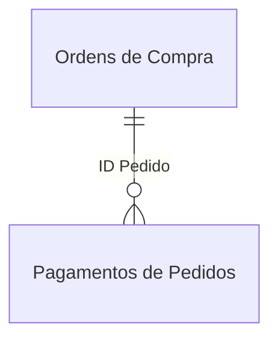
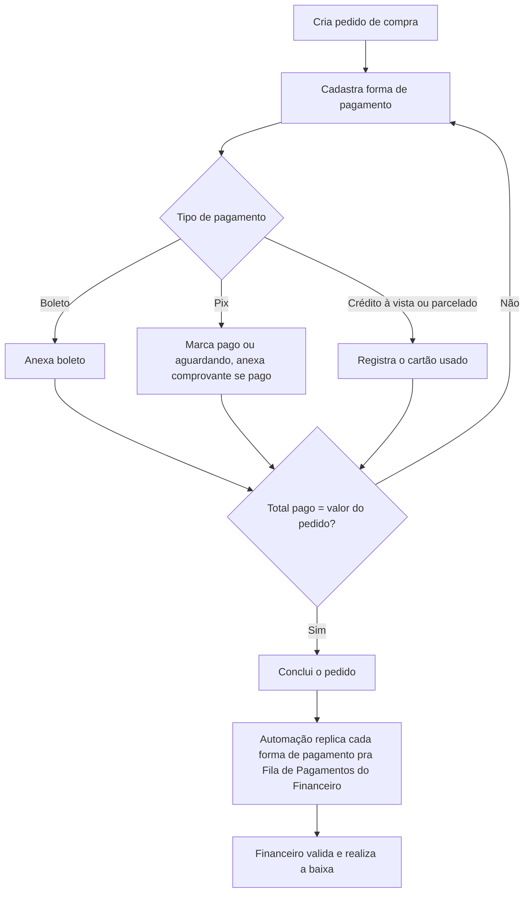

# Compras

App interno da Bello Aramados para o setor de Compras: **cadastro de fornecedores**, **criação e acompanhamento de pedidos de compra**, e **controle das formas de pagamento** até a confirmação com o setor financeiro.

## Contexto

Antes desse app, o setor de Compras da Bello Aramados **não tinha um controle estruturado**. Cada compra era registrada de forma manual, sem sistema próprio, e o processo foi montado com base em ferramentas usadas em outras empresas, de ramos diferentes do da Bello. Faltava um jeito simples e direto de acompanhar pedidos em andamento e o status de cada pagamento.

## Solução

O app cobre o ciclo de uma compra dentro do setor: **cadastro de fornecedores**, **criação e edição de pedidos**, e **controle de pagamentos**.

Cada pedido pode ter várias formas de pagamento associadas (por exemplo, metade em boleto e metade em cartão). O comportamento muda conforme a forma escolhida: **boleto** exige anexar o arquivo pro financeiro processar, **pix** pode ser marcado como pago (com comprovante anexado) ou aguardando, e pagamentos em **cartão** pedem o cartão usado. Quando é **crédito parcelado**, o analista informa o número de parcelas: cada parcela vira uma linha própria na lista `Fila de Pagamentos` do setor financeiro (via automação), mas no setor de Compras o registro continua sendo uma única linha.

O pedido só é marcado como **concluído** quando o total pago bate com o valor total. Documentos auxiliares (notas fiscais, boletos) ficam anexados ao pedido correspondente.

Esse app **não** cobre a requisição da compra em si nem o contato com o fornecedor: ele existe pra registrar compras que já foram feitas ou que já estão em andamento.

## Demonstração

O vídeo de demonstração percorre o fluxo principal do app, já com uma base de dados fictícia carregada (estrutura idêntica à real, dados totalmente inventados).

<figure>
  
  <figcaption>Listagem de pedidos, com filtros por ano, mês, status, unidade, vencimento e forma de pagamento.</figcaption>
</figure>

Um novo pedido é criado preenchendo descrição, data, fornecedor, centro de custo, categoria de compra e valor total.

<figure>
  
  <figcaption>Formulário de criação de pedido, pronto pra registrar.</figcaption>
</figure>

Depois de criado, o pedido recebe uma forma de pagamento (no exemplo, crédito parcelado). O sistema acompanha o **percentual pago** até bater 100%, e só então o pedido pode ser concluído.

<figure>
  
  <figcaption>Forma de pagamento cadastrada, com 100% do valor do pedido coberto.</figcaption>
</figure>

O cadastro de fornecedores segue a mesma lógica: uma listagem com os dados principais e um formulário de criação.

<figure>
  
  <figcaption>Listagem de fornecedores, com CNPJ, endereço, e-mail, telefone e materiais/serviços.</figcaption>
</figure>

<figure>
  
  <figcaption>Formulário de criação de fornecedor.</figcaption>
</figure>

Por fim, o filtro por forma de pagamento confirma que a listagem reflete corretamente os dados cadastrados.

<figure>
  
  <figcaption>Listagem de pedidos filtrada por "Crédito Parcelado".</figcaption>
</figure>

## Arquitetura técnica

### Tecnologias

**Power Apps** (Canvas App) como frontend, com **SharePoint Online** como base de dados. A replicação de cada parcela pra `Fila de Pagamentos` do setor financeiro acontece via **Power Automate**.

### Estrutura de dados

**`Fornecedores`**

| Coluna       | Tipo | Descrição                                                       |
| ------------ | ---- | --------------------------------------------------------------- |
| `Title`      | Text | Identificador interno da linha, não usado como campo de negócio |
| `Fornecedor` | Text | Nome do fornecedor                                              |
| `CNPJ`       | Text | CNPJ do fornecedor                                              |
| `E-mail`     | Text | E-mail de contato                                               |
| `Tel`        | Text | Telefone de contato                                             |
| `Endereço`   | Text | Endereço do fornecedor                                          |

**`Ordens de Compra`**

| Coluna                | Tipo     | Descrição                                                                        |
| --------------------- | -------- | -------------------------------------------------------------------------------- |
| `Title`               | Text     | Identificador interno da linha, não usado como campo de negócio                  |
| `Status`              | Choice   | Etapa atual do pedido (Aguardando, Em andamento, Concluído, Cancelado, Excluído) |
| `Data Solicitação`    | DateTime | Data em que o pedido foi registrado                                              |
| `Unidade`             | Choice   | Unidade/filial que fez a solicitação                                             |
| `Centro de Custos`    | Text     | Centro de custo responsável pela compra                                          |
| `Categoria de Compra` | Text     | Categoria da compra                                                              |
| `Descrição da Compra` | Text     | Descrição livre do que está sendo comprado                                       |
| `Fornecedor`          | Text     | Fornecedor vinculado ao pedido                                                   |
| `Valor Total`         | Number   | Valor total do pedido                                                            |
| `NFs`                 | Text     | Referência às notas fiscais anexadas                                             |
| `Observações`         | Text     | Observações livres sobre o pedido                                                |
| `Link do Comprovante` | Text     | Link pro comprovante de pagamento, quando aplicável                              |
| `Banco`               | Text     | Banco usado no pagamento, quando aplicável                                       |

**`Pagamentos de Pedidos`**

| Coluna                | Tipo      | Descrição                                                                     |
| --------------------- | --------- | ----------------------------------------------------------------------------- |
| `Title`               | Text      | Identificador interno da linha, não usado como campo de negócio               |
| `Status de Envio`     | Choice    | Status do envio da informação pro financeiro                                  |
| `Situação`            | Choice    | Se essa forma de pagamento já foi paga ou está pendente                       |
| `ID Pedido`           | Text      | Referência ao pedido de origem, em`Ordens de Compra`                          |
| `Descrição Breve`     | Text      | Descrição herdada do pedido de origem                                         |
| `Fornecedor`          | Text      | Fornecedor herdado do pedido de origem                                        |
| `Fornecedor CNPJ`     | Text      | CNPJ herdado do fornecedor                                                    |
| `Banco`               | Text      | Banco usado, quando pagamento em cartão                                       |
| `Forma de Pagamento`  | Choice    | Boleto, pix, crédito à vista, crédito parcelado ou débito                     |
| `Valor Total Pedido`  | Number    | Valor total do pedido de origem                                               |
| `Valor Pago`          | Number    | Valor coberto por essa forma de pagamento específica                          |
| `Número de Parcelas`  | Number    | Número de parcelas, quando crédito parcelado                                  |
| `Data de Vencimento`  | DateTime  | Data de vencimento dessa forma de pagamento                                   |
| `Link do Arquivo`     | Hyperlink | Link pro boleto ou anexo relacionado                                          |
| `Arquivado?`          | Boolean   | Indica se o pedido de origem foi excluído                                     |
| `Link do Comprovante` | Text      | Link pro comprovante de pagamento (pix)                                       |
| `EnviadoFinanceiro`   | Boolean   | Indica se a informação já foi replicada pra`Fila de Pagamentos` do financeiro |

**`Categorias de Compra`** (compartilhada com o setor Financeiro)

| Coluna           | Tipo        | Descrição                                                               |
| ---------------- | ----------- | ----------------------------------------------------------------------- |
| `Title`          | Text        | Nome da categoria de compra                                             |
| `Movimento`      | Choice      | Tipo de movimento financeiro associado à categoria                      |
| `Tipo de Conta`  | Text        | Classificação contábil da categoria                                     |
| `Natureza`       | Choice      | Natureza da conta (despesa, receita, etc.)                              |
| `Setor`          | MultiChoice | Setores que podem usar essa categoria, filtra quais aparecem no Compras |
| `Palavras-Chave` | Text        | Termos de busca associados à categoria                                  |

**`Centros de Custo`** (compartilhada com o setor Financeiro)

| Coluna      | Tipo   | Descrição                                        |
| ----------- | ------ | ------------------------------------------------ |
| `Title`     | Text   | Nome do centro de custo                          |
| `Código`    | Text   | Código interno do centro de custo                |
| `Unidade`   | Choice | Unidade/filial à qual o centro de custo pertence |
| `Sigla`     | Text   | Sigla curta do centro de custo                   |
| `Descrição` | Text   | Descrição detalhada do centro de custo           |

**`Documentos`**

| Coluna  | Tipo | Descrição                                                             |
| ------- | ---- | --------------------------------------------------------------------- |
| `Title` | Text | Identificador do arquivo anexado (nota fiscal, boleto ou comprovante) |

### Relacionamentos

A lista `Pagamentos de Pedidos` guarda o **ID do pedido de origem** em `Ordens de Compra`. Não é um Lookup nativo do SharePoint: a relação é resolvida dentro do próprio app, comparando `ID Pedido` com o ID da linha correspondente.



### Fluxo principal



### Fórmulas principais

A listagem de pedidos concentra **toda a lógica de busca e filtro** numa única fórmula, combinando texto livre com os filtros do painel lateral (ano, mês, unidade, status, vencimento e forma de pagamento):

```powerfx
Sort(
    Filter(
        colPedidosAgregado,
        Status.Value <> "Excluído",
        If(ANO_SELECT.Selected.Value = Blank(), true, ANO_SELECT.Selected.Value = Year(Created)),
        If(UNIDADE_SELECT.Selected.Value = "Todas", true, UNIDADE_SELECT.Selected.Value = Unidade.Value),
        If(STATUS_SELECT.Selected.Value = "Todos", true, STATUS_SELECT.Selected.Value = Status.Value),
        If(SEARCH_BAR.Text = "" || SEARCH_BAR.Text = Blank(), true,
            Upper(SEARCH_BAR.Text) in Upper(Fornecedor)
            || Upper(SEARCH_BAR.Text) in Upper(ID)
            || Upper(SEARCH_BAR.Text) in Upper('Descrição da Compra')
        )
        // demais filtros (mês, vencimento, forma de pagamento) seguem o mesmo padrão
    ),
    Created,
    SortOrder.Descending
)
```

Criar um pedido é um `SubmitForm` simples, mas o pós-processamento muda conforme o modo do formulário: se for um **pedido novo**, reseta os campos auxiliares e segue editando o mesmo registro; se for **edição**, volta pra listagem:

```powerfx
SubmitForm(OC_FORM);

If(OC_FORM.Mode = FormMode.New,
    Notify("PEDIDO CRIADO COM SUCESSO!", NotificationType.Success);
    Set(currentPedido, Last('Ordens de Compra'));
    Clear(colAnexos);
    EditForm(OC_FORM),

    Notify("PEDIDO EDITADO COM SUCESSO!", NotificationType.Success);
    Navigate(PEDIDOS_PAGE, ScreenTransition.Fade);
)
```

Cadastrar uma forma de pagamento é a fórmula **mais densa** do app: decide a situação do pagamento (pago ou pendente) conforme o tipo escolhido, herda dados do pedido de origem (fornecedor, CNPJ, descrição, valor) e, pra boleto ou pix, ainda dispara o envio do anexo pro financeiro:

```powerfx
Set(currentIDPagamento, Patch('Pagamentos de Pedidos',
    Defaults('Pagamentos de Pedidos'),
    {
        Situação: {Value:
            If(FRMPAG_TIPO.Selected.Value = "Boleto", "Pendente",
                If(FRMPAG_TIPO.Selected.Value = "Pix", FRMPAG_PAGO.Selected.Key, "Pago")
            )
        },
        'Forma de Pagamento': {Value: FRMPAG_TIPO.Selected.Value},
        'Número de Parcelas': If(FRMPAG_TIPO.Selected.Value = "Crédito Parcelado", FRMPAG_PARCELAS.Value, 1),
        'ID Pedido': currentPedido.ID,
        Fornecedor: currentPedido.Fornecedor,
        'Fornecedor CNPJ': LookUp(Fornecedores, Fornecedor = currentPedido.Fornecedor).CNPJ,
        'Valor Pago': currentNewPagmentoValor,
        Banco: If("Crédito" in FRMPAG_TIPO.Selected.Value || FRMPAG_TIPO.Selected.Value = "Débito", FRMPAG_BANCO.Selected.Value, Blank())
    }
));
```

Concluir um pedido marca **todas as formas de pagamento associadas** como enviadas e atualiza o status do pedido numa única ação:

```powerfx
ClearCollect(colPagamentosPraAtt, Filter('Pagamentos de Pedidos', 'ID Pedido' = currentPedido.ID));

ForAll(
    colPagamentosPraAtt As Pg,
    Patch('Pagamentos de Pedidos', Pg, {'Status de Envio': {Value: "Concluído"}})
);

Patch('Ordens de Compra', currentPedido, {Status: {Value: "Concluído"}});
```

## Decisões de arquitetura

A lista `Pagamentos de Pedidos` guarda **um registro por linha** (não um por parcela), o que dá mais granularidade pra acompanhar cada forma de pagamento separadamente, mesmo quando uma delas é parcelada.

Ela fica centralizada no site de SharePoint do setor de Compras, separada da lista `Fila de Pagamentos` do Financeiro. Essa separação existe porque o SharePoint **não permite restringir permissão por coluna**: unificar as duas listas exporia ao setor de Compras informações que deveriam ficar restritas ao Financeiro. As duas se retroalimentam por uma automação (Power Automate, rodando com um usuário de serviço de TI da Bello), sem ficarem unificadas.

Na prática, o setor de Compras só enxerga os dados de `Pagamentos de Pedidos` e recebe informações pontuais da `Fila de Pagamentos` quando o Financeiro as envia.

> _Versão demo com dados fictícios; estrutura e lógica preservam o app original._
