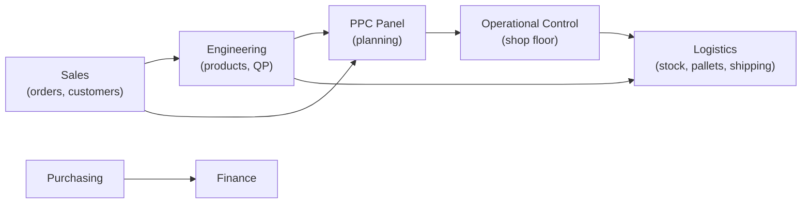
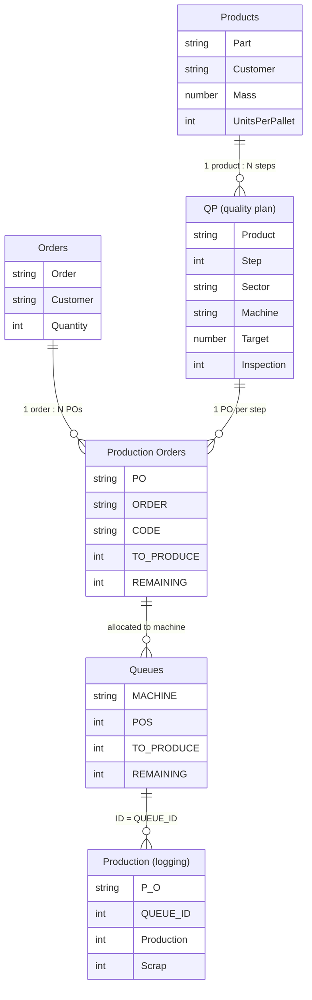

<!-- Portfolio COLLECTION post (zenvv.dev). Covers the 3 Bello `colecao` curated
     apps: pcp, logistica, engenharia. Flagships (compras, financeiro,
     controle-operacional) have their own post. Images in ./images/. -->

# App ecosystem — Bello Aramados

Bello Aramados is a metalworks producing wire, wire mesh, grates and screens,
with two plants. Over the course of the project I built **six Power Apps** that,
together, work as a mini-ERP: sales, engineering, planning, shop floor, logistics
and the financial side (purchasing and payments).

There is no application database. **Everything is a SharePoint list**, no
Dataverse, spread across several sites (one per area). Relationships between
entities are not native Lookups: they are resolved inside each app, by comparing
a code or an ID. That shaped every architecture decision, from caching to the
shape of the keys.

Three of these apps have their own post: [**Purchasing**](/projects/bello-compras),
[**Finance**](/projects/bello-financeiro) and
[**Operational Control**](/projects/operational-app). This text covers the three
supporting ones: the **PPC Panel**, **Logistics** and **Engineering**.

## The shared data architecture

An order's path crosses almost every app:



The production core is a handful of lists that almost every app reads:



**Engineering** registers `Products` and `QP`. **PPC** turns order + QP into
`Production Orders` and builds each machine's `Queue`. **Operational Control**
consumes the queue and records the logging entries. **Logistics** takes what was
produced, packs it into pallets and ships it. Each app owns one step and writes
only to its own part.

---

## PPC Panel

PPC needed to prioritize what to produce, per machine, and see progress without
depending on someone compiling manual logging. Before this, planning lived in an
Excel spreadsheet that never reached the shop floor.

The app does three things: it **registers orders** (mirroring sales), it
**generates the production orders** of each order (one per step of the product's
QP) and it **builds each machine's queue**. The queue is the contract with the
shop-floor app: PPC writes the position (`POS`) and the quantity to produce
(`TO_PRODUCE`), the operator consumes it and returns the remainder.

<figure>
  
  <figcaption>Editing a machine's queue. Each row is a PO step; the arrows reorder the queue.</figcaption>
</figure>

I decided to **materialize the queue order** in a column (`POS`), instead of
recomputing it by priority every time it is opened. The planner drags the rows
and what they save is exactly what the operator sees. Reordering is a position
swap between neighbors:

```powerfx
// move a row up in the queue: swap POS with the one right above
With(
    { neighbor: LookUp(tableFilasMaquina, POS = ThisItem.POS - 1) },
    If(
        !IsBlank(neighbor),
        Patch(tableFilasMaquina, neighbor, { POS: ThisItem.POS });
        Patch(tableFilasMaquina, ThisItem, { POS: ThisItem.POS - 1 })
    )
)
```

This app ended up becoming the **proof of concept** that gave rise to the
[SGE](/projects/erp-bello-aramados), the web system that today brings PPC, sales,
tax and finance together in a Next.js app over the same SharePoint. The
[SGE post](/projects/erp-bello-aramados) tells that part.

---

## Logistics

Logistics controls the **physical flow of the finished product**: from the pallet
that forms at the end of the line to the customer's truck, with batch-level
traceability. Before, material intake, stock and dispatch lived in a spreadsheet,
and there was no way to identify each pallet individually or tie raw material,
production and shipping together.

The app covers four fronts: a **parts catalog** (with the technical drawing
embedded as a PDF), **pallet registration** with its own label, **stock** of
finished product and of packaging supplies, and **assembling the shipment** of
each order.

### The pallet label

Each pallet gets a **tracking code** that ties part, batch, PO and dates. The
label is **built in HTML inside Power Apps itself** (it is not a SharePoint
report or Power BI) and comes out through the browser's print dialog, straight to
the shop-floor label printer, in the fixed 100 mm × 50 mm format.

<figure>
  
  <figcaption>The label: traceability, product code, batch, dates, quantity and a QR code scanned at dispatch.</figcaption>
</figure>

The first print records who printed it and when, and moves the pallet from
"registered" to "available". This gives a simple control of which pallets are
ready to ship.

### Cascading stock

What made me like this app was the **cascade effect** of each movement.
Registering a finished-product pallet does not only add to the product's stock:
it reads the palletization configured on the part and **consumes the packaging
supplies** (pallet, corner protectors, straps), recording each consumption as a
movement. Editing the pallet applies the difference; deleting it reverts
everything.

<figure>
  
  <figcaption>Each supply's balance is computed from the movements, not entered by hand.</figcaption>
</figure>

```powerfx
// on pallet registration: consume straps according to the part's palletization
Patch('Movimentações de Insumos', Defaults('Movimentações de Insumos'),
    {
        Material: strap.Title,
        Quantidade: RoundUp(pallet.Quantidade / partsPerStrap, 0),
        Operação: { Value: "Out" },
        Pallet: pallet.'Código de Rastreio'
    }
)
```

When an auxiliary record is missing (a product with no palletization, an
unregistered supply), the app **does not lock up**: it logs the warning in an
error list on the screen itself and moves on. It is better to let the pallet in
and fix the record later than to block the operator.

---

## Engineering

The smallest Bello app, and deliberately so. Engineering is the **source of truth
for "how to produce"**: the `Products` and `QP` lists (the quality plan, with
each part's process steps) are read by PPC, the shop floor and logistics. But
editing those lists through the SharePoint interface is slow and error-prone.

The app is a lean **lookup and registration** tool: a searchable product list, a
filter by plant and by customer, opening the technical drawing as a PDF, and a
form to edit the product's data.

<figure>
  
  <figcaption>Product list, with search by part, description, customer and batch.</figcaption>
</figure>

Since there is no Lookup between lists, the search and the "has a drawing
attached" filter only work if I build the relationship in memory. I do it once,
when the app opens:

```powerfx
ClearCollect(tableProdutos,
    AddColumns(Produtos,
        Documento, LookUp(Documentos, Peça in 'Nome de arquivo com extensão'),
        Pedidos,   Concat(Filter(Pedidos, Título = Peça), 'Número Pedido', "; ")
    )
)
```

The weight of the model is in the lists, not in the app. It is lightweight
because it only needs to be.

---

## What this set shows

- **SharePoint as a real backend**, no Dataverse: text keys, relationships
  resolved in memory, cache built in `App.OnStart`.
- **Each app owning one step**, writing only to its own part of a shared data
  model.
- **Pragmatic operational decisions:** a materialized queue instead of a
  recomputed one, an HTML label instead of a report, non-blocking warnings
  instead of hard validation.

---

_Apps in production at Bello Aramados. Formulas and list names were simplified for readability._
