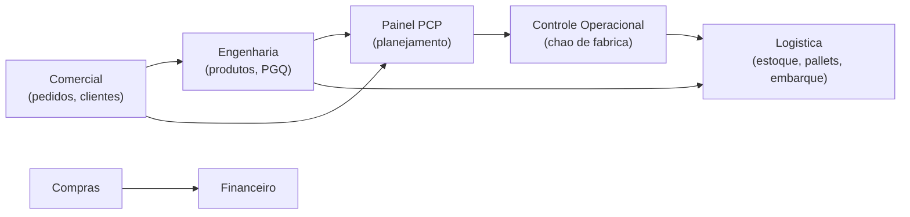
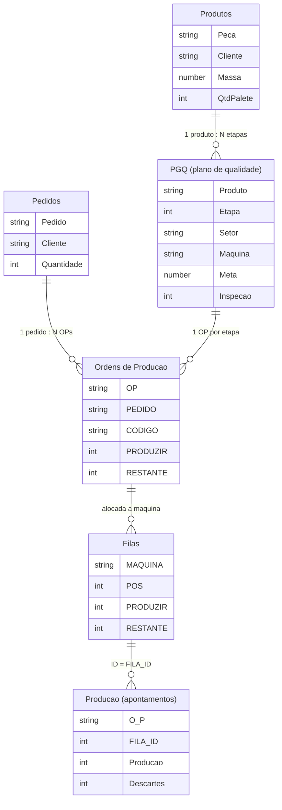

<!-- Post de COLEÇÃO do portfólio (zenvv.dev). Cobre os 3 apps Bello `colecao` da
     curadoria: pcp, logistica, engenharia. Flagships (compras, financeiro,
     controle-operacional) têm post próprio. Imagens em ./imagens/. -->

# Ecossistema de apps — Bello Aramados

A Bello Aramados é uma metalúrgica de arames, aramados, grades e telas, com duas unidades. Ao longo do projeto construí **seis apps Power Apps** que, juntos, funcionam como um mini-ERP: comercial, engenharia, planejamento, chão de fábrica, logística e o lado financeiro (compras e pagamentos).

Não existe banco de dados de aplicação. **Tudo é lista de SharePoint**, sem Dataverse, distribuído em vários sites (um por área). As relações entre entidades não são Lookup nativo: são resolvidas dentro de cada app, comparando código ou ID. Isso moldou todas as decisões de arquitetura, do cache ao formato das chaves.

Três desses apps têm post próprio: [**Compras**](/projects/bello-compras), [**Financeiro**](/projects/bello-financeiro) e [**Controle Operacional**](/projects/operational-app). Este texto cobre os três de apoio: o **Painel PCP**, a **Logística** e a **Engenharia**.

## A arquitetura de dados comum

O caminho de um pedido atravessa quase todos os apps:



O núcleo de produção é um punhado de listas que quase todo app lê:



A **Engenharia** cadastra `Produtos` e `PGQ`. O **PCP** transforma pedido + PGQ em `Ordens de Produção` e monta a `Filas` de cada máquina. O **Controle Operacional** consome a fila e grava os apontamentos. A **Logística** pega o que foi produzido, empacota em pallets e embarca. Cada app é dono de uma etapa e escreve só na sua parte.

---

## Painel PCP

O PCP precisava priorizar o que produzir, por máquina, e enxergar o andamento sem depender de alguém compilar apontamento manual. Antes disso, o planejamento vivia numa planilha de Excel que não chegava ao chão de fábrica.

O app faz três coisas: **cadastra pedidos** (espelhando o comercial), **gera as ordens de produção** de cada pedido (uma por etapa do PGQ do produto) e **monta a fila de cada máquina**. A fila é o contrato com o app de chão de fábrica: o PCP escreve a posição (`POS`) e a quantidade a produzir (`PRODUZIR`), o operador consome e devolve o restante.

<figure>
  
  <figcaption>Edição da fila de uma máquina. Cada linha é uma etapa de OP; as setas reordenam a fila.</figcaption>
</figure>

Decidi **materializar a ordem da fila** numa coluna (`POS`), em vez de recalcular por prioridade a cada abertura. O planejador arrasta as linhas e o que ele salva é exatamente o que o operador vê. A reordenação é uma troca de posição entre vizinhos:

```powerfx
// sobe uma linha na fila: troca o POS com quem está logo acima
With(
    { vizinho: LookUp(tableFilasMaquina, POS = ThisItem.POS - 1) },
    If(
        !IsBlank(vizinho),
        Patch(tableFilasMaquina, vizinho, { POS: ThisItem.POS });
        Patch(tableFilasMaquina, ThisItem, { POS: ThisItem.POS - 1 })
    )
)
```

Esse app acabou virando a **prova de conceito** que deu origem ao [SGE](/projects/erp-bello-aramados), o sistema web que hoje reúne PCP, comercial, fiscal e financeiro num app Next.js sobre o mesmo SharePoint. O [post do SGE](/projects/erp-bello-aramados) conta essa parte.

---

## Logística

A logística controla o **fluxo físico do produto acabado**: do pallet que se forma no fim da linha até o caminhão do cliente, com rastreabilidade por lote. Antes, entrada de material, estoque e expedição viviam em planilha, e não havia como identificar cada pallet individualmente nem amarrar matéria-prima, produção e embarque.

O app cobre quatro frentes: **catálogo de peças** (com o desenho técnico em PDF embutido), **cadastro de pallets** com etiqueta própria, **estoque** de produto acabado e de insumos de embalagem, e **montagem do embarque** de cada pedido.

### A etiqueta do pallet

Cada pallet recebe um **código de rastreio** que amarra peça, lote, OP e datas. A etiqueta é **montada em HTML dentro do próprio Power Apps** (não é relatório do SharePoint nem Power BI) e sai pela janela de impressão do navegador, direto para a etiquetadora do chão de fábrica, no formato fixo de 100 mm × 50 mm.

<figure>
  
  <figcaption>A etiqueta: rastreabilidade, código do produto, lote, datas, quantidade e um QR Code lido na expedição.</figcaption>
</figure>

A primeira impressão grava quem imprimiu e quando, e muda o pallet de "cadastrado" para "disponível". Isso dá um controle simples de quais pallets já estão prontos para embarcar.

### Estoque em cascata

O que me fez gostar desse app foi o **efeito cascata** de cada movimento. Cadastrar um pallet de produto acabado não só soma no estoque do produto: ele lê a paletização configurada na peça e **consome os insumos de embalagem** (palete, cantoneiras, abraçadeiras), gravando cada consumo como movimentação. Editar o pallet aplica a diferença; excluir reverte tudo.

<figure>
  
  <figcaption>O saldo de cada insumo é calculado das movimentações, não lançado à mão.</figcaption>
</figure>

```powerfx
// no cadastro do pallet: consome abraçadeiras conforme a paletização da peça
Patch('Movimentações de Insumos', Defaults('Movimentações de Insumos'),
    {
        Material: abraçadeira.Título,
        Quantidade: RoundUp(pallet.Quantidade / peçasPorAbraçadeira, 0),
        Operação: { Value: "Saída" },
        Pallet: pallet.'Código de Rastreio'
    }
)
```

Quando um cadastro auxiliar falta (produto sem paletização, insumo não cadastrado), o app **não trava**: registra o aviso numa lista de erros na própria tela e segue. É melhor deixar o pallet entrar e corrigir o cadastro depois do que bloquear o operador.

---

## Engenharia

O menor app Bello, e de propósito. A engenharia é a **fonte de verdade do "como produzir"**: as listas `Produtos` e `PGQ` (o plano de qualidade, com as etapas de processo de cada peça) são lidas por PCP, chão de fábrica e logística. Mas mexer nessas listas pela interface do SharePoint é lento e propenso a erro.

O app é uma ferramenta enxuta de **consulta e cadastro**: listagem pesquisável de produtos, filtro por unidade e por cliente, abertura do desenho técnico em PDF, e um formulário para editar os dados do produto.

<figure>
  
  <figcaption>Listagem de produtos, com busca por peça, descrição, cliente e lote.</figcaption>
</figure>

Como não há Lookup entre listas, a busca e o filtro de "tem desenho anexado" só funcionam se eu montar a relação em memória. Faço isso uma vez, na abertura do app:

```powerfx
ClearCollect(tableProdutos,
    AddColumns(Produtos,
        Documento, LookUp(Documentos, Peça in 'Nome de arquivo com extensão'),
        Pedidos,   Concat(Filter(Pedidos, Título = Peça), 'Número Pedido', "; ")
    )
)
```

O peso do modelo está nas listas, não no app. Ele é leve porque só precisa ser.

---

## O que esse conjunto mostra

- **SharePoint como backend de verdade**, sem Dataverse: chaves de texto, relações resolvidas em memória, cache montado no `App.OnStart`.
- **Cada app dono de uma etapa**, escrevendo só na sua parte de um modelo de dados compartilhado.
- **Decisões pragmáticas de operação:** fila materializada em vez de recalculada, etiqueta em HTML no lugar de relatório, avisos não bloqueantes no lugar de validação dura.

---

_Apps em produção na Bello Aramados. As fórmulas e nomes de lista foram simplificados para leitura._
