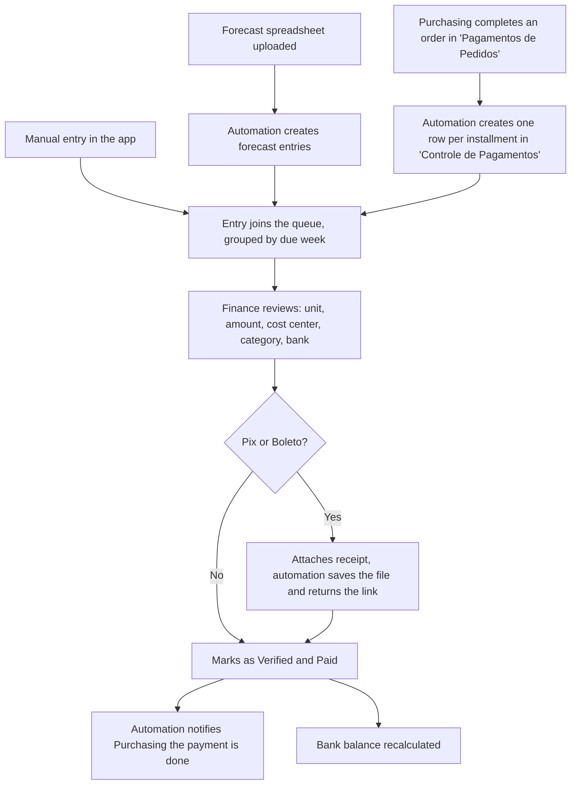
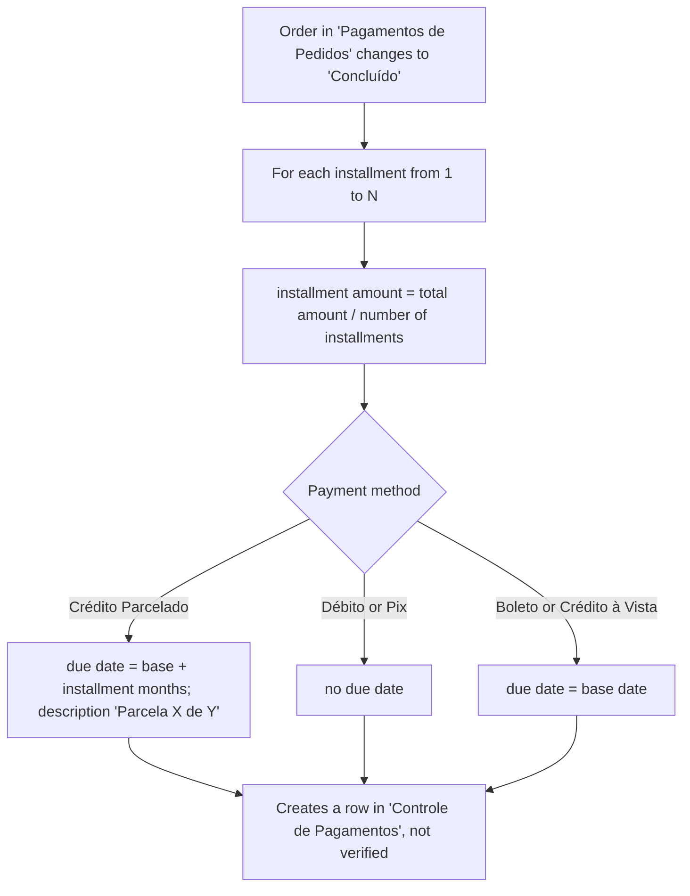
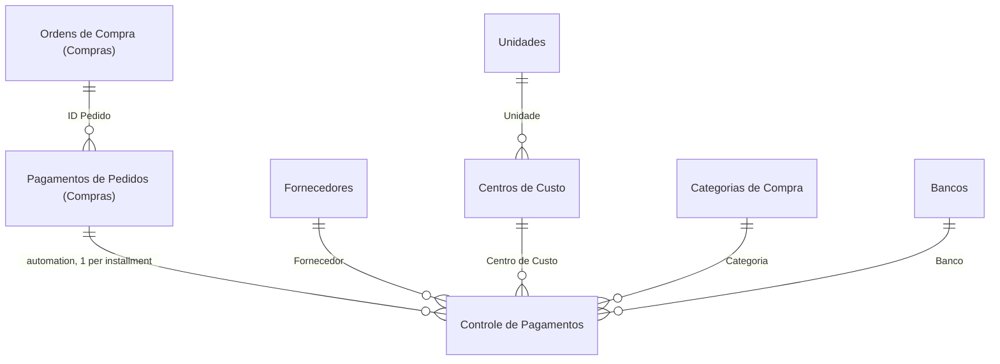

<!-- English version of pt.md. SharePoint list/column names, Power Automate flow
     names and Power Fx are kept in their original Portuguese because they're real
     identifiers in the system; prose is translated. Keep the two files in sync.
     NOTE: image 15-previsao-comparativo.png has "WILLIAN ZENI" (full name) in test
     rows — replace with "Fornecedor" or blur before publishing. -->

# Finance

Finance-sector app for Bello Aramados. Centralizes everything the company has to pay — whether it comes from the Purchasing queue, a manual entry or a forecast spreadsheet — and tracks bank balances alongside the entries.

## Context

- Finance had no way to compile what came in from Purchasing.
- Invoice, boleto and payment receipt were scattered, with no link to the purchase that originated them.
- There was no standardized way to build the accounts-payable forecast, nor to see bank balance and statement next to the entries.

## What the app does

- **Payments:** a single list (`Controle de Pagamentos`), grouped by due week, filterable by year, week, payment method, status, overdue and forecast.
- **Verification:** every pending entry goes through a review screen (unit, amount, cost center, category, bank, date). On verifying, an automation notifies Purchasing that the payment was made.
- **Manual entry:** recording a payment outside the Purchasing flow (registered or one-off supplier, payment method, installments).
- **Registers:** `Centros de Custo` (auto-generated code, e.g. `PCA_ADM`) and `Categorias de Compra`. Same lists used by the Purchasing app.
- **Suppliers:** CRUD for the supplier register (list shared with Purchasing).
- **Banks:** current balance of each bank computed from the opening balance minus the paid and verified entries, with a per-bank statement.
- **Forecast:** the team fills a model Excel spreadsheet and uploads it to the app; an automation turns each spreadsheet row into a forecast entry, and the comparison screen shows forecast against actual.

## A payment's flow



## Automations (Power Automate)

Five flows handle the integration with Purchasing and with the forecast spreadsheet. The two central ones:

**`FINANCEIRO_CRIAR_FILA_DE_PAGAMENTO`** turns an order completed in Purchasing into an installment payment queue.



**`FINANCEIRO_VERIFICA_PAGAMENTO`** closes the loop back: when Finance marks a payment as verified, it finds the matching row in Purchasing and marks it as paid, copying the receipt link.

The other three, in short:

1. **`FINANCEIRO_CANCELA_PEDIDO`** — when an order is cancelled or deleted in Purchasing, cancels every payment row linked to it.
2. **`FINANCEIRO_PREV_CRIAR`** — reads the forecast Excel spreadsheet and creates or updates the forecast entries, writing the ID back into the spreadsheet to keep both sides in sync.
3. **`FINANCEIRO_ENVIAR_COMPROVANTES`** — saves the attached receipts to a document library, resolving name collisions, and returns the link to the entry.

## Data model



| List                                         | Site       | Role                                                                                |
| -------------------------------------------- | ---------- | ----------------------------------------------------------------------------------- |
| `Controle de Pagamentos`                     | Finance    | Payable entry: one row per installment, whether from Purchasing, manual or forecast |
| `Bancos`                                     | Finance    | Account/card, opening balance, cut-off date, assigned payment methods               |
| `Centros de Custo` / `Categorias de Compra`  | Finance    | Accounting classification, shared with the Purchasing app                           |
| `Unidades`                                   | Finance    | Branches (Piracicaba, Caxias do Sul)                                                |
| `Fornecedores`                               | Purchasing | Supplier register, read and edited by both apps                                     |
| `Pagamentos de Pedidos` / `Ordens de Compra` | Purchasing | Origin of the entries, read cross-site                                              |

**`Controle de Pagamentos`** (main fields)

| Column                                                          | Type             | Description                                               |
| --------------------------------------------------------------- | ---------------- | --------------------------------------------------------- |
| `Status` / `Verificado?`                                        | Choice / Bool    | Payment status and whether it has gone through review     |
| `Registro Manual?` / `Previsão?`                                | Bool             | Entry origin (Purchasing, manual or forecast)             |
| `Valor` / `Valor Previsto`                                      | Number           | Actual amount and forecast amount (forecast comparison)   |
| `Forma de Pagamento`                                            | Choice           | Boleto, Crédito Parcelado, Crédito à Vista, Débito, Pix   |
| `Parcela` / `Número de Parcelas`                                | Number           | Installment position and total                            |
| `Data de Vencimento` / `Data de Pagamento`                      | DateTime         | Entry dates                                               |
| `Banco` / `Centro de Custo` / `Categoria` / `Unidade`           | Text / Choice    | Classification                                            |
| `Link do Boleto` / `Link do Comprovante` / `Nota(s) Fiscal(is)` | Hyperlink / Text | Attached documents                                        |
| `ID_PAG_COMPRAS` / `ID Pedido` / `CNPJ`                         | Number / Text    | Reference back to the origin order, copied (not a LookUp) |

## Screens

Demo version, fictional data (structure identical to the real one).

```carousel
/projects/bello-financeiro/images/01-inicio.png | Home | The app's five areas: Payments, Cost Centers, Suppliers, Banks and Forecast.
```

### Payments

```carousel
/projects/bello-financeiro/images/02-pagamentos.png | Payments list | Queue grouped by due week, with the filter panel on the left and the per-week totals (paid vs. pending).
/projects/bello-financeiro/images/03-pagamento-editar.png | Edit a manual payment | Editing an entry: status, unit, supplier (registered or one-off), amount, payment method, bank, cost center.
/projects/bello-financeiro/images/04-pagamento-validar.png | Validate and confirm a payment | Review before marking as paid: amount, cost center, category, date and bank. This is where the entry becomes "verified".
/projects/bello-financeiro/images/05-pagamento-manual.png | New manual payment | Manual entry, outside the Purchasing flow, with the five payment methods.
```

### Registers

```carousel
/projects/bello-financeiro/images/06-cadastros.png | Registers | Cost centers (code in the format SIGLA_UNIDADE) and purchase categories, side by side. Both lists are shared with the Purchasing app.
/projects/bello-financeiro/images/07-cadastro-categoria.png | Create a category | New purchase category: movement (income/expense), keywords and sectors allowed to use it.
/projects/bello-financeiro/images/08-cadastro-centro-custo.png | Create a cost center | The code is built from the acronym and the unit.
```

### Suppliers

```carousel
/projects/bello-financeiro/images/09-fornecedores.png | Suppliers list | Supplier register, with a shortcut to copy email and phone.
/projects/bello-financeiro/images/10-fornecedor-cadastro.png | Create a supplier | Supplier form.
```

### Banks

```carousel
/projects/bello-financeiro/images/11-bancos-resumo.png | Banks summary | Current balance of each bank, computed from the opening balance minus the payments already paid and verified.
/projects/bello-financeiro/images/12-bancos-distribuicao.png | Per-bank breakdown | Statement filtered by bank.
```

### Forecast

```carousel
/projects/bello-financeiro/images/13-previsao-cadastros.png | Uploaded bases | The forecast spreadsheets already uploaded.
/projects/bello-financeiro/images/14-previsao-envio-base.png | Upload a forecast base | Download the model, fill it in, upload. An automation turns each row into a forecast entry.
/projects/bello-financeiro/images/15-previsao-comparativo.png | Forecast comparison | Forecast amount against the actual amount of each entry.
```

## Key formulas

**A bank's current balance.** Not stored: it's the opening balance minus the sum of the entries already paid and verified for that bank.

```powerfx
ThisItem.'Saldo Inicial' -
Sum(
    Filter('Controle de Pagamentos', Status.Value = "Pago" && 'Verificado?' = true, Banco = ThisItem.'Nome do Banco'),
    Valor
)
```

**Grouping by due week.** The payments list is built by ISO week of the due date; "week 99" gathers the entries with no date.

```powerfx
Filter(tablePagamentos,
    If(ThisItem.Value = 99, IsBlankOrError(DatadeVencimento), ISOWeekNum(DatadeVencimento) = ThisItem.Value)
)
```

## Architecture decisions

- **One row per installment.** The Purchasing automation already splits the payment into installments when creating the entries, so Finance tracks month by month what's coming, without having to open each order.
- **Integration by automation, not a shared list.** Purchasing and Finance have separate lists, on separate sites, that feed each other through flows. SharePoint can't restrict permissions per column, so unifying them would expose one sector to the other's data.
- **Copied references, not a LookUp.** `ID_PAG_COMPRAS`, `ID Pedido`, `CNPJ` and supplier are stored on the entry, so the payment's history survives a change or deletion of the origin order.
- **Forecast in Excel, synced.** The team already worked the payables forecast in a spreadsheet. Instead of forcing a migration, the app imports the spreadsheet and returns each row's ID, keeping both sides in sync.
- **Bank balance computed, not stored.** Keeps the record from going stale; the number is always derived from the entries.

_Demo version with fictional data; structure and logic preserve the original app._
