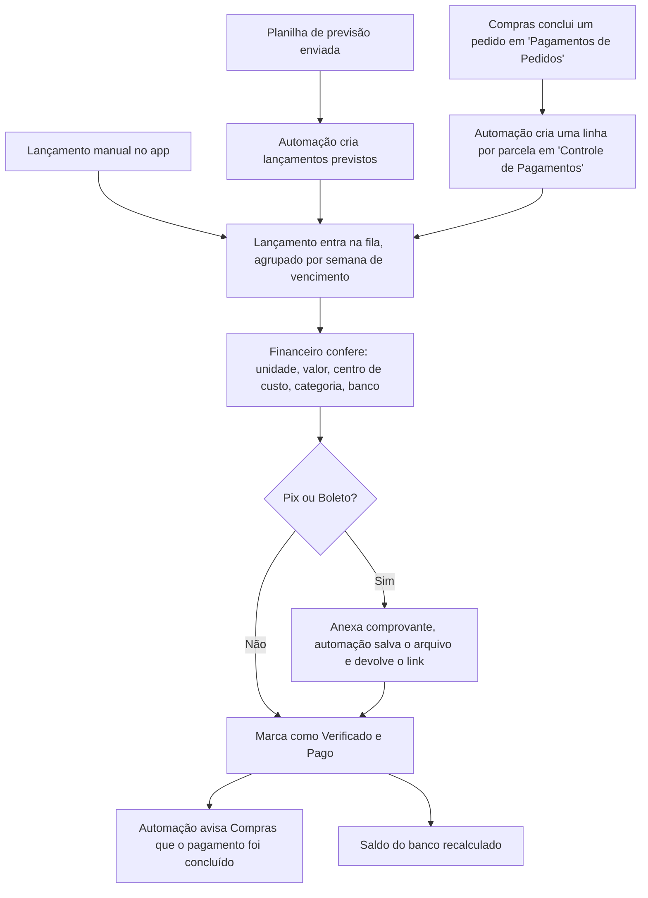
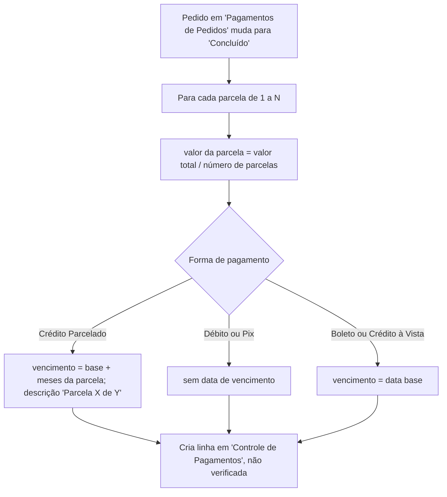
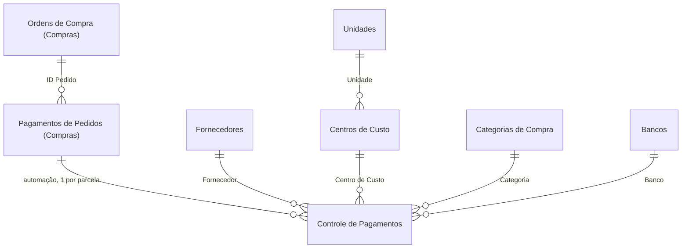

<!-- RASCUNHO Claude — post de portfólio (flagship), mesmo molde do controle-operacional v2:
     enxuto, bullets/tabelas/Mermaid, imagens públicas. Revisar tom e cortes.
     ATENÇÃO: a imagem 15-previsao-comparativo.png tem "WILLIAN ZENI" (nome completo) em
     linhas de teste — trocar por "Fornecedor" ou blur antes de publicar. -->

# Financeiro

App do setor financeiro da Bello Aramados. Centraliza tudo que a empresa tem a pagar, venha da fila do setor de Compras, de um lançamento manual ou de uma planilha de previsão, e acompanha o saldo dos bancos junto com os lançamentos.

## Contexto

- O financeiro não tinha como compilar o que entrava vindo de Compras.
- Nota fiscal, boleto e comprovante ficavam soltos, sem vínculo com a compra que os originou.
- Não havia forma padronizada de montar a previsão de contas a pagar nem de ver saldo e extrato dos bancos junto dos lançamentos.

## O que o app faz

- **Pagamentos:** lista única (`Controle de Pagamentos`), agrupada por semana de vencimento, com filtro por ano, semana, forma de pagamento, situação, vencido e previsto.
- **Verificação:** cada lançamento pendente passa por uma tela de conferência (unidade, valor, centro de custo, categoria, banco, data). Ao verificar, uma automação avisa o setor de Compras que aquele pagamento foi feito.
- **Lançamento manual:** registro de pagamento fora do fluxo de Compras (fornecedor cadastrado ou avulso, forma de pagamento, parcelas).
- **Cadastros:** `Centros de Custo` (código gerado automático, tipo `PCA_ADM`) e `Categorias de Compra`. São as mesmas listas usadas pelo app de Compras.
- **Fornecedores:** CRUD do cadastro de fornecedores (lista compartilhada com Compras).
- **Bancos:** saldo atual de cada banco calculado a partir do saldo inicial menos os lançamentos pagos e verificados, com extrato por banco.
- **Previsão:** o time preenche uma planilha Excel modelo e sobe pro app; uma automação transforma cada linha da planilha num lançamento previsto, e a tela comparativa mostra previsto contra realizado.

## Fluxo de um pagamento



## Automações (Power Automate)

Cinco fluxos fazem a integração com o setor de Compras e com a planilha de previsão. Os dois centrais:

**`FINANCEIRO_CRIAR_FILA_DE_PAGAMENTO`** transforma um pedido concluído em Compras numa fila de pagamentos parcelada.



**`FINANCEIRO_VERIFICA_PAGAMENTO`** fecha o ciclo de volta: quando o financeiro marca um pagamento como verificado, encontra a linha correspondente em Compras e a marca como paga, copiando o link do comprovante.

Os outros três, em resumo:

1. **`FINANCEIRO_CANCELA_PEDIDO`** — quando um pedido é cancelado ou excluído em Compras, cancela todas as linhas de pagamento ligadas a ele.
2. **`FINANCEIRO_PREV_CRIAR`** — lê a planilha Excel de previsão e cria ou atualiza os lançamentos previstos, gravando o ID de volta na planilha pra manter os dois lados sincronizados.
3. **`FINANCEIRO_ENVIAR_COMPROVANTES`** — salva os comprovantes anexados numa biblioteca de documentos, resolvendo colisão de nome, e devolve o link pro lançamento.

## Modelo de dados



| Lista                                        | Site       | Papel                                                                          |
| -------------------------------------------- | ---------- | ------------------------------------------------------------------------------ |
| `Controle de Pagamentos`                     | Financeiro | Lançamento a pagar: uma linha por parcela, seja de Compras, manual ou previsto |
| `Bancos`                                     | Financeiro | Conta/cartão, saldo inicial, data de corte, formas de pagamento atribuídas     |
| `Centros de Custo` / `Categorias de Compra`  | Financeiro | Classificação contábil, compartilhadas com o app de Compras                    |
| `Unidades`                                   | Financeiro | Filiais (Piracicaba, Caxias do Sul)                                            |
| `Fornecedores`                               | Compras    | Cadastro de fornecedores, lido e editado pelos dois apps                       |
| `Pagamentos de Pedidos` / `Ordens de Compra` | Compras    | Origem dos lançamentos, lidas cross-site                                       |

**`Controle de Pagamentos`** (campos principais)

| Coluna                                                          | Tipo             | Descrição                                                      |
| --------------------------------------------------------------- | ---------------- | -------------------------------------------------------------- |
| `Status` / `Verificado?`                                        | Choice / Bool    | Situação do pagamento e se já passou pela conferência          |
| `Registro Manual?` / `Previsão?`                                | Bool             | Origem do lançamento (Compras, manual ou previsto)             |
| `Valor` / `Valor Previsto`                                      | Number           | Valor realizado e valor previsto (comparativo da previsão)     |
| `Forma de Pagamento`                                            | Choice           | Boleto, Crédito Parcelado, Crédito à Vista, Débito, Pix        |
| `Parcela` / `Número de Parcelas`                                | Number           | Posição e total de parcelas                                    |
| `Data de Vencimento` / `Data de Pagamento`                      | DateTime         | Datas do lançamento                                            |
| `Banco` / `Centro de Custo` / `Categoria` / `Unidade`           | Text / Choice    | Classificação                                                  |
| `Link do Boleto` / `Link do Comprovante` / `Nota(s) Fiscal(is)` | Hyperlink / Text | Documentos anexados                                            |
| `ID_PAG_COMPRAS` / `ID Pedido` / `CNPJ`                         | Number / Text    | Referência de volta ao pedido de origem, copiadas (não LookUp) |

## Telas

Versão demo, dados fictícios (estrutura idêntica à real).

```carousel
/projects/bello-financeiro/images/01-inicio.png | Início | As cinco áreas do app: Pagamentos, Centros de Custo, Fornecedores, Bancos e Previsão.
```

### Pagamentos

```carousel
/projects/bello-financeiro/images/02-pagamentos.png | Lista de pagamentos | Fila agrupada por semana de vencimento, com o painel de filtros à esquerda e os totais por semana (pago x pendente).
/projects/bello-financeiro/images/03-pagamento-editar.png | Editar pagamento manual | Edição de um lançamento: status, unidade, fornecedor (cadastrado ou avulso), valor, forma de pagamento, banco, centro de custo.
/projects/bello-financeiro/images/04-pagamento-validar.png | Validar e confirmar pagamento | Conferência antes de marcar como pago: valor, centro de custo, categoria, data e banco. É aqui que o lançamento passa a "verificado".
/projects/bello-financeiro/images/05-pagamento-manual.png | Novo pagamento manual | Lançamento manual, fora do fluxo de Compras, com as cinco formas de pagamento.
```

### Cadastros

```carousel
/projects/bello-financeiro/images/06-cadastros.png | Cadastros | Centros de custo (código no formato SIGLA_UNIDADE) e categorias de compra, lado a lado. As duas listas são compartilhadas com o app de Compras.
/projects/bello-financeiro/images/07-cadastro-categoria.png | Cadastrar categoria | Nova categoria de compra: movimento (receita/despesa), palavras-chave e setores que podem usá-la.
/projects/bello-financeiro/images/08-cadastro-centro-custo.png | Cadastrar centro de custo | O código é montado a partir da sigla e da unidade.
```

### Fornecedores

```carousel
/projects/bello-financeiro/images/09-fornecedores.png | Lista de fornecedores | Cadastro de fornecedores, com atalho pra copiar e-mail e telefone.
/projects/bello-financeiro/images/10-fornecedor-cadastro.png | Cadastrar fornecedor | Formulário de fornecedor.
```

### Bancos

```carousel
/projects/bello-financeiro/images/11-bancos-resumo.png | Resumo dos bancos | Saldo atual de cada banco, calculado a partir do saldo inicial menos os pagamentos já pagos e verificados.
/projects/bello-financeiro/images/12-bancos-distribuicao.png | Distribuição por banco | Extrato filtrado por banco.
```

### Previsão

```carousel
/projects/bello-financeiro/images/13-previsao-cadastros.png | Bases enviadas | As planilhas de previsão já enviadas.
/projects/bello-financeiro/images/14-previsao-envio-base.png | Enviar base de previsão | Baixa o modelo, preenche, sobe. Uma automação transforma cada linha num lançamento previsto.
/projects/bello-financeiro/images/15-previsao-comparativo.png | Comparativo de previsão | Valor previsto contra valor real de cada lançamento.
```

## Fórmulas-chave

**Saldo atual de um banco.** Não é armazenado: é o saldo inicial menos a soma dos lançamentos já pagos e verificados naquele banco.

```powerfx
ThisItem.'Saldo Inicial' -
Sum(
    Filter('Controle de Pagamentos', Status.Value = "Pago" && 'Verificado?' = true, Banco = ThisItem.'Nome do Banco'),
    Valor
)
```

**Agrupamento por semana de vencimento.** A lista de pagamentos é montada por semana ISO do vencimento; a "semana 99" junta os lançamentos sem data.

```powerfx
Filter(tablePagamentos,
    If(ThisItem.Value = 99, IsBlankOrError(DatadeVencimento), ISOWeekNum(DatadeVencimento) = ThisItem.Value)
)
```

## Decisões de arquitetura

- **Uma linha por parcela.** A automação de Compras já quebra o pagamento em parcelas ao criar os lançamentos, então o financeiro acompanha mês a mês o que vai entrar, sem ter que abrir cada pedido.
- **Integração por automação, não lista compartilhada.** Compras e Financeiro têm listas separadas, em sites separados, que se retroalimentam por fluxo. O SharePoint não restringe permissão por coluna, então unificar exporia um setor a dados do outro.
- **Referências copiadas, não LookUp.** `ID_PAG_COMPRAS`, `ID Pedido`, `CNPJ` e fornecedor ficam gravados no lançamento, pra o histórico do pagamento sobreviver a mudança ou exclusão do pedido de origem.
- **Previsão em Excel, sincronizada.** O time já trabalhava a previsão de contas numa planilha. Em vez de forçar a migração, o app importa a planilha e devolve o ID de cada linha, mantendo os dois lados em sincronia.
- **Saldo de banco calculado, não guardado.** Evita o registro ficar defasado; o número é sempre derivado dos lançamentos.

_Versão demo com dados fictícios; estrutura e lógica preservam o app original._
