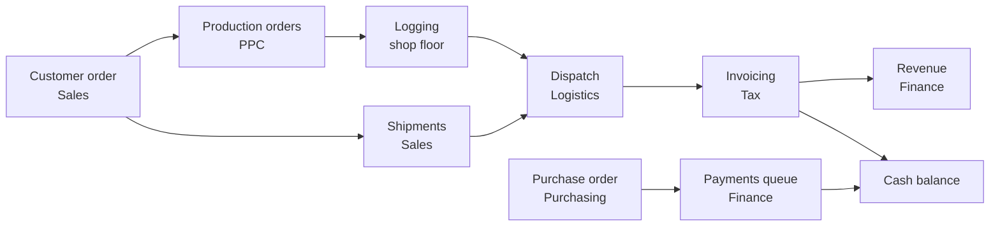

# Bello SGE

Internal ERP for a wire and wire-mesh metalworks, covering the operational flow
end to end: from the customer order to the production order, to invoicing and
payment. A real system, in production at the company.

**[See the live demo running](https://bello-sge-demo.vercel.app)**: pick a
persona on the login screen, no sign-up or password, and explore freely.

`6 areas` · `7 SharePoint sites` · `~18 config-generated screens` ·
`5 automations ported from Power Automate` · `2 manufacturing plants` ·
Next.js 16 / React 19 / TypeScript

<figure>
  
  <figcaption>PPC dashboard: production scheduling queues, machine status and
  per-operator logging. The per-sector sidebar and the breadcrumb chrome are the
  shell of every screen.</figcaption>
</figure>

## What it is

The **SGE** (Enterprise Management System) is the internal ERP of Bello
Aramados, a metalworks producing wire, wire mesh, grates and similar products,
with two plants. It is a web application used by office and factory-office staff,
always in Portuguese, with no public sign-up: accounts are the company's own
Microsoft 365 accounts.

Before it, each sector ran its process on a mix of spreadsheets, isolated Power
Apps and dozens of Power Automate flows gluing one sector to the next. The SGE
unifies the master data (CRUD) and the **flow tracking** of those sectors in a
single interface, keeping an order's traceability from the sale to the cash desk.

## What the system does

| Area          | What it does in the system                                                                                                     |
| ------------- | ----------------------------------------------------------------------------------------------------------------------------- |
| **PPC**       | Production scheduling queues, machines, operators, production orders, quality inspections, logging dashboard                    |
| **Sales**     | Customer orders (and the automatic generation of production orders from them), shipments, customer master data                 |
| **Tax**       | Invoicing queue, generation of invoices from dispatches, carriers, price table                                                 |
| **Finance**   | Payments queue, revenue, cash forecast, balance sheet, banks, cost centers and accounting categories                          |
| **Purchasing**| Purchase orders, per-order payment methods, invoice attachments, approval of changes to an already completed order            |
| **Admin**     | Users and permissions (granular RBAC), dynamic registration of each sector's sites, lists and navigation pages                 |

<figure>
  
  <figcaption>Sales, order list: a statistics panel (total, by status, quantities
  to produce and remaining, by plant) recalculated over the items that pass the
  active filters. This is the visual pattern of every config-generated
  screen.</figcaption>
</figure>

<figure>
  
  <figcaption>Finance, payments queue: installments grouped by due week, with the
  total amount in each group's header and a count of verified and pending items
  in the footer.</figcaption>
</figure>

### Real business rules

Beyond CRUD, the system runs the logic that connects the sectors:

- **Production order generation**: when an order is created, the system reads the
  product's quality plan and creates one order per process step, already
  computing the quantity of each component from stock, shipment backlog and a
  margin. The calculation was validated by the head of production.
- **Invoicing 1:1 with the dispatch**, never with the order: it resolves the
  price in the table by product, customer and plant, splits the total amount
  across the payment methods and generates one revenue line per method.
- **Payments queue**: a completed purchase order explodes into one line per
  installment, with the due date computed according to the payment method.
  Canceling the purchase cancels the installments in cascade.
- **Change approval**: editing an already completed purchase order generates a
  request with the field diff and a mandatory justification, which is only
  applied once a plant approver confirms it.

## How it works inside

The path of an order through the system, and how revenue and expense meet in the
cash balance:

Four architecture decisions define the rest of the code:

1. **The whole ERP on SharePoint Lists, no database.** The company already had
   all its data infrastructure in Microsoft 365, with a paid license and Entra
   ID accounts for everyone. Instead of standing up a database and a bespoke API,
   the backend is SharePoint Lists via the Microsoft Graph API, and
   authentication is Azure AD / MSAL. The price of that choice: there is no JOIN,
   no transaction and no referential integrity. Relationships between entities
   are resolved in memory, comparing IDs stored in text or number fields. This is
   a prerequisite for touching any data code.
2. **Config-generated CRUD.** Dozens of auxiliary master-data screens (customers,
   suppliers, carriers, operators, machines, accounting accounts) share the same
   shape. A declarative per-list configuration generates the table, the form, the
   Zod validation and the SharePoint mapping, without writing code for each new
   screen. About 18 screens are born this way. Each sector's main flows (order
   creation, invoicing, payment verification, approval) are still hand-built,
   because each one has its own rule.
3. **Granular RBAC mirroring Entra ID.** The company already had per-sector
   security groups in the tenant. The permission model has one record per
   (user, sector) pair, with Viewer, Editor and Approver roles, cached in a
   short-lived signed cookie that the route gate reads on every request. A person
   can be Editor in PPC and Viewer in Finance at the same time, and each demo
   persona sees exactly what it would see in the real system.
4. **Power Automate automations rewritten as code.** The legacy system relied on
   five flows to propagate data between sectors: generate the payments queue when
   a purchase is completed, cancel payments in cascade, verify a payment, approve
   a change to a completed order, attach invoices. All were reimplemented as pure
   testable functions, called directly by the server actions, with no dependency
   on an external connector or on a manager's email hard-coded in the source.

<figure>
  
  <figcaption>Admin, users screen: a band of system administrators at the top, a
  per-sector permission matrix below (each user expands to view and edit the role
  in each area).</figcaption>
</figure>

## The demo

**[Open the live demo](https://bello-sge-demo.vercel.app)**: the login screen is
a persona selector. Each persona carries the real RBAC of its role, with
fictional but mutually consistent data (a seed order already has production
orders, a shipment and invoicing derived from it, not loose records), a
per-persona onboarding tour and a data reset at any time.

What the demo does **not** cover:

- Real backend and authentication: instead of SharePoint and Azure AD, a
  browser store and the persona selector, with the same public API, so as not to
  touch the business logic or the UI.
- Persistence between sessions: the data lives in the tab and resets when it is
  closed.
- Real email sending and file upload.
- Real-time collaboration between users or tabs.

## Stack

- **Next.js 16** (App Router, Turbopack) + **React 19** + TypeScript
- **Tailwind CSS v4** + **shadcn/ui** (Radix primitives) + Fluent UI / Phosphor icons
- **TanStack** Table (virtualization), Query and Form + **Zod** + **nuqs** (table
  state in the URL) + **next-safe-action** (permission centralized in the server actions)
- In the real app: **Microsoft Graph API** over **SharePoint Lists** as the
  backend and **Azure AD / MSAL** as authentication. In the demo, a client-side
  store with the same interface.
- **Vitest** + Testing Library, **ESLint** + Prettier + Husky on pre-commit

## Transparency note

The architecture decisions (SharePoint as the backend via Microsoft Graph, Azure
AD as authentication, the granular RBAC mirroring Entra ID, the config-driven
CRUD system, the design of each business flow) are mine and the real project's. I
used **[Claude Code](https://claude.com/claude-code)** as an accelerator in
implementation, refactoring and debugging on top of those decisions, mainly in
the sectors added after the first version (Tax, Finance, Purchasing).

---

_Demo version with fictional data (company "Empresa LTDA"); structure, navigation
and business logic preserve the real system in production._
