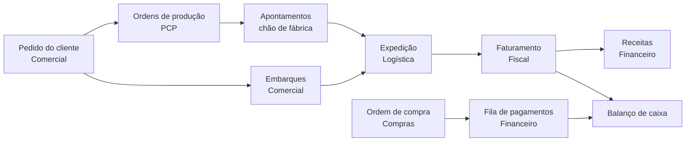

# Bello SGE

ERP interno de uma metalúrgica de arames e aramados, cobrindo o fluxo operacional
de ponta a ponta: do pedido do cliente à ordem de produção, ao faturamento e ao
pagamento. Sistema real, em produção na empresa.

**[Ver a demo rodando ao vivo](https://bello-sge-demo.vercel.app)**: escolha uma
persona na tela de login, sem cadastro nem senha, e explore à vontade.

`6 áreas` · `7 sites SharePoint` · `~18 telas geradas por configuração` ·
`5 automações portadas do Power Automate` · `2 unidades fabris` ·
Next.js 16 / React 19 / TypeScript

<figure>
  
  <figcaption>Dashboard do PCP: filas de programação de produção, status das
  máquinas e apontamentos por operador. A sidebar por setor e o chrome com
  breadcrumb são o shell de todas as telas.</figcaption>
</figure>

## O que é

O **SGE** (Sistema de Gestão Empresarial) é o ERP interno da Bello Aramados, uma
metalúrgica de arames, aramados, grades e produtos similares com duas unidades. É
uma aplicação web usada por funcionários de escritório e de escritório de fábrica,
sempre em português, sem cadastro público: as contas são as próprias contas
Microsoft 365 da empresa.

Antes dele, cada setor tocava seu processo em uma mistura de planilhas, apps de
Power Apps isolados e dezenas de flows de Power Automate colando um setor no
outro. O SGE unifica o cadastro (CRUD) e o **acompanhamento de fluxo** desses
setores numa interface só, com a rastreabilidade de um pedido preservada da venda
até o caixa.

## O que o sistema faz

| Área           | O que faz no sistema                                                                                                          |
| -------------- | ----------------------------------------------------------------------------------------------------------------------------- |
| **PCP**        | Filas de programação de produção, máquinas, operadores, ordens de produção, inspeções de qualidade, dashboard de apontamentos |
| **Comercial**  | Pedidos de clientes (e a geração automática das ordens de produção a partir deles), embarques, cadastro de clientes           |
| **Fiscal**     | Fila de faturamento, geração de faturamentos a partir das expedições, transportadoras, tabela de preços                       |
| **Financeiro** | Fila de pagamentos, receitas, previsão de caixa, balanço, bancos, centros de custo e categorias contábeis                     |
| **Compras**    | Ordens de compra, formas de pagamento por pedido, anexos de nota, aprovação de alteração de pedido já concluído               |
| **Admin**      | Usuários e permissões (RBAC granular), registro dinâmico de sites, listas e páginas de navegação de cada setor                |

<figure>
  
  <figcaption>Comercial, listagem de pedidos: painel de estatísticas (total, por
  status, quantidades a produzir e restante, por unidade) recalculado sobre os
  itens que passam pelos filtros ativos. Esse é o padrão visual de toda tela
  gerada por configuração.</figcaption>
</figure>

<figure>
  
  <figcaption>Financeiro, fila de pagamentos: parcelas agrupadas por semana de
  vencimento, com valor total no cabeçalho de cada grupo e contagem de
  verificados e pendentes no rodapé.</figcaption>
</figure>

### Regras de negócio de verdade

Além do CRUD, o sistema roda a lógica que conecta os setores:

- **Geração de ordens de produção**: ao criar um pedido, o sistema lê o plano de
  qualidade do produto e cria uma ordem por etapa de processo, já calculando a
  quantidade de cada componente a partir de estoque, backlog de embarques e uma
  margem. Cálculo validado pelo chefe de produção.
- **Faturamento 1:1 com a expedição**, nunca com o pedido: resolve o preço na
  tabela por produto, cliente e unidade, rateia o valor total entre as formas de
  pagamento e gera uma linha de receita por forma.
- **Fila de pagamentos**: uma ordem de compra concluída explode em uma linha por
  parcela, com o vencimento calculado conforme a forma de pagamento. Cancelar a
  compra cancela as parcelas em cascata.
- **Aprovação de alteração**: editar um pedido de compra já concluído gera uma
  solicitação com o diff dos campos e uma justificativa obrigatória, que só é
  aplicada quando um aprovador da unidade confirma.

## Como funciona por dentro

O caminho de um pedido pelo sistema, e como a receita e a despesa se encontram no
balanço de caixa:

Quatro decisões de arquitetura definem o resto do código:

1. **ERP inteiro sobre SharePoint Lists, sem banco de dados.** A empresa já tinha
   toda a infra de dados no Microsoft 365, com licença paga e contas no Entra ID
   para todo mundo. Em vez de subir um banco e uma API própria, o backend é
   SharePoint Lists via Microsoft Graph API, e a autenticação é Azure AD / MSAL.
   O preço dessa escolha: não há JOIN, transação nem integridade referencial. As
   relações entre entidades são resolvidas em memória, comparando IDs guardados em
   campos de texto ou número. Isso é pré-requisito para mexer em qualquer código
   de dados.
2. **CRUD gerado por configuração.** Dezenas de telas de cadastro auxiliar
   (clientes, fornecedores, transportadoras, operadores, máquinas, contas
   contábeis) têm o mesmo formato. Uma configuração declarativa por lista gera a
   tabela, o formulário, a validação com Zod e o mapeamento para o SharePoint, sem
   escrever código a cada nova tela. Cerca de 18 telas nascem assim. Os fluxos
   principais de cada setor (criação de pedido, faturamento, verificação de
   pagamento, aprovação) continuam feitos à mão, porque cada um tem regra própria.
3. **RBAC granular espelhando o Entra ID.** A empresa já tinha grupos de segurança
   por setor no tenant. O modelo de permissão tem um registro por par
   (usuário, setor), com papéis Viewer, Editor e Aprovador, cacheado num cookie
   assinado de curta duração que o gate de rota lê a cada request. Uma pessoa pode
   ser Editor no PCP e Viewer no Financeiro ao mesmo tempo, e cada persona da demo
   enxerga exatamente o que enxergaria no sistema real.
4. **Automações do Power Automate reescritas como código.** O sistema legado
   dependia de cinco flows para propagar dados entre setores: gerar a fila de
   pagamento ao concluir uma compra, cancelar pagamentos em cascata, verificar
   pagamento, aprovar alteração de pedido concluído, anexar notas fiscais. Todos
   foram reimplementados como funções puras testáveis, chamadas direto pelas
   server actions, sem depender de conector externo nem de e-mail de gestor
   fixado no código.

<figure>
  
  <figcaption>Admin, tela de usuários: faixa de administradores do sistema no
  topo, matriz de permissões por setor abaixo (cada usuário expande para ver e
  editar o papel em cada área).</figcaption>
</figure>

## A demo

**[Abrir a demo ao vivo](https://bello-sge-demo.vercel.app)**: a tela de login é
um seletor de personas. Cada persona traz o RBAC real da sua função, com dados
fictícios mas coerentes entre si (um pedido do seed já tem ordens de produção,
embarque e faturamento derivados dele, não registros soltos), tour de onboarding
por persona e reset de dados a qualquer momento.

O que a demo **não** cobre:

- Backend e autenticação reais: no lugar do SharePoint e do Azure AD, uma store
  no navegador e o seletor de personas, com a mesma API pública, para não tocar na
  lógica de negócio nem na UI.
- Persistência entre sessões: os dados vivem na aba e resetam ao fechá-la.
- Envio de e-mail e upload real de arquivo.
- Colaboração em tempo real entre usuários ou abas.

## Stack

- **Next.js 16** (App Router, Turbopack) + **React 19** + TypeScript
- **Tailwind CSS v4** + **shadcn/ui** (Radix primitives) + Fluent UI / Phosphor icons
- **TanStack** Table (virtualização), Query e Form + **Zod** + **nuqs** (estado de
  tabela na URL) + **next-safe-action** (permissão centralizada nas server actions)
- No app real: **Microsoft Graph API** sobre **SharePoint Lists** como backend e
  **Azure AD / MSAL** como autenticação. Na demo, uma store client-side com a
  mesma interface.
- **Vitest** + Testing Library, **ESLint** + Prettier + Husky no pre-commit

## Nota de transparência

As decisões de arquitetura (SharePoint como backend via Microsoft Graph, Azure AD
como autenticação, o RBAC granular espelhando o Entra ID, o sistema de CRUD por
configuração, o desenho de cada fluxo de negócio) são minhas e do projeto real.
Usei o **[Claude Code](https://claude.com/claude-code)** como acelerador na implementação, refatoração e depuração em cima dessas decisões, principalmente nos setores adicionados depois da primeira versão (Fiscal, Financeiro, Compras).

---

_Versão demo com dados fictícios (empresa "Empresa LTDA"); estrutura, navegação e
lógica de negócio preservam o sistema real em produção._
