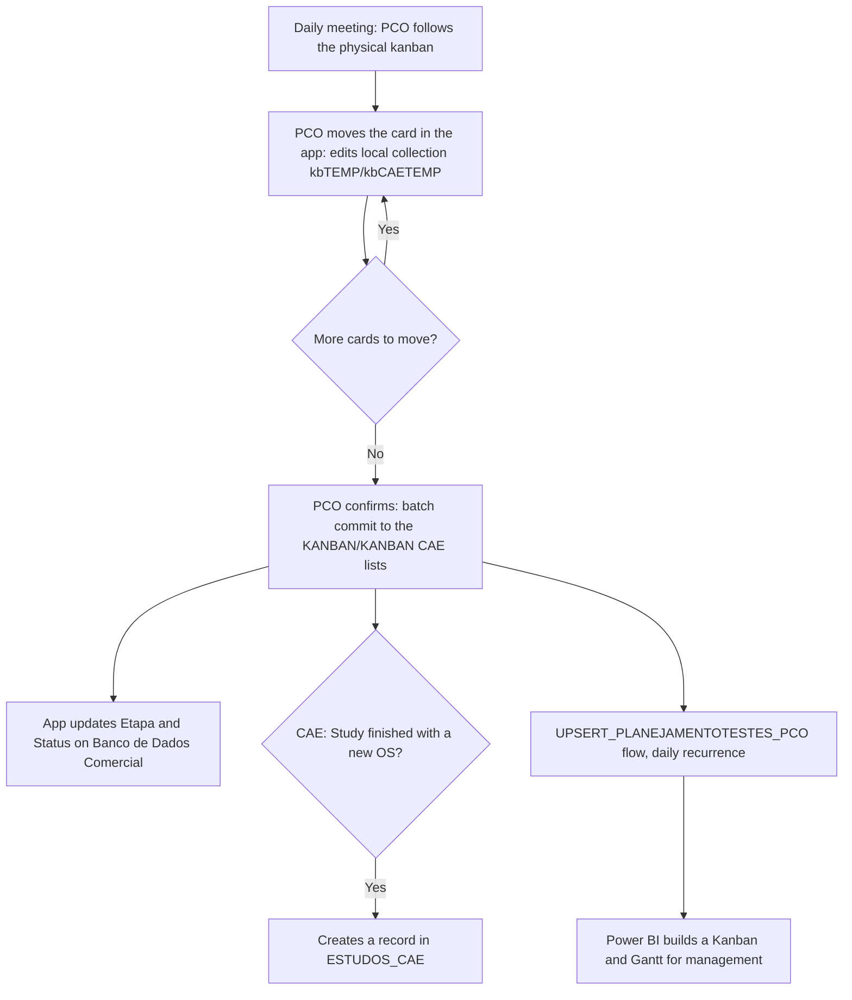

<!-- English version of pt.md. SharePoint list/column names kept in Portuguese
     (real identifiers); prose translated. Keep the two files in sync. -->

## What the app does

- The **PCO** (operations scheduler) uses the app on a tablet during the daily meeting itself: as a physical sticky note moves to a new column on the garage board, they reflect the same move on the digital board.
- **Two boards:** `KANBAN` covers general operations (staging, track run, lab, review); `KANBAN CAE` is separate because the CAE sector (simulation engineering) develops tests on its own schedule, including a "Study" flow — exploratory, with no commercial service order yet — that only becomes a real order once approved.
- Moving a card **never writes straight to SharePoint**: every phase/status/position change becomes a `Patch` on a local collection (`kbTEMP`/`kbCAETEMP`), and everything only syncs in one batch once the PCO confirms — avoiding a partial write mid-meeting while cards are still being moved.
- On confirm, the app also updates the source commercial order's `Etapa` and `Status`, keeping the sales funnel in sync with the operational kanban.

## From the meeting to Power BI



That's the real gain over the physical board: a **real history** of every phase change, without relying on each sector reporting through a different channel, and an automatic feed into a **Kanban and Gantt in Power BI** for management to follow without attending the meeting.

## Automation (Power Automate → Power BI)

The **`UPSERT_PLANEJAMENTOTESTES_PCO`** flow runs on a daily recurrence (Monday to Friday, 6 AM) and re-syncs the planning list used by the Gantt, instead of the app writing to it directly: keeps the board fast to use and pushes the sync workload to a background flow. That's the list **Power BI** consumes to build the Kanban/Gantt management sees.

## Data model

| List                        | Role                                                                                  |
| ----------------------------- | -------------------------------------------------------------------------------------- |
| `KANBAN`                     | General operations cards: `FASE`, `SITUAÇÃO`, `POS`, client, description, owner         |
| `KANBAN CAE`                 | CAE sector cards, with `TIPO` (`ESTUDO` or `ORDEM`) defining the available phase set     |
| `ESTUDOS_CAE`                | Record created when a CAE Study becomes a service order, with the study's start/end      |
| `Banco de Dados Comercial`   | Source service order; `Etapa` and `Status` synced from the kanban card                   |

## Key formulas

**Moving a card without touching SharePoint.** Every phase change becomes a `Patch` on the local collection `kbTEMP`, reusing the pending record if one already exists for that `ORDEM`, and recalculates derived fields from `Banco de Dados Comercial`.

```powerfx
Patch(
    kbTEMP,
    If(IsBlank(LookUp(kbTEMP, ORDEM = currentItem.ORDEM)), Defaults(kbTEMP), LookUp(kbTEMP, ORDEM = currentItem.ORDEM)),
    {
        DATA: Today(),
        HORA: Text(Now(), DateTimeFormat.ShortTime24),
        ORDEM: currentItem.ORDEM,
        FASE: {Value: faseOptions.Selected.Value},
        SITUAÇÃO: {Value: situacaoOptions.Selected.Value},
        POS: Value(posOptions.Selected.Value),
        'OS-TIPO': If(currentItem.'OS-TIPO' = "", $"{currentItem.ORDEM} - {LookUp('Banco de Dados Comercial', Ordem = currentItem.ORDEM).'Tipo Teste'.Value}", currentItem.'OS-TIPO')
    }
);
```

**Batch confirm.** Goes through the whole local collection and writes each row to SharePoint in one go, also syncing back the macro stage (`Etapa`) and `Status` on the source commercial order.

```powerfx
ForAll(
    kbTEMP As NR,
    Patch(KANBAN, Defaults(KANBAN), {
        DATA: NR.DATA, HORA: NR.HORA, ORDEM: NR.ORDEM, FASE: NR.FASE,
        SITUAÇÃO: NR.SITUAÇÃO, POS: NR.POS, 'OS-TIPO': NR.'OS-TIPO', RESP: NR.RESP
    });
    Patch('Banco de Dados Comercial', LookUp('Banco de Dados Comercial', Ordem = NR.ORDEM), {
        Etapa: {Value: Switch(NR.FASE.Value, "BACKLOG", "0. Backlog", "CHECAGEM", "2. Relatório", "FINALIZADA", "3. Faturar e Encerrar OS", "1. Operação")},
        Status: {Value: Proper(NR.SITUAÇÃO.Value)}
    })
);
```

**CAE phases depend on the card's type.** On the `KANBAN CAE` board, the set of available phases changes depending on whether the card is an `ESTUDO` (exploratory, no OS) or a regular `ORDEM` — implementing the sector's two work tracks within the same board.

```powerfx
Filter(Choices('KANBAN CAE'[@FASE]), If(currentItemCAE.TIPO.Value = "ESTUDO",
    Value in ["EM ESTUDO", "AGUARDANDO", "FINALIZADA", "EXCLUÍDA"],
    Value in ["BACKLOG", "MOVER", "OPERAÇÃO", "FINALIZADA"]))
```

## Architecture decisions

- **Local edits, batch commit.** Moving a card only edits the local collection; the real write to SharePoint only happens when the PCO confirms — avoiding a partial write mid-meeting.
- **Bridge to Power BI via a scheduled flow, not a direct write.** `UPSERT_PLANEJAMENTOTESTES_PCO` re-syncs the planning list on a daily recurrence, instead of the app writing to it on every change: keeps the board fast to use and pushes the sync workload to the background.
- **Two nearly identical boards, on purpose.** `KANBAN` and `KANBAN CAE` have different phases because CAE works on its own logic (exploratory studies with no OS). It's duplicated logic, but it avoided complicating the screen with a per-sector phase configuration.
- **Digital kanban as a complement, not a replacement.** The physical board still exists; the app just formalizes what already happens in the meeting, without changing the ritual itself — which cut a lot of resistance from the operations team.
