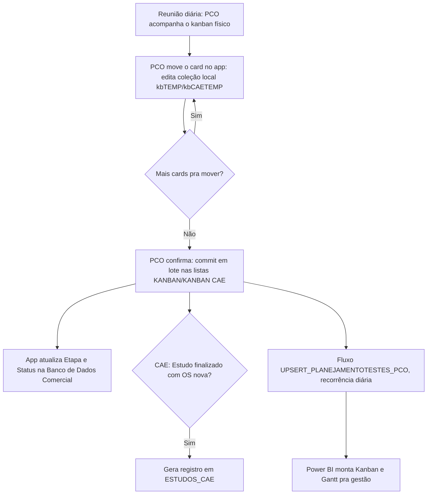

<!-- Post de portfólio (flagship): app + automação + BI. Molde do operational-app
     v2. Fonte: .todo/ctr/entregas/kanban-relatorio-final.md. Sem imagens
     ainda (sem acesso ao ambiente real do CTR). -->

## O que o app faz

- O **PCO** (Programador de Operações) usa o app em tablet durante a própria reunião diária: conforme o post-it físico muda de coluna no quadro da garagem, ele reflete a mudança no board digital.
- **Dois boards:** `KANBAN` cobre a operação geral (locação, rodagem, laboratório, checagem); `KANBAN CAE` é separado porque o setor de CAE (engenharia de simulação) desenvolve testes numa ordem própria, incluindo um fluxo de "Estudo" — exploratório, sem ordem de serviço comercial — que só vira uma ordem de fato quando aprovado.
- Mover um card **nunca grava direto no SharePoint**: cada mudança de fase/situação/posição vira um `Patch` numa coleção local (`kbTEMP`/`kbCAETEMP`), e só quando o PCO confirma é que tudo sincroniza de uma vez em lote — evita gravação parcial no meio da reunião enquanto os cards ainda estão sendo movidos.
- Ao confirmar, o app também atualiza a `Etapa` e o `Status` da ordem comercial de origem, mantendo o funil comercial em sincronia com o kanban operacional.

## Da reunião ao Power BI



Esse é o ganho real sobre o quadro físico: um **histórico verdadeiro** de cada mudança de fase, sem depender de cada setor reportando por um canal diferente, e uma alimentação automática de um **Kanban e Gantt no Power BI** pra gestão acompanhar sem precisar estar na reunião.

## Automação (Power Automate → Power BI)

O fluxo **`UPSERT_PLANEJAMENTOTESTES_PCO`** roda numa recorrência diária (segunda a sexta, 6h) e resincroniza a lista de planejamento usada no Gantt, em vez do app escrever direto nela: mantém o board rápido de usar e deixa a carga de sincronização pro fluxo em background. É essa lista que o **Power BI** consome pra montar o Kanban/Gantt visto pela gestão.

## Modelo de dados

| Lista                | Papel                                                                                   |
| --------------------- | ------------------------------------------------------------------------------------------ |
| `KANBAN`             | Cards da operação geral: `FASE`, `SITUAÇÃO`, `POS`, cliente, descrição, responsável         |
| `KANBAN CAE`         | Cards do setor de CAE, com `TIPO` (`ESTUDO` ou `ORDEM`) definindo o conjunto de fases        |
| `ESTUDOS_CAE`        | Registro gerado quando um Estudo CAE vira ordem de serviço, com início/fim do estudo         |
| `Banco de Dados Comercial` | Ordem de serviço de origem; `Etapa` e `Status` sincronizados a partir do card do kanban |

## Fórmulas-chave

**Mover um card sem tocar no SharePoint.** Cada mudança de fase vira um `Patch` na coleção local `kbTEMP`, reaproveitando o registro pendente se já existir um pra aquela `ORDEM`, e recalcula campos derivados a partir da `Banco de Dados Comercial`.

```powerfx
Patch(
    kbTEMP,
    If(IsBlank(LookUp(kbTEMP, ORDEM = currentItem.ORDEM)), Defaults(kbTEMP), LookUp(kbTEMP, ORDEM = currentItem.ORDEM)),
    {
        DATA: Today(),
        HORA: Text(Now(), DateTimeFormat.ShortTime24),
        ORDEM: currentItem.ORDEM,
        FASE: {Value: faseOptions.Selected.Value},
        SITUAÇÃO: {Value: situacaoOptions.Selected.Value},
        POS: Value(posOptions.Selected.Value),
        'OS-TIPO': If(currentItem.'OS-TIPO' = "", $"{currentItem.ORDEM} - {LookUp('Banco de Dados Comercial', Ordem = currentItem.ORDEM).'Tipo Teste'.Value}", currentItem.'OS-TIPO')
    }
);
```

**Confirmar em lote.** Percorre a coleção local inteira e grava cada linha de uma vez só no SharePoint, além de sincronizar de volta o macro-estágio (`Etapa`) e o `Status` na ordem comercial de origem.

```powerfx
ForAll(
    kbTEMP As NR,
    Patch(KANBAN, Defaults(KANBAN), {
        DATA: NR.DATA, HORA: NR.HORA, ORDEM: NR.ORDEM, FASE: NR.FASE,
        SITUAÇÃO: NR.SITUAÇÃO, POS: NR.POS, 'OS-TIPO': NR.'OS-TIPO', RESP: NR.RESP
    });
    Patch('Banco de Dados Comercial', LookUp('Banco de Dados Comercial', Ordem = NR.ORDEM), {
        Etapa: {Value: Switch(NR.FASE.Value, "BACKLOG", "0. Backlog", "CHECAGEM", "2. Relatório", "FINALIZADA", "3. Faturar e Encerrar OS", "1. Operação")},
        Status: {Value: Proper(NR.SITUAÇÃO.Value)}
    })
);
```

**Fases do CAE dependem do tipo do card.** No board `KANBAN CAE`, o conjunto de fases disponíveis muda conforme o card é um `ESTUDO` (exploratório, sem OS) ou uma `ORDEM` normal — implementa as duas linhas de trabalho do setor dentro do mesmo board.

```powerfx
Filter(Choices('KANBAN CAE'[@FASE]), If(currentItemCAE.TIPO.Value = "ESTUDO",
    Value in ["EM ESTUDO", "AGUARDANDO", "FINALIZADA", "EXCLUÍDA"],
    Value in ["BACKLOG", "MOVER", "OPERAÇÃO", "FINALIZADA"]))
```

## Decisões de arquitetura

- **Edição local, commit em lote.** Mover um card edita só a coleção local; a gravação real no SharePoint só acontece quando o PCO confirma — evita gravação parcial no meio da reunião.
- **Ponte pro Power BI via fluxo agendado, não escrita direta.** `UPSERT_PLANEJAMENTOTESTES_PCO` resincroniza a lista de planejamento numa recorrência diária, em vez do app escrever nela a cada mudança: mantém o board rápido de usar e joga a carga de sincronização pro background.
- **Dois boards quase idênticos, de propósito.** `KANBAN` e `KANBAN CAE` têm fases diferentes porque o CAE trabalha numa lógica própria (estudos exploratórios sem OS). É lógica duplicada, mas evitou complicar a tela com uma configuração de fases por setor.
- **Kanban digital como complemento, não substituto.** O quadro físico continua existindo; o app só formaliza o que já acontece na reunião, sem mudar o ritual em si — o que reduziu bastante a resistência da equipe operacional.

