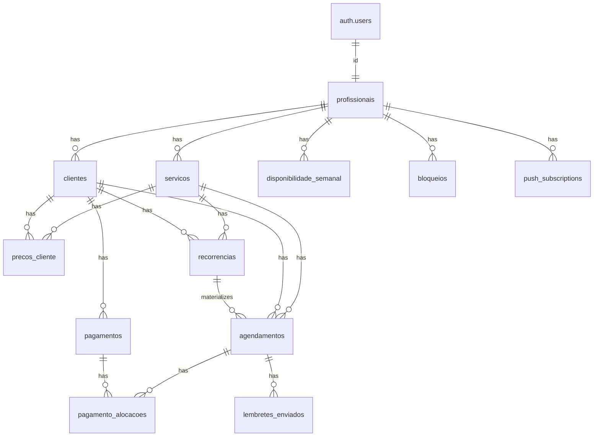
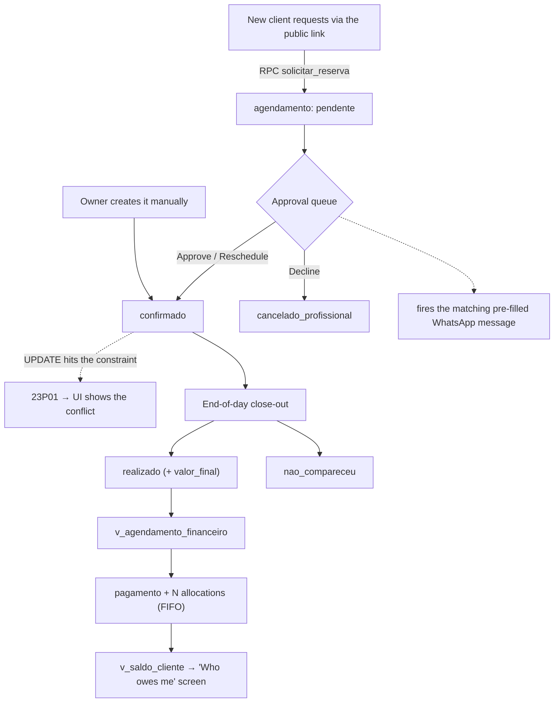

<!-- Portfolio project post (zenvv.dev). Scheduling + finance app for a
     self-employed manicurist. Screenshots in ./images/ captured from a demo
     instance with fictional data (structure identical to production).
     DB table/column names kept in Portuguese; they're real schema identifiers. -->

> **AI-assisted development**
>
> This project was developed primarily through AI-assisted coding. Architecture, requirements, business rules and technical decisions were defined and validated by me, while implementation was heavily assisted by AI.

## What the app does

- **The day as a continuous time band**: every appointment takes height
  proportional to its duration; every free gap is visibly a gap. 1-day, 3-day
  and 1-month views. A "now" line when the shown day is today.
- **Manual booking in a few taps**, with slot-conflict resolution handled by the
  database (a constraint), not the application.
- **Recurrence** weekly / biweekly / monthly, materialized into concrete
  appointments 8 weeks ahead.
- **End-of-day close-out**, a checklist of every appointment: done / no-show /
  cancelled, with an editable final amount. Target: 8 appointments in < 2 min.
- **Payments as an entity**: one received payment allocates to N appointments.
  Partial payment and running tabs work with no hacks.
- **"Who owes me"**: one card per open appointment, sortable, with a charge
  button that opens WhatsApp with the message pre-filled.
- **History** filtered by period/client, totals on top, CSV export.
- **Public form** (`/agendar/[slug]`): a new client requests a slot, it lands
  as `pendente`, and she approves / reschedules / declines from a queue that is
  a card at the top of the agenda, not a separate screen.
- **PWA + Web Push**: new-request alert (event-driven) and an appointment
  reminder (time-driven, configurable at 30 / 60 / 120 min).
- **Theme** light / dark / auto, for real, with color tokens named after the
  salon domain (`--esmalte` polish, `--creme`, `--cuticula` cuticle,
  `--terracota`).

## Stack

| Layer      | Choice                                                                 |
| ---------- | ---------------------------------------------------------------------- |
| Framework  | Next.js 16 (App Router), TypeScript strict                             |
| UI         | Tailwind CSS v4 + shadcn/ui (Base UI underneath), Phosphor + Heroicons |
| Backend    | Supabase: Postgres, Auth, **RLS as the security boundary**            |
| Serverless | Supabase Edge Functions (Deno) + `pg_cron` + `pg_net` for push         |
| Deploy     | Vercel                                                                 |
| Dates      | `date-fns` + `date-fns-tz` (DB in UTC, UI in `America/Sao_Paulo`)      |
| Forms      | `react-hook-form` + `zod`                                              |
| Motion     | `motion` (Android-style screen transitions, draggable day band)        |

No spare dependencies: money is an `integer` in cents (never `float`); phone
numbers are normalized to **E.164 on input** (`normalizarTelefone()`, used
everywhere; the phone number is the client's identity key).

## Data model

Schema in `supabase/migrations/`, numbered, validated against PostgreSQL 16.
"Cheap" multi-tenant: `profissional_id` on everything, 1 row today, N later with
no refactor.



| Table                     | Role                                                                                                                         |
| ------------------------- | ---------------------------------------------------------------------------------------------------------------------------- |
| `profissionais`           | Tenant. `id` = `auth.users.id`. Buffer, timezone, `estabelecimento` (display name), public-link `slug`, reminder offsets     |
| `servicos`                | Service: name, duration, default price, icon                                                                                 |
| `clientes`                | Client: name, E.164 phone (unique per professional), default location, address, notes                                        |
| `precos_cliente`          | Price override per client + service                                                                                          |
| `disponibilidade_semanal` | Weekly availability template: N blocks per weekday                                                                          |
| `bloqueios`               | One-off exceptions (lunch, day off, vacation)                                                                                |
| `recorrencias`            | The repetition **rule**. Not an appointment                                                                                  |
| `agendamentos`            | The concrete event. `preco_congelado_centavos` copied at creation, **never recomputed**. `fim`/`periodo` filled by a trigger |
| `pagamentos`              | A received payment (amount, date, method)                                                                                    |
| `pagamento_alocacoes`     | Links 1 payment to N appointments, with a per-appointment amount                                                             |
| `push_subscriptions`      | 1 row per owner browser (Web Push)                                                                                           |
| `lembretes_enviados`      | Anti-duplicate ledger for the reminder cron                                                                                  |

**Views** (`security_invoker = on`, real RLS): `v_agendamento_financeiro` (per
completed appointment: owed, paid, balance) and `v_saldo_cliente` (aggregated
per client, this _is_ the "who owes me" screen).

**Function:** `slots_livres(professional, date, duration, buffer, granularity)`:
crosses weekly availability, busy appointments (with buffer) and blocks.

## Business rules that live in the database

Three decisions that define the project and are **not** the application's job:

### 1. No overlap: a constraint, not a `SELECT` before `INSERT`

```sql
constraint sem_sobreposicao exclude using gist (
  profissional_id with =,
  periodo         with &&
) where (status in ('confirmado','realizado'))
```

Two simultaneous requests aren't caught by a check `SELECT`, only by a
constraint. The UI handles error `23P01` and shows _"that time is already
taken"_ + the next free slot. `pendente` is left **out** on purpose: several
clients may request the same time; she decides, at approval, and it's the
`UPDATE` to `confirmado` where the constraint may fail.

### 2. The frozen price is immutable

`preco_congelado_centavos` is copied at creation and never recomputed. A
close-out adjustment (discount, repair, extra service) goes into
`valor_final_centavos`, kept separate. History never changes retroactively: she
can see _"I quoted R$ 40, received R$ 45 because of a repair"_.

### 3. A payment is an entity, not a boolean

A `pago boolean` field on the appointment can't model _"paid R$ 130 of the
R$ 180 for 4 sessions"_. A `pagamento` has N `alocações`; a client's balance is
`Σ owed (only realizado) − Σ paid`. Partial payments and running tabs come for
free.

### Public side: `anon` has no grant on any table

The public form doesn't talk to tables, only to `SECURITY DEFINER` RPCs
(`servicos_publicos`, `dias_disponiveis`, `slots_livres`, `solicitar_reserva`).
`select * from clientes` as `anon` returns `permission denied`, stronger than
RLS, it never even evaluates a policy. The RPC validates minimum lead time
(2h), maximum window (90 days), phone format, and caps at 3 pending requests per
phone + a 10-minute per-IP cooldown (anti-flood).

## The lifecycle of an appointment



Client contact **stays on WhatsApp**: the app never tries to replace the
conversation, it only builds the deep link with the message ready (confirmation,
reschedule, day-before reminder, charge). At 6–8 clients/day, a screen with the
links ready costs ~40 s of her day and delivers ~90% of the value of an official
integration, with 0% of the risk of getting her work number banned.

## The screens

Demo instance, fictional data (structure identical to production).

### Panel: agenda

```carousel
/projects/nailly/images/02-inicio.png | Home: greeting, the day summarized as running text (never a big-number tile), the pending-requests queue and the day's shortcuts.
/projects/nailly/images/03-agenda-dia.png | The day as a continuous band: each card sized to its real duration, free gaps marked, a terracotta "now" line, pending-requests card on top.
/projects/nailly/images/04-agenda-calendario.png | Calendar drawer: switch view (1 day / 3 days / 1 month) and jump to any date.
/projects/nailly/images/05-agenda-3dias.png | 3-day view: 3 columns from today, hourly ruler.
/projects/nailly/images/06-agenda-mes.png | Month view: calendar grid with a per-day appointment count.
/projects/nailly/images/07-agendamento-form.png | New appointment: client, service (with resolved price), date, time (free slots grouped Morning/Afternoon/Evening), location and note. A warning when the time falls outside the normal grid.
/projects/nailly/images/08-atendimento-detalhe.png | Appointment detail: quoted / closed / open amount, status, and the Edit, Confirm on WhatsApp and Cancel actions.
```

### Panel: approvals

```carousel
/projects/nailly/images/09-aprovacoes.png | The pending-requests queue, grouped by day. Requests that landed on the same time get a terracotta highlight. "Confirm" opens the 3 options (Approve, Reschedule, Decline) and each one fires the matching WhatsApp message on its own.
```

### Panel: close-out and finance

```carousel
/projects/nailly/images/10-fechamento-dia.png | End-of-day close-out: "to close" on top, "closed" below. One tap on the check assumes the frozen amount (the common case); tapping the row opens it to edit. "Mark all" runs a single UPDATE ... IN (...).
/projects/nailly/images/13-receber.png | "Who owes me": one card per open appointment (not an aggregated per-client balance). Balances from v_agendamento_financeiro (money math on the server). Search + filter by date/amount/service.
/projects/nailly/images/14-pagamento-form.png | Register a payment: amount, date and method (Pix / cash / card / other). Allocation against the oldest open appointments is automatic (FIFO).
/projects/nailly/images/12-cliente-ficha.png | Client sheet: details, notes, balance (owed / paid / open), specific prices, recurrences and history. The "add" action is always the last row of the list itself, not a header button.
/projects/nailly/images/11-clientes.png | Client list: search by name/phone, outstanding balance visible, WhatsApp button, and import from a .vcf file.
/projects/nailly/images/15-historico.png | History: filter by period and client, totals on one line of text (Billed · Received · Open), and a full-width Export CSV button.
```

### Panel: settings

```carousel
/projects/nailly/images/16-config.png | Settings is a menu, not a page with sections. Reached via the gear at the top of Home.
/projects/nailly/images/17-config-servicos.png | Services: a 2-column card grid, each with an icon from a curated set, name and duration · price.
/projects/nailly/images/18-config-horarios.png | Hours: weekly template (several blocks per day), the between-appointments interval, and one-off blocks: all on one screen.
/projects/nailly/images/19-config-avisos.png | Alerts: toggle the new-request push and pick the appointment-reminder offsets (30 / 60 / 120 min).
/projects/nailly/images/20-config-tema.png | Theme: light / dark / auto, persisted in localStorage and applied before hydration so it doesn't flash.
```

### Public side: booking

```carousel
/projects/nailly/images/30-publico-intro.png | Intro: the brand logo, one sentence, one button. 17px body text for the 65-year-old in the brief.
/projects/nailly/images/31-publico-identificacao.png | Identification: first name, last name, phone with a live mask, a hidden honeypot, and LGPD consent linking to the privacy notice.
/projects/nailly/images/32-publico-servico.png | Service: large cards, tapping advances. Only active services, from the servicos_publicos RPC.
/projects/nailly/images/33-publico-horario.png | Time: only days with an opening are enabled (dias_disponiveis RPC); slots come grouped Morning / Afternoon / Evening.
/projects/nailly/images/34-publico-observacoes.png | Review + optional note before sending.
/projects/nailly/images/35-publico-enviado.png | Sent: the request lands as pendente for the owner to approve; the client is handed off to the salon's WhatsApp.
```

### Dark theme

```carousel
/projects/nailly/images/21-agenda-escuro.png | The agenda in dark theme: same color family inverted, a neutral warm-grey base, green only in the details.
/projects/nailly/images/22-inicio-escuro.png | Home in dark theme.
/projects/nailly/images/01-login.png | Login: email + password (Supabase Auth). Persistent session: she logs in once and never signs out.
```

## Architecture decisions

- **PWA, not React Native.** The public side has to be web anyway (nobody
  installs an app to book once). Expo would mean two projects, two deploys, and
  shadcn/ui doesn't run on RN. The app is list + form + table; on Android, Web
  Push is the only real gain native would bring, and it works well.
- **RLS is the boundary, not the application.** All DB access is straight from
  the client component (`lib/supabase/client.ts`), no Server Actions. Every
  table has `profissional_id` and a policy `using (profissional_id =
auth.uid())`. Isolation tested: a different `auth.uid()` → 0 clients visible.
- **`fim` and `periodo` via a trigger, not a generated column.** `timestamptz +
interval` is `STABLE`, not `IMMUTABLE`, so Postgres rejects the generated
  column. Trigger `trg_calc_periodo` fills both before every insert/update and
  can't be bypassed by anything writing directly to the DB.
- **Recurrence with no cron in the MVP.** `lib/recorrencia.ts` materializes the
  8-week window when the rule is created and, opportunistically, every time the
  agenda loads if the window is running out. She opens the app several times a
  day: in practice that replaces the daily job.
- **Push: two triggers, one secret.** New request is _event-driven_: trigger on
  `INSERT` → `pg_net` → Edge Function. The appointment reminder is _time-driven_:
  `pg_cron` every minute → Edge Function, which crosses the next 2 hours of
  `confirmado` rows with the configured offsets and an anti-duplicate ledger.
  Both read the same `webhook_secret` from Vault; `service_role` stays only in
  the Edge runtime.
- **WhatsApp by deep link, not API.** The official Cloud API needs a dedicated
  number, a verified Meta Business account, approved templates, and has a
  per-conversation cost; unofficial libraries break the ToS and can ban her work
  number. The deep link delivers the essentials at zero risk.
- **Interface by subtraction.** A 5-item bottom nav, primary actions always in
  the sheet footer (the thumb doesn't reach the top), 44px minimum touch target,
  16px minimum body text, a loading state on everything (she's on salon 4G). No
  sidebar.

---

_Demo instance with fictional data. Table and column names kept in Portuguese
because they're real identifiers in the schema._
