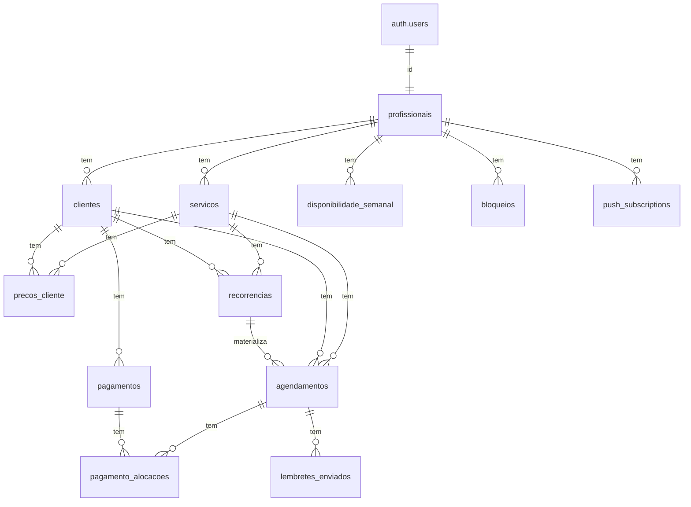
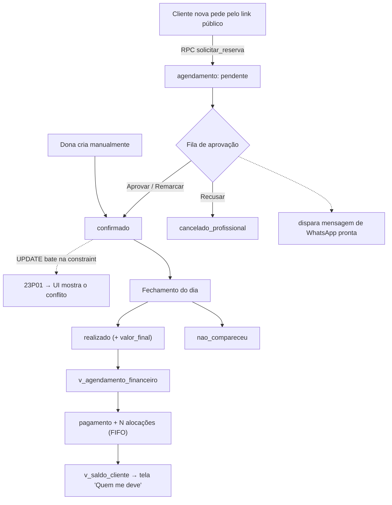

<!-- Post de projeto do portfólio (zenvv.dev). App de agenda + financeiro para
     uma manicure autônoma. Screenshots em ./images/ capturados de uma instância
     de demonstração com dados fictícios (estrutura idêntica à de produção). -->

App de **agenda e controle financeiro** para uma manicure autônoma. PWA,
mobile-first, usado quase 100% num Android, entre um atendimento e outro. Ele
substitui o Google Agenda + a cobrança informal no WhatsApp por uma ferramenta
só, feita para o fluxo real de uma profissional que atende ~6–8 clientes por
dia e recebe em lote.

## Contexto

- A usuária é uma manicure de meia-idade, cansada, com as mãos ocupadas. Não é
  dev, não é "persona": é uma pessoa real que hoje **esquece agendamentos** e
  **não lembra se já cobrou**.
- O trabalho já é mentalmente pesado (horas conversando com gente). O app existe
  para **tirar carga da cabeça dela**, não adicionar.
- Critério de escopo único: _isso reduz a carga mental dela?_ Se não, não entra.
  Se uma tela exige mais de dois toques para a tarefa mais comum, está errada.
- Ela atende entre 20 e 40 clientes fixas, com recorrência semanal, quinzenal ou
  mensal. Três são a domicílio. **Recebe pagamento em lote** — R$ 180 de uma vez
  cobrindo as 4 sessões do mês — e não por atendimento.
- Duas telas, dois públicos: o **painel dela** (autenticado, aberto dezenas de
  vezes por dia) e um **formulário público** para clientes novas pedirem
  horário (uma pessoa de 65 anos, com pressa, no 4G da rua).

## O que o app faz

- **Agenda como faixa contínua de tempo** — cada atendimento ocupa altura
  proporcional à duração, cada vão livre é visivelmente um vão. Visões de 1 dia,
  3 dias e 1 mês. Linha de "agora" quando o dia exibido é hoje.
- **Agendamento manual em poucos toques**, com resolução de conflito de horário
  feita pelo banco (constraint), não pela aplicação.
- **Recorrência** semanal / quinzenal / mensal, materializada em agendamentos
  concretos 8 semanas à frente.
- **Fechamento do dia** — checklist de todos os atendimentos: realizado / não
  veio / cancelado, com valor final editável. Meta: 8 atendimentos em < 2 min.
- **Pagamentos como entidade** — 1 recebimento aloca-se a N atendimentos.
  Suporta pagamento parcial e fiado acumulado sem gambiarra.
- **"Quem me deve"** — um card por atendimento em aberto, ordenável, com botão
  de cobrança que abre o WhatsApp com a mensagem pronta.
- **Histórico** com filtro por período/cliente, totais no topo e export CSV.
- **Formulário público** (`/agendar/[slug]`) — cliente nova pede horário, entra
  como `pendente`, e a dona aprova / remarca / recusa numa fila que é um card no
  topo da agenda, não uma tela separada.
- **PWA + Web Push** — aviso de novo pedido (event-driven) e lembrete de
  atendimento (time-driven, configurável em 30 / 60 / 120 min).
- **Tema** claro / escuro / automático de verdade, com tokens de cor nomeados
  pelo domínio do salão (`--esmalte`, `--creme`, `--cuticula`, `--terracota`).

## Stack

| Camada     | Escolha                                                               |
| ---------- | --------------------------------------------------------------------- |
| Framework  | Next.js 16 (App Router), TypeScript strict                            |
| UI         | Tailwind CSS v4 + shadcn/ui (Base UI por baixo), Phosphor + Heroicons |
| Backend    | Supabase — Postgres, Auth, **RLS como fronteira de segurança**        |
| Serverless | Supabase Edge Functions (Deno) + `pg_cron` + `pg_net` para o push     |
| Deploy     | Vercel                                                                |
| Datas      | `date-fns` + `date-fns-tz` (banco em UTC, UI em `America/Sao_Paulo`)  |
| Forms      | `react-hook-form` + `zod`                                             |
| Animação   | `motion` (transição de tela estilo Android, faixa de dia arrastável)  |

Sem dependência supérflua: dinheiro é `integer` em centavos (nunca `float`),
telefone é normalizado para **E.164 na entrada** (`normalizarTelefone()`, usada
em todo lugar — telefone é a chave de identidade da cliente).

## Modelo de dados

Schema em `supabase/migrations/`, numerado, validado contra PostgreSQL 16.
Multi-tenant "barato": `profissional_id` em tudo, 1 linha hoje, N no futuro sem
refatorar.



| Tabela                    | Papel                                                                                                                            |
| ------------------------- | -------------------------------------------------------------------------------------------------------------------------------- |
| `profissionais`           | Tenant. `id` = `auth.users.id`. Buffer, timezone, `estabelecimento`, `slug` do link público, offsets de lembrete                 |
| `servicos`                | Nome, duração, preço padrão, ícone                                                                                               |
| `clientes`                | Nome, telefone E.164 (chave única por profissional), local padrão, endereço, observações                                         |
| `precos_cliente`          | Override de preço por cliente + serviço                                                                                          |
| `disponibilidade_semanal` | Template de horário — N blocos por dia da semana                                                                                 |
| `bloqueios`               | Exceções pontuais (almoço, folga, férias)                                                                                        |
| `recorrencias`            | A **regra** de repetição. Não é agendamento                                                                                      |
| `agendamentos`            | O evento concreto. `preco_congelado_centavos` copiado na criação, **nunca recalculado**. `fim`/`periodo` preenchidos por trigger |
| `pagamentos`              | Recebimento (valor, data, forma)                                                                                                 |
| `pagamento_alocacoes`     | Liga 1 pagamento a N atendimentos, com valor por atendimento                                                                     |
| `push_subscriptions`      | 1 linha por navegador da dona (Web Push)                                                                                         |
| `lembretes_enviados`      | Livro-razão anti-duplicata do cron de lembretes                                                                                  |

**Views** (`security_invoker = on` — RLS de verdade):
`v_agendamento_financeiro` (por atendimento realizado: devido, pago, saldo) e
`v_saldo_cliente` (agregado por cliente — é a tela "quem me deve").

**Função:** `slots_livres(profissional, data, duração, buffer, granularidade)` —
cruza disponibilidade semanal, agendamentos ocupados (com buffer) e bloqueios.

## Regras de negócio que moram no banco

Três decisões que definem o projeto e que **não** são responsabilidade da
aplicação:

### 1. Sem sobreposição — constraint, não `SELECT` antes de `INSERT`

```sql
constraint sem_sobreposicao exclude using gist (
  profissional_id with =,
  periodo         with &&
) where (status in ('confirmado','realizado'))
```

Duas requisições simultâneas não são pegas por um `SELECT` de checagem — só por
uma constraint. A UI trata o erro `23P01` e mostra _"esse horário já está
ocupado"_ + o próximo livre. `pendente` fica **de fora** de propósito: várias
clientes podem pedir o mesmo horário; quem decide é a dona, na aprovação — e é
no `UPDATE` para `confirmado` que a constraint pode falhar.

### 2. Preço congelado é imutável

`preco_congelado_centavos` é copiado no momento da criação e nunca recalculado.
Ajuste de fechamento (desconto, reparo, serviço extra) vai em
`valor_final_centavos`, separado. O histórico nunca muda retroativamente — ela
consegue ver _"cobrei R$ 40, recebi R$ 45 porque teve reparo"_.

### 3. Pagamento é entidade, não booleano

Um campo `pago boolean` no agendamento não modela _"pagou R$ 130 dos R$ 180 de 4
sessões"_. Um `pagamento` tem N `alocações`; o saldo do cliente é
`Σ devido (só realizado) − Σ pago`. Parcial e fiado acumulado saem de graça.

### Lado público: `anon` não tem grant em tabela nenhuma

O formulário público não fala com tabelas — só com RPCs `SECURITY DEFINER`
(`servicos_publicos`, `dias_disponiveis`, `slots_livres`, `solicitar_reserva`).
`select * from clientes` como `anon` retorna `permission denied` — mais forte
que RLS, nem chega a avaliar policy. A RPC valida antecedência mínima (2h),
janela máxima (90 dias), formato do telefone, e limita a 3 pendentes por
telefone + cooldown de 10 min por IP (anti-flood).

## Fluxo de um agendamento



O contato com a cliente **continua sendo WhatsApp** — o app nunca tenta
substituir a conversa, só monta o deep link com a mensagem pronta (confirmação,
remarcação, lembrete de véspera, cobrança). Com 6–8 clientes/dia, uma tela com
os links prontos custa ~40 s do dia dela e entrega ~90% do valor de uma
integração oficial, com 0% do risco de banir o número de trabalho.

## As telas

Instância de demonstração, dados fictícios — estrutura idêntica à de produção.

### Painel — agenda

```carousel
/projects/nailly/images/02-inicio.png | Início: saudação, resumo do dia em texto corrido (nunca tile de número grande), fila de pendências e os atalhos do dia.
/projects/nailly/images/03-agenda-dia.png | Agenda do dia como faixa contínua: cada card com altura proporcional à duração, vãos livres marcados, linha de "agora" em terracota, card de pendências no topo.
/projects/nailly/images/04-agenda-calendario.png | Drawer do calendário: troca de visão (1 dia / 3 dias / 1 mês) e salto para qualquer data.
/projects/nailly/images/05-agenda-3dias.png | Visão de 3 dias — 3 colunas a partir de hoje, faixa de 1 em 1 h.
/projects/nailly/images/06-agenda-mes.png | Visão de mês — grade de calendário com a contagem de atendimentos por dia.
/projects/nailly/images/07-agendamento-form.png | Novo agendamento: cliente, serviço (com preço resolvido), data, horário (slots livres agrupados em Manhã/Tarde/Noite), local e observação. Aviso quando o horário cai fora da grade.
/projects/nailly/images/08-atendimento-detalhe.png | Detalhe do atendimento: valor combinado / fechado / em aberto, status, e as ações Editar, Confirmar no WhatsApp e Cancelar.
```

### Painel — aprovações

```carousel
/projects/nailly/images/09-aprovacoes.png | Fila dos pedidos pendentes, agrupada por dia. Pedidos que caíram no mesmo horário ganham destaque terracota. "Confirmar" abre as 3 opções — Aprovar, Remarcar, Recusar — e cada uma dispara sozinha a mensagem de WhatsApp correspondente.
```

### Painel — fechamento e financeiro

```carousel
/projects/nailly/images/10-fechamento-dia.png | Fechamento do dia: "a fechar" em cima, "fechados" embaixo. Um toque no check assume o valor congelado (caso comum); tocar na linha abre para editar. "Marcar todos" faz um único UPDATE ... IN (...).
/projects/nailly/images/13-receber.png | "Quem me deve" — um card por atendimento em aberto (não um saldo agregado por cliente). Saldo vindo de v_agendamento_financeiro (money math no servidor). Busca + filtro por data/valor/serviço.
/projects/nailly/images/14-pagamento-form.png | Registrar pagamento: valor, data e forma (Pix / dinheiro / cartão / outro). A alocação contra os atendimentos em aberto mais antigos é automática (FIFO).
/projects/nailly/images/12-cliente-ficha.png | Ficha da cliente: dados, observações, saldo (devido / pago / em aberto), preços específicos, recorrências e histórico. A ação de adicionar é sempre a última linha da própria lista, não um botão no cabeçalho.
/projects/nailly/images/11-clientes.png | Lista de clientes: busca por nome/telefone, saldo devedor visível, botão de WhatsApp e importação por arquivo .vcf.
/projects/nailly/images/15-historico.png | Histórico: filtro por período e cliente, totais em uma linha de texto (Faturado · Recebido · Em aberto) e Exportar CSV em botão de largura total.
```

### Painel — configuração

```carousel
/projects/nailly/images/16-config.png | Config é um menu, não uma página com seções. Chega-se pela engrenagem no topo do Início.
/projects/nailly/images/17-config-servicos.png | Serviços: grid de cards 2 colunas, cada um com ícone de uma grade curada, nome e duração · preço.
/projects/nailly/images/18-config-horarios.png | Horários: template semanal (vários blocos por dia), intervalo entre atendimentos e bloqueios pontuais — tudo numa tela.
/projects/nailly/images/19-config-avisos.png | Avisos: liga/desliga o push de novo pedido e escolhe os offsets do lembrete de atendimento (30 / 60 / 120 min).
/projects/nailly/images/20-config-tema.png | Tema: claro / escuro / automático, persistido em localStorage e aplicado antes da hidratação para não piscar.
```

### Lado público — reserva

```carousel
/projects/nailly/images/30-publico-intro.png | Intro: logo da marca, uma frase, um botão. Corpo de texto a 17px para a pessoa de 65 anos do briefing.
/projects/nailly/images/31-publico-identificacao.png | Identificação: nome, sobrenome, celular com máscara ao vivo, honeypot escondido e consentimento LGPD com link para o aviso de privacidade.
/projects/nailly/images/32-publico-servico.png | Serviço: cards grandes, tocar já avança. Só serviços ativos, vindos da RPC servicos_publicos.
/projects/nailly/images/33-publico-horario.png | Horário: só os dias com vaga ficam habilitados (RPC dias_disponiveis); os slots vêm agrupados em Manhã / Tarde / Noite.
/projects/nailly/images/34-publico-observacoes.png | Revisão + observação opcional antes de enviar.
/projects/nailly/images/35-publico-enviado.png | Enviado: o pedido entra como pendente para a dona aprovar; a cliente é levada ao WhatsApp do salão.
```

### Tema escuro

```carousel
/projects/nailly/images/21-agenda-escuro.png | A agenda no tema escuro — mesma família de cor invertida, base cinza-quente neutra, verde só nos detalhes.
/projects/nailly/images/22-inicio-escuro.png | O Início no tema escuro.
/projects/nailly/images/01-login.png | Login: e-mail + senha (Supabase Auth). Sessão persistente — ela loga uma vez e nunca desloga.
```

## Decisões de arquitetura

- **PWA, não React Native.** A parte pública tem que ser web de qualquer jeito
  (ninguém instala app para agendar uma vez). Expo seriam dois projetos, dois
  deploys, e shadcn/ui não roda em RN. O app é lista + formulário + tabela — no
  Android o Web Push é o único ganho real do nativo, e ele funciona bem.
- **RLS é a fronteira, não a aplicação.** Todo acesso ao banco é direto do
  client component (`lib/supabase/client.ts`), sem Server Actions. Toda tabela
  tem `profissional_id` e policy `using (profissional_id = auth.uid())`.
  Isolamento testado: outro `auth.uid()` → 0 clientes visíveis.
- **`fim` e `periodo` por trigger, não generated column.** `timestamptz +
interval` é `STABLE`, não `IMMUTABLE` — o Postgres recusa a generated column.
  O trigger `trg_calc_periodo` preenche os dois antes de todo insert/update e
  não pode ser burlado por quem escrever direto no banco.
- **Recorrência sem cron no MVP.** `lib/recorrencia.ts` materializa a janela de
  8 semanas ao criar a regra e, oportunisticamente, toda vez que a agenda
  carrega, se a janela estiver acabando. Ela abre o app várias vezes por dia —
  na prática substitui o job diário.
- **Push: dois gatilhos, um segredo.** Novo pedido é _event-driven_ — trigger no
  `INSERT` → `pg_net` → Edge Function. Lembrete de atendimento é _time-driven_ —
  `pg_cron` de minuto em minuto → Edge Function, que cruza os `confirmado` das
  próximas 2 h com os offsets configurados e um livro-razão anti-duplicata.
  Ambas leem o mesmo `webhook_secret` do Vault; a `service_role` fica só no
  runtime Edge.
- **WhatsApp por deep link, não API.** A Cloud API oficial exige número
  dedicado, conta Meta Business verificada, templates aprovados e tem custo por
  conversa; bibliotecas não oficiais violam os ToS e podem banir o número dela.
  O deep link entrega o essencial com risco zero.
- **Interface por subtração.** Bottom nav de 5 itens, ações primárias sempre no
  rodapé do sheet (o polegar não alcança o topo), alvo de toque mínimo 44px,
  corpo de texto mínimo 16px, estado de carregamento em tudo (ela está no 4G do
  salão). Nada de sidebar, nada de card grid genérico de métrica.

---

_Instância de demonstração com dados fictícios. Nomes de tabela e coluna
mantidos em português porque são identificadores reais do schema._
