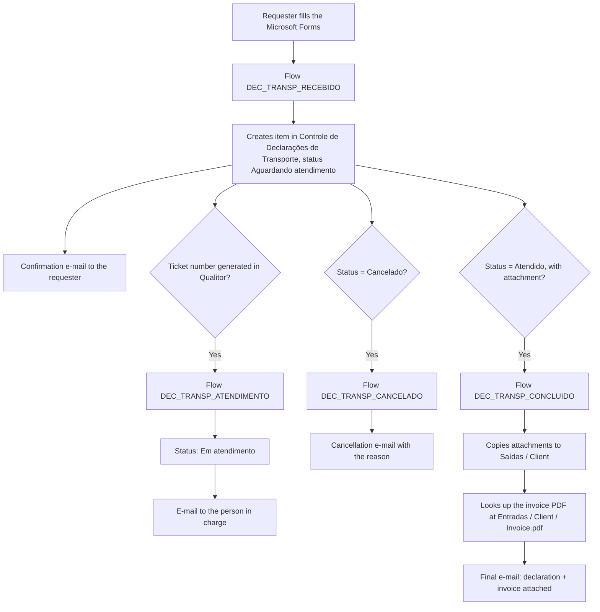
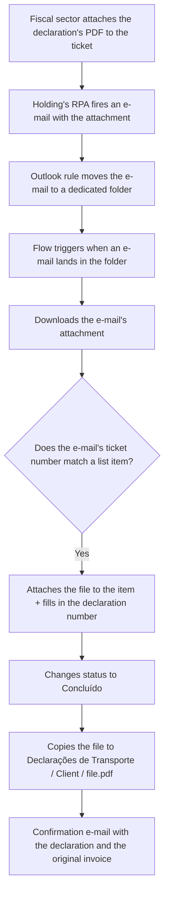
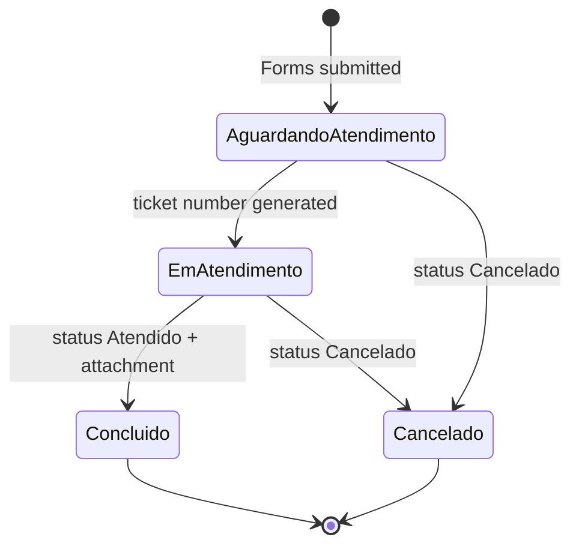

<!-- English version of pt.md. Flow names and list names kept as the real
     internal ones (consistent with the rest of the CTR posts); prose
     translated. Keep the two files in sync. -->

At CTR (Centro Tecnológico Randon), every vehicle test sample received from a client (a body, chassis, whole vehicle, part) arrives with an invoice. To return the sample, a **Transportation Declaration** often has to be issued: a substitute document, used because CTR has no state tax registration and can't issue its own invoices. I redesigned this flow end to end (request, issuance by the holding's fiscal sector, and the invoice's return) on the same `Controle de Declarações de Transporte` list that feeds the [Sample Checklists](/projects/amostras-checklists) lookup panel.

## How it works

- A single **Microsoft Forms** replaced requests sent over Teams, e-mail, in person or on a sticky note. Every response becomes an item in the `Controle de Declarações de Transporte` list, which doubles as a queue and an index: you can check any request's status and look up whether a given invoice has already been returned.
- When a sample arrives, the warehouse scans the invoice and saves it into a standard directory, organized by client folder. That made it possible to add a formula to the list that builds the PDF's link straight from the invoice number and client. Without that habit, every issuance meant digging through physical folders.
- Every status change sends a custom HTML e-mail to the requester (cc'd to logistics): received, in progress, completed with attachments, or cancelled with the reason.
- The fiscal paperwork itself still runs through Qualitor, outside CTR: the holding's fiscal sector is who fills in and signs the declaration. What changed is everything around it: the request, the tracking, and getting the final PDF back.

## From request to completion

The four flows don't talk to each other directly: each one reacts to a change on the same list. `DEC_TRANSP_ATENDIMENTO`, for instance, doesn't look for "Status = Aguardando atendimento": its real trigger is the ticket-number column having changed, which is what pushes the status forward.

## Automatic PDF capture

The most specific part of the flow: once the fiscal sector issues the declaration and attaches the PDF to the ticket, an RPA run by the holding fires off an e-mail with the file. Before this, someone at CTR had to periodically open Qualitor just to check whether it was out yet. An Outlook rule moves that e-mail into a dedicated folder, and a flow cross-references the e-mail's ticket number against the pending list item to fetch the file on its own.

## Request lifecycle

## Data model

**`Controle de Declarações de Transporte`** (main fields)

| Column | Type | Description |
| --- | --- | --- |
| `Solicitante` | Person | Who filled in the form |
| `Prioridade` | Choice | Urgency stated on the request |
| `Tipo` | Choice | Return or Exit |
| `Operação` | Text | CFOP/reason for the exit (repair, maintenance, external test), or the receiving invoice's data if it's a return |
| `Destinatário` | Text | Name + tax ID, combined from two form answers |
| `Nota Fiscal` | Text | Invoice number linked to the request |
| `Transportadora` | Text | Selected carrier, or free text when "Other" |
| `Data de Retorno/Saída` | Date | Expected date stated on the request |
| `Materiais` | Text | Material description, line by line |
| `Número do Chamado` | Text | Filled in when the Qualitor ticket is opened; its change triggers `DEC_TRANSP_ATENDIMENTO` |
| `Número da Declaração` | Text | Filled in automatically once the PDF is captured by e-mail |
| `Status` | Choice | Aguardando atendimento, Em atendimento, Concluído, Cancelado |
| `Status OBS` | Text | Cancellation reason |

## Architecture decisions

- **A SharePoint list instead of Excel.** Power Automate handles indexed-row updates far more reliably against a SharePoint list than against Excel, the same reasoning used across the rest of the CTR ecosystem.
- **Standardized scanning as a prerequisite for the automatic link.** The formula that resolves the invoice's PDF only works because the folder convention (by client) and the scan timing (on arrival) became an operational habit, not just a technical feature.
- **PDF capture by e-mail, not by querying Qualitor.** Qualitor exposes no API to read tickets; the viable path was intercepting the e-mail the holding's RPA already sends, matched by ticket number.
- **`DEC_TRANSP_CANCELADO` re-sends on any later edit.** It only checks whether the current status is Cancelado, not whether it just changed to that value; unlike `DEC_TRANSP_ATENDIMENTO`, which explicitly checks the column change. A known point for improvement, with no practical impact so far.
