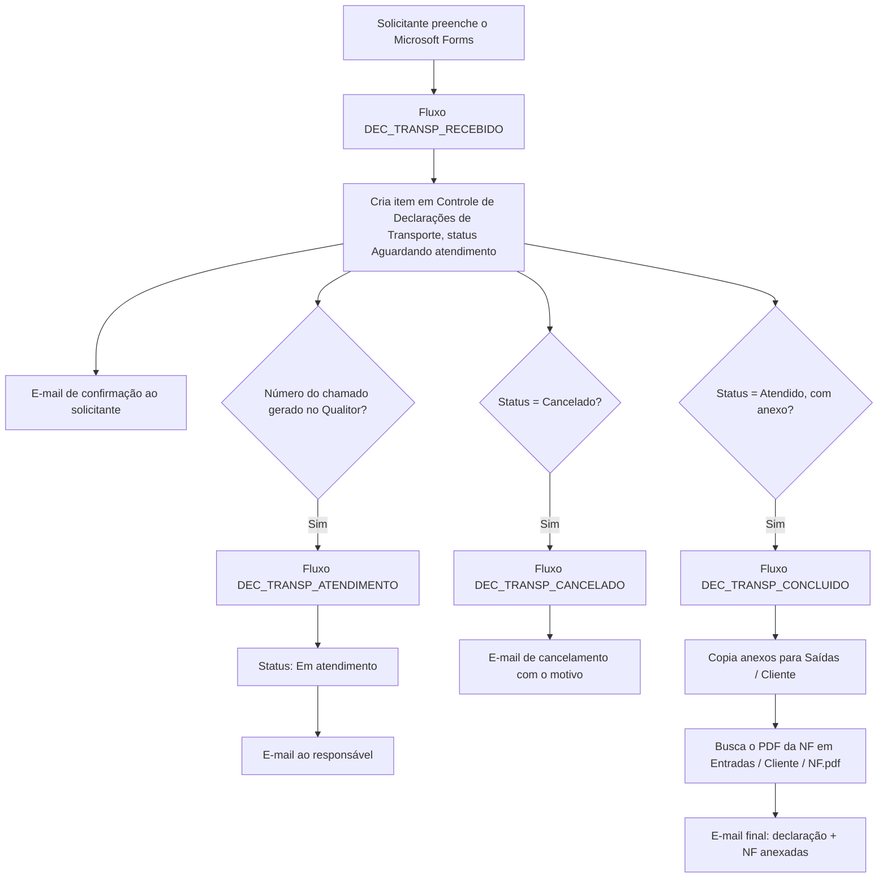
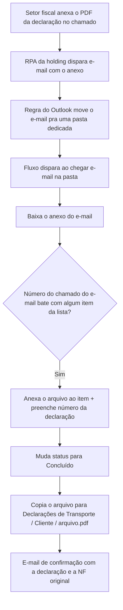
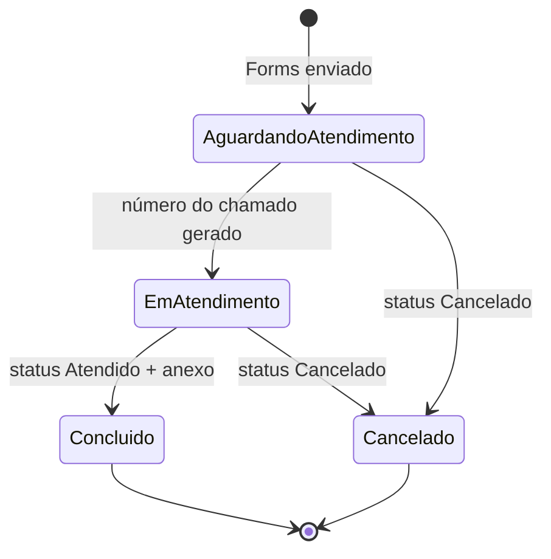

<!-- Post de portfólio (flagship). Fonte: .todo/ctr/automacaoNFs.md e
     .todo/ctr/documentacao-fluxos-declaracoes-transporte.md (docs dos 4 fluxos,
     gerada a partir dos exports JSON do Power Automate). Sem app próprio: é
     Forms + SharePoint List + Power Automate. Nomes de coluna simplificados
     pra leitura (o export JSON só expõe field_0, field_4 etc., sem o nome
     amigável). Sem imagens ainda (sem acesso ao ambiente real do CTR). -->

No CTR (Centro Tecnológico Randon), toda amostra de teste veicular recebida de um cliente (carroceria, chassi, veículo inteiro, peça) chega junto de uma nota fiscal. Pra devolver a amostra, muitas vezes é preciso emitir uma **Declaração de Transporte**: documento substituto, usado porque o CTR não tem inscrição estadual e não pode emitir notas fiscais próprias. Redesenhei esse fluxo de ponta a ponta (pedido, emissão pelo setor fiscal da holding e retorno da nota) sobre a mesma lista `Controle de Declarações de Transporte` que alimenta o painel de consulta do projeto [Amostras e Checklists](/projects/amostras-checklists).

## Como funciona

- Um **Microsoft Forms** único substituiu os pedidos por Teams, e-mail, pessoalmente ou post-it. Cada resposta vira um item na lista `Controle de Declarações de Transporte`, que funciona como fila e como índice: dá pra ver o status de qualquer solicitação e procurar se uma nota fiscal específica já retornou.
- Ao chegar uma amostra, o almoxarifado escaneia a nota fiscal e salva num diretório padrão, organizado por pasta de cliente. Isso possibilitou uma fórmula na lista que monta o link do PDF direto a partir do número da nota e do cliente. Sem esse hábito, cada emissão exigia vasculhar pastas físicas.
- A cada mudança de status, um e-mail HTML customizado sai pro solicitante (com cópia pra logística): recebido, em atendimento, concluído com anexos, ou cancelado com o motivo.
- O trâmite fiscal em si continua no Qualitor, fora do CTR: quem preenche e assina a declaração é o setor fiscal da holding. O que mudou foi tudo em volta: pedido, rastreio e retorno do PDF final.

## Do pedido à conclusão

Os quatro fluxos não conversam entre si diretamente: cada um reage a uma mudança na mesma lista. `DEC_TRANSP_ATENDIMENTO`, por exemplo, não procura por "Status = Aguardando atendimento": o evento real é a coluna do número do chamado ter mudado, o que empurra o status pra frente.

## Captura automática do PDF

A parte mais específica do fluxo: depois que o setor fiscal emite a declaração e anexa o PDF no chamado, um RPA da holding dispara um e-mail com o arquivo. Antes, alguém do CTR precisava abrir o Qualitor periodicamente pra ver se já tinha saído. Uma regra do Outlook move esse e-mail pra uma pasta dedicada, e um fluxo cruza o número do chamado do e-mail com o item pendente na lista pra buscar o arquivo sozinho.

## Ciclo de vida da solicitação

## Modelo de dados

**`Controle de Declarações de Transporte`** (campos principais)

| Coluna | Tipo | Descrição |
| --- | --- | --- |
| `Solicitante` | Person | Quem preencheu o formulário |
| `Prioridade` | Choice | Urgência informada no pedido |
| `Tipo` | Choice | Retorno ou Saída |
| `Operação` | Text | CFOP/motivo da saída (conserto, manutenção, teste externo), ou os dados da NF de recebimento se for retorno |
| `Destinatário` | Text | Nome + CNPJ, combinação de duas respostas do formulário |
| `Nota Fiscal` | Text | Número da NF vinculada à solicitação |
| `Transportadora` | Text | Transportadora selecionada, ou texto livre quando "Outra" |
| `Data de Retorno/Saída` | Date | Data prevista informada no pedido |
| `Materiais` | Text | Descrição dos materiais, linha a linha |
| `Número do Chamado` | Text | Preenchido ao abrir o chamado no Qualitor; sua alteração dispara `DEC_TRANSP_ATENDIMENTO` |
| `Número da Declaração` | Text | Preenchido automaticamente quando o PDF é capturado por e-mail |
| `Status` | Choice | Aguardando atendimento, Em atendimento, Concluído, Cancelado |
| `Status OBS` | Text | Motivo do cancelamento |

## Decisões de arquitetura

- **Lista do SharePoint em vez de Excel.** Power Automate manipula linha indexada de forma muito mais confiável no SharePoint do que no Excel, mesmo raciocínio usado no resto do ecossistema CTR.
- **Digitalização padronizada como pré-requisito pro link automático.** A fórmula que resolve o PDF da NF só funciona porque a nomenclatura de pasta (por cliente) e o momento do scan (na chegada) viraram hábito operacional, não só um recurso técnico.
- **Captura de PDF por e-mail, não por consulta ao Qualitor.** O Qualitor não expõe API pra ler chamados; o caminho viável foi interceptar o e-mail que o RPA da holding já dispara, casando pelo número do chamado.
- **`DEC_TRANSP_CANCELADO` reenvia em qualquer edição posterior.** Ele só checa se o status atual é Cancelado, não se acabou de mudar pra esse valor; diferente de `DEC_TRANSP_ATENDIMENTO`, que verifica explicitamente a alteração da coluna. Ponto conhecido de melhoria, sem impacto prático até hoje.
