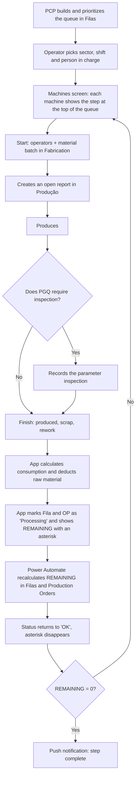
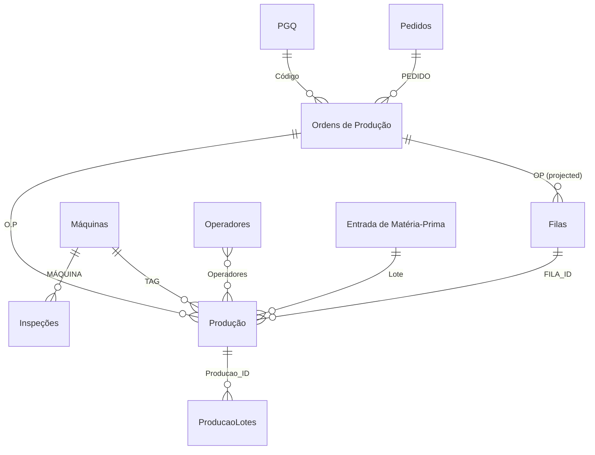

<!-- English version of pt.md. SharePoint list/column names are kept in their
     original Portuguese because they're real identifiers in the system; prose
     is translated. Keep the two files in sync. -->

Shop-floor app for the Piracicaba plant. For every machine it shows what to
produce now, in the right order, and records each report already subtracting it
from what's left. Runs on a tablet, used by the whole plant's operation.

## Context

- There was no production control on the shop floor.
- What existed was an Excel spreadsheet cross-referencing orders, products and
  quantities, but the result never reached the person at the machine.
- The operator had no way to know which order to prioritize, how much had
  already been done, or when to stop for inspection.
- Audience: production operators with no familiarity with technology. Most of
  the design decisions were about **what to take off the screen**.

## What the app does

- Consumes a **production queue** per machine (list `Filas`), assembled and
  prioritized by PCP (production planning) in another app.
- The operator picks **sector**, shift and person in charge, and sees the
  machines screen: each machine shows the step at the top of its queue, the
  hourly target and the remaining quantity.
- Operator cycle at each machine: **Start** → produce → **Finish**.
- On start: selects operators and, in Fabrication, the raw-material batch.
  Creates an open report in the `Produção` list.
- During production: if the step's quality plan (`PGQ`) requires it, the app
  enforces the **parameter inspection** before allowing a finish.
- On finish: enters quantity produced, scrap and rework. The app calculates
  material consumption, deducts from the raw-material batch and closes the
  report.
- Every relevant action writes an audit row to `LOG` (person in charge, shift,
  message).

## The three sector logics

| Sector          | What the operator enters                  | Particularity                                                                               |
| --------------- | ----------------------------------------- | ------------------------------------------------------------------------------------------- |
| **Fabrication** | Operator, material batch, machine counter | Quantity produced = final counter minus initial. Deducts from the raw-material batch.       |
| **Assembly**    | Operator, quantity                        | Split into two machine groups, **Schlatter** and **Projection**, shown as separate screens. |
| **Finishing**   | Operator, quantity                        | Last step in the sequence.                                                                  |

The production order of an item is always Fabrication, then Assembly, then
Finishing. The three machine screens are **the same screen** (`MAQUINAS`),
changing only the collection filter.

## Main flow



**Why the asterisk.** Right after a report, the remaining quantity shows as
`* 994 UN`: it's a **local estimate** by the app while the official recalculation
runs in the background in Power Automate. The flow `OP_PROD_ATUALIZA_RESTANTES`:

- Triggers when an item in `Produção` is created or changed (check every 3 min).
- **Creation:** subtracts the quantity produced from the `RESTANTE` (remaining)
  of the queue and of the production order.
- **Edit:** reads the **last two versions** of the report via the SharePoint
  REST API and applies only the difference. This is what can't be done reliably
  on the client, because it would require storing the previous state of every
  report.
- Marks the row as synced (the asterisk disappears) and, if the remaining
  reaches zero, sends a push notification.

## Data model

Relationships resolved inside the app (text or ID comparison), not as native
Lookups between sites. Exception: the `OP: ...` fields on the `Filas` list are a
**projected** Lookup, pulling several production-order fields embedded into the
queue row.



| List                 | Site        | Role                                                                      |
| -------------------- | ----------- | ------------------------------------------------------------------------- |
| `Ordens de Produção` | Operation   | One process step of an order, with target and balance (`RESTANTE`)        |
| `Filas`              | Operation   | The production order allocated to a machine, with `POS` defining priority |
| `Produção`           | Operation   | The report: who, when, how much produced, scrap, consumption              |
| `ProducaoLotes`      | Operation   | Material batches of a report (1 report to N batches)                      |
| `PGQ`                | Engineering | Quality plan per product/step: target, mass, inspection cadence           |
| `Máquinas`           | Operation   | Equipment register and each one's inspection parameters                   |
| `Operadores`         | Operation   | Operator register, sector and machine group                               |
| `Inspeções` / `LOG`  | Operation   | Record of each inspection and audit trail of every action                 |

Supporting, read-only: `Pedidos` and `Clientes` (Sales), `Produtos` and
`Documentos` (Engineering), `Entrada de Matéria-Prima` (Logistics).

**`Filas`** (main fields)

| Column                                | Type   | Description                                                 |
| ------------------------------------- | ------ | ----------------------------------------------------------- |
| `MAQUINA`                             | Text   | TAG of the machine that runs the step                       |
| `POS`                                 | Number | Position in the queue (1 = next)                            |
| `HABILITADO`                          | Text   | Whether the previous step is already complete               |
| `PRODUZIR` / `RESTANTE` / `DESCARTES` | Number | Target and balance of the step                              |
| `Status`                              | Choice | Row sync (`Processando` while the flow hasn't recalculated) |
| `OP`, `OP: PEDIDO`, `OP: CÓDIGO`, ... | Lookup | Production-order fields pulled along                        |

**`Produção`** (main fields)

| Column                                             | Type          | Description                                 |
| -------------------------------------------------- | ------------- | ------------------------------------------- |
| `O.P` / `FILA_ID`                                  | Text / Number | OP and queue row that originated the report |
| `Máquina` / `Operadores` / `Responsável` / `Turno` | Text / Number | Report context                              |
| `Início` / `Fim`                                   | DateTime      | An open report has an empty `Fim`           |
| `Contador Inicial` / `Contador Final`              | Number        | Machine reading (Fabrication)               |
| `Produção` / `Descartes` / `Retrabalho`            | Number        | Report result                               |
| `Consumo Kg`                                       | Text          | Mass consumed, calculated at finish         |
| `Última Inspeção` / `Próxima Inspeção`             | DateTime      | Inspection-cadence control                  |

## Screens

Demo version, fictional data (structure identical to the real one).

### Entry and machines panel

<figure><figcaption>Entry: sector, person in charge and shift. The only screen where the operator selects something about themselves.</figcaption></figure>
<figure><figcaption>Machines panel: step at the top of the queue, hourly target, remaining quantity and the actions Start, Queues, Report. A machine with no queue shows "no work assigned".</figcaption></figure>
<figure><figcaption>Machine in production: elapsed-time counter, operators in the tooltip, countdown to the next inspection.</figcaption></figure>
<figure><figcaption>When the inspection falls due, the card is locked until the inspection is recorded.</figcaption></figure>
<figure><figcaption>Right after a report, the remaining quantity shows with an asterisk: a local estimate while Power Automate recalculates.</figcaption></figure>

### Start production (4-step wizard)

<figure><figcaption>1/4: who is at the machine.</figcaption></figure>
<figure><figcaption>2/4 (Fabrication): the machine's initial counter, with explicit confirmation.</figcaption></figure>
<figure><figcaption>3/4 (Fabrication): raw-material batch(es) used in production.</figcaption></figure>
<figure><figcaption>4/4: summary before starting.</figcaption></figure>
<figure><figcaption>Summary with all data filled in, Start Production button.</figcaption></figure>

### Parameter inspection

<figure><figcaption>Numeric parameter, with a shortcut to the part's technical drawing.</figcaption></figure>
<figure><figcaption>Production report: numeric parameter.</figcaption></figure>
<figure><figcaption>Boolean parameter: Conforming, N/A or Non-conforming. Each parameter's type comes from the machine register.</figcaption></figure>
<figure><figcaption>Optional additional comments at the end of the report.</figcaption></figure>

### Finish production (3-step wizard)

<figure><figcaption>1/3: final counter, scrap and rework, with examples in the placeholder.</figcaption></figure>
<figure><figcaption>1/3 filled in.</figcaption></figure>
<figure><figcaption>2/3: confirmation of the start and end times.</figcaption></figure>
<figure><figcaption>3/3: report summary before saving.</figcaption></figure>
<figure><figcaption>Loading state while saving.</figcaption></figure>

## Key formulas

**What the machine should be doing right now.** For each machine in the sector,
it resolves the step at position 1 of the queue and the open report:

```powerfx
ClearCollect(tableMaquinas,
    AddColumns(
        Filter(Máquinas, 'Setor (SetorPai)' = currentSetor),
        PrimeiraFila,  LookUp(Filas, MAQUINA = TAG && POS = 1 && Value(HABILITADO) = 1),
        ProducaoAtiva, LookUp(Produção, Máquina = TAG && Início <> Blank() && Fim = Blank())
    )
)
```

**Remaining quantity with a local estimate.** If the queue row is
`Processando`, it prefixes `*` and subtracts the last report on the spot,
instead of waiting for the flow's number:

```powerfx
$"{If(fila.Status.Value = "Processando", "* ", "")}{
    fila.RESTANTE - If(fila.Status.Value = "Processando",
        Last(Filter(Produção, Máquina = ThisItem.TAG && Fim <> Blank())).Produção, 0)
} UN"
```

## Architecture decisions

- **Materialized queue, not computed.** Each machine's order is stored in
  `Filas` (`POS`), editable by PCP and cheap to read on a tablet over a plant
  network.
- **Projected Lookup on the queue.** The machines screen shows everything it
  needs without opening the production order one item at a time.
- **Interface by subtraction.** One machines screen, three actions always in
  the same place, no free text input where it can be avoided. The three sector
  logics run over the same screen with different filters.
- **Optimistic UI + asynchronous recalculation.** The app shows an estimate of
  the remaining quantity immediately; the official number comes from Power
  Automate, which handles edited reports by reading the SharePoint version
  history. The operator never waits for a screen to load to see the effect of
  what they reported.
- **Two apps over the same base.** `pcp` is for the planner to build and
  prioritize; `controle-operacional` is for the operator to receive and report.
  The separation exists because there's a hierarchy of who can see what: the
  operator doesn't see the planning, only their own queue.
- **Auditing in its own list (`LOG`).** Makes it possible to reconstruct what
  happened on a machine on a given day without relying on anyone's memory.
