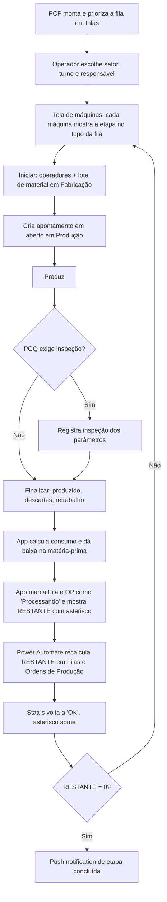
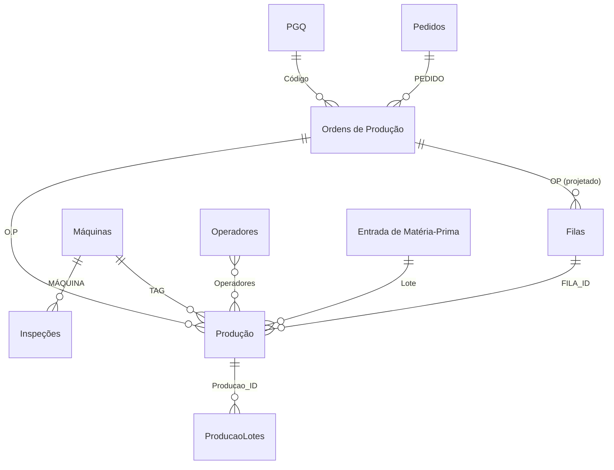

<!-- RASCUNHO Claude v2 — versão enxuta (feedback: v1 tava longa/densa demais).
     Foco em bullets, tabelas, Mermaid e imagens. Power Automate fundido no "Fluxo principal".
     Todas as 19 telas incluídas. Revisar tom e cortes. -->

App de chão de fábrica da unidade de Piracicaba. Mostra pra cada máquina o que produzir agora, na ordem certa, e registra cada apontamento já descontando do que falta. Roda em tablet, usado pela operação inteira da fábrica.

## Contexto

- Não existia controle de produção no chão de fábrica.
- O que existia era uma planilha de Excel que cruzava pedidos, produtos e quantidades, mas o resultado não chegava a quem estava na máquina.
- O operador não tinha como saber qual pedido priorizar, quanto já tinha sido feito, nem quando parar pra inspeção.
- Público: operadores de produção sem familiaridade com tecnologia. A maior parte das decisões de projeto foi sobre **o que tirar da tela**.

## O que o app faz

- Consome uma **fila de produção** por máquina (lista `Filas`), montada e priorizada pelo PCP em outro app.
- O operador escolhe **setor**, turno e responsável, e vê a tela de máquinas: cada máquina mostra a etapa no topo da sua fila, a meta por hora e a quantidade restante.
- Ciclo do operador em cada máquina: **Iniciar** → produzir → **Finalizar**.
- Ao iniciar: seleciona operadores e, em Fabricação, o lote de matéria-prima. Cria um apontamento em aberto na lista `Produção`.
- Durante a produção: se o plano de qualidade (`PGQ`) da etapa exige, o app cobra a **inspeção de parâmetros** antes de deixar finalizar.
- Ao finalizar: informa quantidade produzida, descartes e retrabalho. O app calcula o consumo de material, dá baixa no lote de matéria-prima e fecha o apontamento.
- Toda ação relevante grava uma linha de auditoria em `LOG` (responsável, turno, mensagem).

## As três lógicas de setor

| Setor          | O que o operador informa                        | Particularidade                                                                                      |
| -------------- | ----------------------------------------------- | ---------------------------------------------------------------------------------------------------- |
| **Fabricação** | Operador, lote de material, contador da máquina | Quantidade produzida = contador final menos inicial. Dá baixa no lote de matéria-prima.              |
| **Montagem**   | Operador, quantidade                            | Dividida em dois grupos de máquinas,**Schlatter** e **Projeção**, que aparecem como telas separadas. |
| **Acabamento** | Operador, quantidade                            | Última etapa da sequência.                                                                           |

A ordem de produção de um item é sempre Fabricação, depois Montagem, depois Acabamento. As três telas de máquina são **a mesma tela** (`MAQUINAS`), mudando só o filtro da coleção.

## Fluxo principal



**Por que o asterisco.** Logo depois de um apontamento, a quantidade restante aparece como `* 994 UN`: é uma **estimativa local** do app enquanto o recálculo oficial roda em segundo plano no Power Automate. O fluxo `OP_PROD_ATUALIZA_RESTANTES`:

- Dispara quando um item de `Produção` é criado ou alterado (verificação a cada 3 min).
- **Criação:** desconta a quantidade produzida do `RESTANTE` da fila e da ordem de produção.
- **Edição:** lê as **duas últimas versões** do apontamento pela API REST do SharePoint e aplica só a diferença. Isso é o que não dá pra fazer de forma confiável no cliente, porque exigiria guardar o estado anterior de cada apontamento.
- Marca a linha como sincronizada (o asterisco some) e, se o restante zera, manda uma notificação push.

## Modelo de dados

Relações resolvidas dentro do app (comparação de texto ou ID), não como Lookup nativo entre sites. Exceção: os campos `OP: ...` da lista `Filas` são um Lookup **projetado**, que traz vários campos da ordem de produção embutidos na linha da fila.



| Lista                | Site       | Papel                                                                      |
| -------------------- | ---------- | -------------------------------------------------------------------------- |
| `Ordens de Produção` | Operação   | Uma etapa de processo de um pedido, com meta e saldo (`RESTANTE`)          |
| `Filas`              | Operação   | A ordem de produção alocada a uma máquina, com`POS` definindo a prioridade |
| `Produção`           | Operação   | O apontamento: quem, quando, quanto produziu, descartes, consumo           |
| `ProducaoLotes`      | Operação   | Lotes de material de um apontamento (1 apontamento para N lotes)           |
| `PGQ`                | Engenharia | Plano de qualidade por produto/etapa: meta, massa, cadência de inspeção    |
| `Máquinas`           | Operação   | Cadastro do equipamento e os parâmetros de inspeção de cada um             |
| `Operadores`         | Operação   | Cadastro de operador, setor e grupo de máquinas                            |
| `Inspeções` / `LOG`  | Operação   | Registro de cada inspeção e trilha de auditoria de todas as ações          |

Apoio, só leitura: `Pedidos` e `Clientes` (Comercial), `Produtos` e `Documentos` (Engenharia), `Entrada de Matéria-Prima` (Logística).

**`Filas`** (campos principais)

| Coluna                                | Tipo   | Descrição                                                              |
| ------------------------------------- | ------ | ---------------------------------------------------------------------- |
| `MAQUINA`                             | Text   | TAG da máquina que roda a etapa                                        |
| `POS`                                 | Number | Posição na fila (1 = próxima)                                          |
| `HABILITADO`                          | Text   | Se a etapa anterior já foi concluída                                   |
| `PRODUZIR` / `RESTANTE` / `DESCARTES` | Number | Meta e saldo da etapa                                                  |
| `Status`                              | Choice | Sincronização da linha (`Processando` enquanto o fluxo não recalculou) |
| `OP`, `OP: PEDIDO`, `OP: CÓDIGO`, ... | Lookup | Campos da ordem de produção trazidos junto                             |

**`Produção`** (campos principais)

| Coluna                                             | Tipo          | Descrição                                       |
| -------------------------------------------------- | ------------- | ----------------------------------------------- |
| `O.P` / `FILA_ID`                                  | Text / Number | OP e linha de fila que originaram o apontamento |
| `Máquina` / `Operadores` / `Responsável` / `Turno` | Text / Number | Contexto do apontamento                         |
| `Início` / `Fim`                                   | DateTime      | Apontamento em aberto tem`Fim` vazio            |
| `Contador Inicial` / `Contador Final`              | Number        | Leitura da máquina (Fabricação)                 |
| `Produção` / `Descartes` / `Retrabalho`            | Number        | Resultado do apontamento                        |
| `Consumo Kg`                                       | Text          | Massa consumida, calculada na finalização       |
| `Última Inspeção` / `Próxima Inspeção`             | DateTime      | Controle da cadência de inspeção                |

## Telas

Versão demo, dados fictícios (estrutura idêntica à real).

### Entrada e painel de máquinas

<figure><figcaption>Entrada: setor, responsável e turno. Única tela onde o operador seleciona algo sobre si.</figcaption></figure>
<figure><figcaption>Painel de máquinas: etapa no topo da fila, meta por hora, quantidade restante e as ações Iniciar, Filas, Reporte. Máquina sem fila mostra "sem trabalho atribuído".</figcaption></figure>
<figure><figcaption>Máquina em produção: contador de tempo, operadores no tooltip, contagem regressiva pra próxima inspeção.</figcaption></figure>
<figure><figcaption>Quando a inspeção vence, o card fica bloqueado até a inspeção ser registrada.</figcaption></figure>
<figure><figcaption>Logo após um apontamento, a quantidade restante aparece com asterisco: estimativa local enquanto o Power Automate recalcula.</figcaption></figure>

### Iniciar produção (assistente de 4 passos)

<figure><figcaption>1/4: quem está na máquina.</figcaption></figure>
<figure><figcaption>2/4 (Fabricação): contador inicial da máquina, com confirmação explícita.</figcaption></figure>
<figure><figcaption>3/4 (Fabricação): lote(s) de matéria-prima usados na produção.</figcaption></figure>
<figure><figcaption>4/4: resumo antes de iniciar.</figcaption></figure>
<figure><figcaption>Resumo com todos os dados preenchidos, botão Iniciar Produção.</figcaption></figure>

### Inspeção de parâmetros

<figure><figcaption>Parâmetro numérico, com atalho pro desenho técnico da peça.</figcaption></figure>
<figure><figcaption>Reporte de produção: parâmetro numérico.</figcaption></figure>
<figure><figcaption>Parâmetro booleano: Conforme, N/A ou Não Conforme. O tipo de cada parâmetro vem do cadastro da máquina.</figcaption></figure>
<figure><figcaption>Comentários adicionais opcionais ao fim do reporte.</figcaption></figure>

### Finalizar produção (assistente de 3 passos)

<figure><figcaption>1/3: contador final, descartes e retrabalho, com exemplos no placeholder.</figcaption></figure>
<figure><figcaption>1/3 preenchido.</figcaption></figure>
<figure><figcaption>2/3: confirmação dos horários de início e fim.</figcaption></figure>
<figure><figcaption>3/3: resumo do apontamento antes de gravar.</figcaption></figure>
<figure><figcaption>Estado de carregamento durante a gravação.</figcaption></figure>

## Fórmulas-chave

**O que a máquina deveria estar fazendo agora.** Pra cada máquina do setor, resolve a etapa na posição 1 da fila e o apontamento em aberto:

```powerfx
ClearCollect(tableMaquinas,
    AddColumns(
        Filter(Máquinas, 'Setor (SetorPai)' = currentSetor),
        PrimeiraFila,  LookUp(Filas, MAQUINA = TAG && POS = 1 && Value(HABILITADO) = 1),
        ProducaoAtiva, LookUp(Produção, Máquina = TAG && Início <> Blank() && Fim = Blank())
    )
)
```

**Quantidade restante com estimativa local.** Se a linha da fila está `Processando`, prefixa `*` e desconta na hora o último apontamento, em vez de esperar o número do fluxo:

```powerfx
$"{If(fila.Status.Value = "Processando", "* ", "")}{
    fila.RESTANTE - If(fila.Status.Value = "Processando",
        Last(Filter(Produção, Máquina = ThisItem.TAG && Fim <> Blank())).Produção, 0)
} UN"
```

## Decisões de arquitetura

- **Fila materializada, não calculada.** A ordem de cada máquina fica gravada em `Filas` (`POS`), editável pelo PCP e barata de ler num tablet em rede de fábrica.
- **Lookup projetado na fila.** A tela de máquinas mostra tudo que precisa sem abrir a ordem de produção item a item.
- **Interface por subtração.** Uma tela de máquinas, três ações sempre no mesmo lugar, nenhuma digitação livre onde dá pra evitar. As três lógicas de setor rodam sobre a mesma tela com filtros diferentes.
- **UI otimista + recálculo assíncrono.** O app mostra na hora uma estimativa do restante; o número oficial vem do Power Automate, que lida com apontamentos editados lendo o histórico de versões do SharePoint. O operador nunca espera tela carregar pra ver o efeito do que apontou.
- **Dois apps sobre a mesma base.** `pcp` é pro planejador montar e priorizar; `controle-operacional` é pro operador receber e apontar. A separação existe porque há uma hierarquia de quem pode ver o quê: o operador não enxerga o planejamento, só a sua fila.
- **Auditoria em lista própria (`LOG`).** Permite reconstruir o que aconteceu numa máquina num dia sem depender da memória de ninguém.
