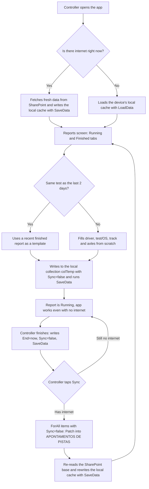

<!-- English version of pt.md. SharePoint list/column names kept in Portuguese
     (real identifiers); prose translated. Keep the two files in sync. -->

## What the app does

- **Track logging:** a CRUD for driver, test, track and vehicle axles. One list shows what's "Running" right now; the controller can finish it once the test ends.
- **Resume a recent report:** reports finished in the last 2 days stay available to "restart" — reuses driver, test and axles, only resets the time — saving time when the same test runs again the same day.
- **Driver lookup:** quick search of registered drivers with a valid license, for the Track Controller's own use.
- **Daily track inspection:** a condition checklist per track segment (ABS, Alta, VDA, Especiais, Offroad) — cleanliness and whether the track is dry — filled per shift, as a safety check between operations, HSE and management.

## Local caching: the core of the project

Out on the test tracks, where the controller works, there's practically no internet — some areas have very limited 3G/4G. Power Apps only has native offline caching via **Dataverse**, and CTR's entire base lives in **SharePoint**. The app stores reports, inspections and supporting lists (drivers, pilots, commercial orders) in a local copy with `SaveData`/`LoadData`, works entirely offline, and only syncs back to SharePoint when the controller manually triggers a sync button.



## Data model

| List                                              | Role                                                                     |
| --------------------------------------------------- | --------------------------------------------------------------------------- |
| `APONTAMENTOS DE PISTAS`                          | One record per report: driver, test, track, axles, start/end               |
| `INSPEÇÕES PISTAS`                                | Daily condition checklist per track segment, per shift                     |
| `REGISTRO DE PILOTOS`                              | Registered internal drivers, with status (active/inactive/suspended)       |
| `Controle de Visitantes Externos (FO-085)`        | External drivers/visitors with license and validity, looked up by the controller |
| `Banco de Dados Comercial`                        | Service/test orders, matched to the report through the `OS` field           |

## Key formulas

**`App.OnStart`** decides, right at launch, whether the app fetches fresh data from SharePoint or loads straight from the device cache — the base of the whole workaround.

```powerfx
If(
    Connection.Connected,
    Set(loadingAllData, true);
    ClearCollect(baseApontamentoComparativo, ShowColumns(Filter('APONTAMENTOS DE PISTAS', Criado >= DateAdd(Now(), -3, TimeUnit.Days)), ID, OS, Eixos, Piloto, Pista, Início, Fim));
    SaveData(baseApontamentoComparativo, "LocalBaseApontamentos");
    ClearCollect(baseComercial, Filter('Banco de Dados Comercial', Etapa.Value = "0. Backlog" || Etapa.Value = "1. Operação" || Etapa.Value = "2. Relatório"));
    SaveData(baseComercial, "LocalBaseComercial");
    LoadData(colTemp, "LocalApontTable");
    Set(loadingAllData, false)
    ,
    Set(loadingAllData, true);
    LoadData(baseApontamentoComparativo, "LocalBaseApontamentos");
    LoadData(baseComercial, "LocalBaseComercial");
    LoadData(colTemp, "LocalApontTable");
    Set(loadingAllData, false)
);
```

**Creating a report offline.** Writes straight to the local collection `colTemp` with `Sync: false`, and only calls `SaveData` on mobile (iOS/Android), where the physical cache actually matters.

```powerfx
Patch(
    colTemp,
    Defaults(colTemp),
    {
        ID: Blank(),
        Sync: false,
        Início: DateTime(Year(InicioDateValue.SelectedDate), Month(InicioDateValue.SelectedDate), Day(InicioDateValue.SelectedDate), InicioHourValue.Selected.Value, InicioMinuteValue.Selected.Value, "00"),
        OS: OSFieldValue.Text,
        Pista: {Value: PistaFieldValue.Selected.Value},
        Eixos: Value(EixosFieldValue.Text),
        Piloto: RespFieldValueOther.Value
    }
);
If(Host.OSType = "iOS" || Host.OSType = "Android", SaveData(colTemp, "LocalApontTable"));
```

**Syncing.** Goes through only the local items with `Sync = false` and filled in, `Patch`es each one to SharePoint (creating or updating depending on whether the `ID` already exists), then reloads the base from the server and rewrites the local cache from scratch, marking everything as synced.

```powerfx
ForAll(
    Filter(colTemp, Sync = false && !IsBlank(OS) && !IsBlank(Piloto) && !IsBlank(Pista) && !IsBlank(Início)) As apont,
    Patch(
        'APONTAMENTOS DE PISTAS',
        If(!IsBlankOrError(LookUp('APONTAMENTOS DE PISTAS', ID = apont.ID)), {ID: apont.ID}, Defaults('APONTAMENTOS DE PISTAS')),
        {Início: apont.Início, Fim: apont.Fim, Pista: apont.Pista, Piloto: apont.Piloto, OS: apont.OS, Eixos: apont.Eixos}
    )
);
ClearData("LocalBaseApontamentos");
Refresh('APONTAMENTOS DE PISTAS');
ClearData("LocalApontTable");
```

## Architecture decisions

- **Local cache with manual, not automatic, sync.** A dedicated "sync" button avoids partial writes: the controller decides when to send data, instead of the app retrying in the background over an unstable connection.
- **One device per controller.** The app runs on a single device at a time, so the risk of a sync conflict between two devices editing the same report never became a real problem.
- **Resume instead of recreate.** Reusing the most recent finished report as a template for the next one avoids re-typing driver, test and axles when the same test runs again the same day.
- **Track inspection kept separate from usage logging.** The daily track-condition checklist is its own list (`INSPEÇÕES PISTAS`), decoupled from the usage report — different processes, with different owners and frequencies.
