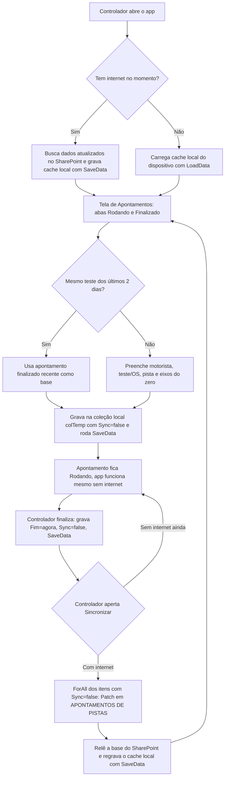

<!-- Post de portfólio (flagship). Molde do operational-app v2. Fonte:
     .todo/ctr/entregas/pistas-relatorio-final.md. Sem imagens ainda (sem
     acesso ao ambiente real do CTR). -->

## O que o app faz

- **Apontamento de pista:** CRUD de motorista, teste, pista e eixos do veículo. Uma lista mostra o que está "Rodando" agora; o controlador pode finalizar quando o teste acaba.
- **Retomar apontamento recente:** os apontamentos finalizados nos últimos 2 dias ficam disponíveis pra "recomeçar" — reaproveita motorista, teste e eixos, só zera o horário — economizando tempo quando o mesmo teste volta a rodar no mesmo dia.
- **Consulta de motoristas:** busca rápida de motoristas cadastrados com CNH válida, pro próprio Controlador de Pista.
- **Inspeção diária de pista:** checklist de condição por trecho (ABS, Alta, VDA, Especiais, Offroad) — limpeza e se a pista está seca — feito por turno, como validação de segurança entre operação, SSMA e a gestão.

## Cache local: o núcleo do projeto

Nas pistas de teste, onde o controlador fica, praticamente não há internet — algumas áreas têm 3G/4G bem limitado. Power Apps só tem cache nativo offline via **Dataverse**, e a base do CTR inteira está em **SharePoint**. O app guarda apontamentos, inspeções e listas de apoio (pilotos, motoristas, ordens comerciais) numa cópia local com `SaveData`/`LoadData`, funciona inteiramente offline, e só sincroniza de volta pro SharePoint quando o controlador aciona manualmente um botão de sincronizar.



## Modelo de dados

| Lista                                             | Papel                                                              |
| -------------------------------------------------- | -------------------------------------------------------------------- |
| `APONTAMENTOS DE PISTAS`                          | Um registro por apontamento: motorista, teste, pista, eixos, início/fim |
| `INSPEÇÕES PISTAS`                                | Checklist diário de condição por trecho, por turno                    |
| `REGISTRO DE PILOTOS`                              | Motoristas internos cadastrados, com situação (ativo/inativo/suspenso) |
| `Controle de Visitantes Externos (FO-085)`        | Motoristas/visitantes externos com CNH e validade, consultado pelo controlador |
| `Banco de Dados Comercial`                        | Ordens de serviço/teste, casadas com o apontamento pelo campo `OS`     |

## Fórmulas-chave

**`App.OnStart`** decide, logo na abertura, se o app busca dado fresco do SharePoint ou carrega direto do cache do dispositivo — a base de todo o workaround.

```powerfx
If(
    Connection.Connected,
    Set(loadingAllData, true);
    ClearCollect(baseApontamentoComparativo, ShowColumns(Filter('APONTAMENTOS DE PISTAS', Criado >= DateAdd(Now(), -3, TimeUnit.Days)), ID, OS, Eixos, Piloto, Pista, Início, Fim));
    SaveData(baseApontamentoComparativo, "LocalBaseApontamentos");
    ClearCollect(baseComercial, Filter('Banco de Dados Comercial', Etapa.Value = "0. Backlog" || Etapa.Value = "1. Operação" || Etapa.Value = "2. Relatório"));
    SaveData(baseComercial, "LocalBaseComercial");
    LoadData(colTemp, "LocalApontTable");
    Set(loadingAllData, false)
    ,
    Set(loadingAllData, true);
    LoadData(baseApontamentoComparativo, "LocalBaseApontamentos");
    LoadData(baseComercial, "LocalBaseComercial");
    LoadData(colTemp, "LocalApontTable");
    Set(loadingAllData, false)
);
```

**Criar apontamento offline.** Grava direto na coleção local `colTemp` com `Sync: false`, e só chama `SaveData` em dispositivo móvel (iOS/Android), onde o cache físico importa.

```powerfx
Patch(
    colTemp,
    Defaults(colTemp),
    {
        ID: Blank(),
        Sync: false,
        Início: DateTime(Year(InicioDateValue.SelectedDate), Month(InicioDateValue.SelectedDate), Day(InicioDateValue.SelectedDate), InicioHourValue.Selected.Value, InicioMinuteValue.Selected.Value, "00"),
        OS: OSFieldValue.Text,
        Pista: {Value: PistaFieldValue.Selected.Value},
        Eixos: Value(EixosFieldValue.Text),
        Piloto: RespFieldValueOther.Value
    }
);
If(Host.OSType = "iOS" || Host.OSType = "Android", SaveData(colTemp, "LocalApontTable"));
```

**Sincronizar.** Percorre só os itens locais com `Sync = false` e preenchidos, faz `Patch` de cada um no SharePoint (criando ou atualizando conforme o `ID` já existir), depois recarrega a base do servidor e regrava o cache local do zero, já marcando tudo como sincronizado.

```powerfx
ForAll(
    Filter(colTemp, Sync = false && !IsBlank(OS) && !IsBlank(Piloto) && !IsBlank(Pista) && !IsBlank(Início)) As apont,
    Patch(
        'APONTAMENTOS DE PISTAS',
        If(!IsBlankOrError(LookUp('APONTAMENTOS DE PISTAS', ID = apont.ID)), {ID: apont.ID}, Defaults('APONTAMENTOS DE PISTAS')),
        {Início: apont.Início, Fim: apont.Fim, Pista: apont.Pista, Piloto: apont.Piloto, OS: apont.OS, Eixos: apont.Eixos}
    )
);
ClearData("LocalBaseApontamentos");
Refresh('APONTAMENTOS DE PISTAS');
ClearData("LocalApontTable");
```

## Decisões de arquitetura

- **Cache local com sincronização manual, não automática.** Um botão dedicado de "sincronizar" evita gravação parcial: o controlador decide quando mandar os dados, em vez do app tentar em segundo plano numa rede instável.
- **Um dispositivo por controlador.** O app roda num único aparelho por vez, então o risco de conflito de sincronização entre dois dispositivos editando o mesmo apontamento nunca chegou a ser um problema real.
- **Retomar em vez de recriar.** Reaproveitar o apontamento finalizado mais recente como base pro próximo evita redigitar motorista, teste e eixos quando o mesmo teste roda de novo no mesmo dia.
- **Inspeção de pista separada do apontamento.** A checklist diária de condição da pista é uma lista própria (`INSPEÇÕES PISTAS`), desacoplada do apontamento de uso — são processos com donos e frequências diferentes.
