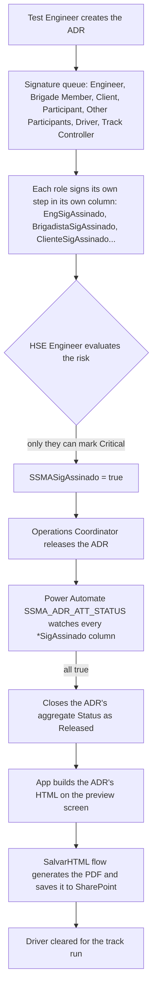
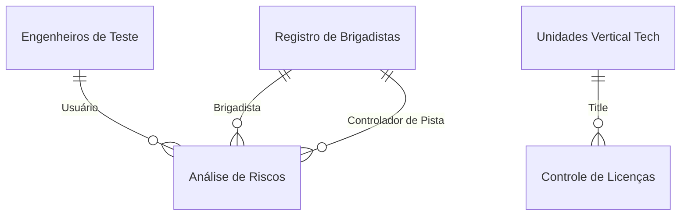

<!-- English version of pt.md. SharePoint list/column names kept in Portuguese
     (real identifiers); prose translated. Keep the two files in sync. -->

## What the app does

- **Test Risk Analysis (ADR):** one form per test, with a sequential approval queue — Test Engineer → Brigade Member → Track Controller → HSE Engineer → Operations Coordinator. Each role signs its own step in its own boolean column; the overall `Status` only closes as "Released" once they all do.
- **Restricted risk classification:** only the HSE Engineer can mark a risk as **Critical**. A deliberate decision, to keep that classification out of the hands of whoever has an interest in prioritizing their own test.
- **Tooling-shop services:** a separate form, opened by any internal or external client, with two-step approval (Safety Engineer, then Operations Coordinator). Same queue pattern as the ADR, applied to services (bending, welding) that previously ran with no service order or risk analysis of their own.
- **Environmental licenses:** CRUD for CTR's licenses and other group companies', with automatic expiry warnings from a scheduled flow.
- **People management:** registry of brigade members, test engineers (with linked analysts), authorized visitors and operators/employees — each with their own access and qualifications.
- Once fully signed, the ADR becomes a printable document that clears the driver for the run.

## ADR flow



## Automations (Power Automate)

- **`SSMA_ADR_ATT_STATUS`** avoids the app recalculating status every time the screen opens: since each role signs in its own boolean column, the flow watches them and only closes the ADR's `Status` as "Released" once they're all `true`.
- **`SalvarHTML`** replaces Power Apps' native PDF connector: the app builds the ADR's HTML on screen and hands file generation off to the flow, which returns the path already saved in SharePoint.
- A scheduled flow notifies the HSE engineer as an environmental license approaches its expiry date.

## Data model



**`Análise de Riscos`** (main fields)

| Column                              | Type     | Description                                                                |
| ------------------------------------ | -------- | ---------------------------------------------------------------------------- |
| `Título`                             | Text     | Unique ADR identifier, auto-generated (test type + sequence)                |
| `Status`                             | Choice   | ADR's current step in the queue, aggregated by the `SSMA_ADR_ATT_STATUS` flow |
| `Classificação do Risco`             | Choice   | Risk level; only the HSE Engineer can mark Critical                          |
| `Revisão` / `Data Revisão`           | Number / DateTime | Revision counter, incremented on every edit                       |
| `EngResp` / `Brigadista` / `EngSSMA` / `Controlador de Pista` | Lookup | Linked responsible parties per queue step                     |
| `EngSigAssinado` ... `ControladorSigAssinado` | Boolean | One signature column per role in the approval queue             |
| `Riscos e Perigos` / `Medidas Complementares` | MultiChoice / Text | Risks identified and preventive measures for the test     |
| `GerarArquivo`                       | Boolean  | Flag that triggers the ADR's final PDF/HTML generation                       |

**`Registro de Brigadistas`**, **`Engenheiros de Teste`**, **`Controle de Licenças`** and **`ATIVIDADES SPOT FERRAMENTARIA`** round out the model: registry of authorized people (with `Função Principal` deciding who signs each step), engineers with their linked analysts, licenses per business unit with expiry dates, and the two-step approval queue for tooling-shop services.

## Key formulas

**Lock on who can mark a risk "Critical".** The solution's central segregation decision: the risk-classification options gallery only shows "Critical" to whoever is logged in as the HSE Engineer (checked against the brigade registry); any other user doesn't even see the option in the form.

```powerfx
Filter(
    Choices([@'Análise de Riscos'].'Classificação do Risco'),
    If(
        LookUp('Registro de Brigadistas', Contato.DisplayName = User().FullName && 'Função Principal'.Value = "Eng SSMA").Contato.DisplayName = User().FullName,
        true,
        Not(Value = "Crítico")
    )
)
```

**Revision control on edit.** Every time an existing ADR is saved again, the app increments the `Revisão` counter instead of silently overwriting it, preserving a history of how many times that analysis was changed.

```powerfx
Set(newRev, If(Form1.Mode = FormMode.New, 0, varADRatual.Revisão + 1));

If(
    Form1.Mode = FormMode.Edit,
    Patch('Análise de Riscos', LookUp('Análise de Riscos', ID = Form1.LastSubmit.ID), {Revisão: newRev})
);
```

**Issuing the final document.** Instead of the native PDF connector, the download button builds the ADR's HTML and passes it to the `SalvarHTML` flow, which returns the path of the file already saved in SharePoint to open next.

```powerfx
Set(varPDFpath, SalvarHTML.Run(HtmlText5_1.HtmlText, $"{varADRatual.Título}", $"{varADRatual.'Número do Teste'}").caminho);
Launch($"https://[site]/sites/SSMA-CTR/{varPDFpath}");
```

## Architecture decisions

- **Status as an aggregate of signature columns, not a single field.** Each role has its own boolean column; a flow watches for when they all turn `true` instead of the app recalculating that every time the screen opens.
- **PDF via HTML + flow, not the native connector.** The app builds the preview in HTML and hands file generation off to `SalvarHTML`, which saves directly to SharePoint.
- **Same queue pattern reused twice.** The ADR and the tooling-shop services use the same sequential-approval-via-signature-columns logic, just with different steps — avoided designing two approval mechanisms from scratch.
- **One risk classification locked by profile.** "Critical" only shows up for whoever is registered as the HSE Engineer, taking that decision out of the hands of whoever has an interest in prioritizing their own test.
