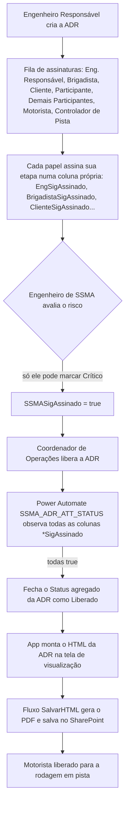
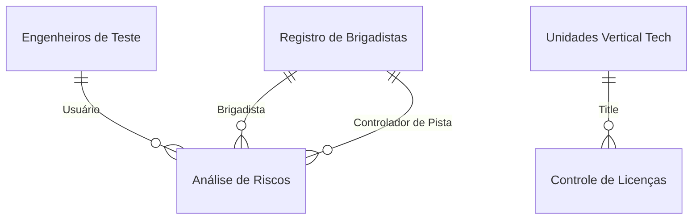

<!-- Post de portfólio (flagship). Molde do operational-app v2: bullets, tabelas,
     Mermaid. Fonte: .todo/ctr/entregas/ssma-relatorio-final.md. Sem imagens
     ainda (sem acesso ao ambiente real do CTR). -->

## O que o app faz

- **Análise de Risco de Teste (ADR):** um formulário por teste, com uma fila de aprovação sequencial — Engenheiro Responsável → Brigadista → Controlador de Pista → Engenheiro de SSMA → Coordenador de Operações. Cada papel assina sua própria etapa numa coluna booleana própria; o `Status` geral só fecha como "Liberado" quando todas fecham.
- **Classificação de risco restrita:** só o Engenheiro de SSMA pode marcar um risco como **Crítico**. Decisão proposital, pra tirar essa classificação da mão de quem tem interesse em priorizar o próprio teste.
- **Serviços de Ferramentaria:** formulário separado, aberto por qualquer cliente interno ou externo, com aprovação em duas etapas (Engenheiro de Segurança, depois Coordenador de Operações). Mesmo padrão de fila da ADR, aplicado a serviços (dobra, solda) que antes rodavam sem ordem de serviço nem análise de risco própria.
- **Licenças Ambientais:** CRUD de licenças do CTR e de outras empresas do grupo, com aviso automático de vencimento por fluxo agendado.
- **Gestão de Pessoas:** cadastro de brigadistas, engenheiros de teste (com analistas vinculados), visitantes habilitados e operadores/funcionários — cada um com seus acessos e habilitações.
- Depois de assinada, a ADR vira um documento imprimível que libera o motorista pra rodagem.

## Fluxo da ADR



## Automações (Power Automate)

- **`SSMA_ADR_ATT_STATUS`** evita o app ter que recalcular status toda vez que a tela abre: como cada papel assina numa coluna booleana própria, o fluxo fica de olho nelas e só fecha o `Status` da ADR como "Liberado" quando todas viram `true`.
- **`SalvarHTML`** substitui o conector nativo de PDF do Power Apps: o app monta o HTML da ADR na tela e delega a geração do arquivo pro fluxo, que devolve o caminho já salvo no SharePoint.
- Um fluxo agendado notifica o engenheiro de SSMA quando uma licença ambiental se aproxima do vencimento.

## Modelo de dados



**`Análise de Riscos`** (campos principais)

| Coluna                             | Tipo     | Descrição                                                                 |
| ----------------------------------- | -------- | -------------------------------------------------------------------------- |
| `Título`                            | Text     | Identificador único da ADR, gerado automaticamente (tipo de teste + sequência) |
| `Status`                            | Choice   | Etapa atual da ADR na fila, agregado pelo fluxo `SSMA_ADR_ATT_STATUS`      |
| `Classificação do Risco`            | Choice   | Nível de risco; só o Eng. de SSMA pode marcar Crítico                      |
| `Revisão` / `Data Revisão`          | Number / DateTime | Contador de revisões, incrementado a cada edição                 |
| `EngResp` / `Brigadista` / `EngSSMA` / `Controlador de Pista` | Lookup | Responsáveis vinculados por etapa da fila                     |
| `EngSigAssinado` ... `ControladorSigAssinado` | Boolean | Uma coluna de assinatura por papel da fila de aprovação        |
| `Riscos e Perigos` / `Medidas Complementares` | MultiChoice / Text | Riscos identificados e medidas preventivas do teste       |
| `GerarArquivo`                      | Boolean  | Flag que aciona a geração do PDF/HTML final da ADR                        |

**`Registro de Brigadistas`**, **`Engenheiros de Teste`**, **`Controle de Licenças`** e **`ATIVIDADES SPOT FERRAMENTARIA`** completam o modelo: cadastro de pessoas habilitadas (com `Função Principal` definindo quem assina cada etapa), engenheiros com seus analistas vinculados, licenças por unidade com data de vencimento, e a fila de aprovação de dois passos dos serviços de ferramentaria.

## Fórmulas-chave

**Trava de quem pode marcar um risco como "Crítico".** A decisão central de segregação da solução: a galeria de opções de classificação de risco só mostra "Crítico" pra quem está logado como Eng. de SSMA (checado contra o registro de brigadistas); qualquer outro usuário nem vê a opção no formulário.

```powerfx
Filter(
    Choices([@'Análise de Riscos'].'Classificação do Risco'),
    If(
        LookUp('Registro de Brigadistas', Contato.DisplayName = User().FullName && 'Função Principal'.Value = "Eng SSMA").Contato.DisplayName = User().FullName,
        true,
        Not(Value = "Crítico")
    )
)
```

**Controle de revisão ao editar.** Toda vez que uma ADR já existente é salva de novo, o app incrementa o contador de `Revisão` em vez de sobrescrever silenciosamente, preservando o histórico de quantas vezes aquela análise foi alterada.

```powerfx
Set(newRev, If(Form1.Mode = FormMode.New, 0, varADRatual.Revisão + 1));

If(
    Form1.Mode = FormMode.Edit,
    Patch('Análise de Riscos', LookUp('Análise de Riscos', ID = Form1.LastSubmit.ID), {Revisão: newRev})
);
```

**Emissão do documento final.** Em vez do conector nativo de PDF, o botão de download monta o HTML da ADR e passa pro fluxo `SalvarHTML`, que devolve o caminho do arquivo já salvo no SharePoint pra abrir em seguida.

```powerfx
Set(varPDFpath, SalvarHTML.Run(HtmlText5_1.HtmlText, $"{varADRatual.Título}", $"{varADRatual.'Número do Teste'}").caminho);
Launch($"https://[site]/sites/SSMA-CTR/{varPDFpath}");
```

## Decisões de arquitetura

- **Status como agregado de colunas de assinatura, não campo único.** Cada papel tem sua própria coluna booleana; um fluxo observa quando todas viram `true` em vez do app recalcular isso toda vez que a tela abre.
- **PDF via HTML + fluxo, não conector nativo.** O app monta a visualização em HTML e delega a geração do arquivo pra `SalvarHTML`, que salva direto no SharePoint.
- **Mesmo padrão de fila reaproveitado.** A ADR e os Serviços de Ferramentaria usam a mesma lógica de aprovação sequencial em colunas de assinatura, só com etapas diferentes — evitou desenhar dois mecanismos de aprovação do zero.
- **Uma classificação de risco travada por perfil.** "Crítico" só aparece pra quem está cadastrado como Eng. de SSMA, retirando essa decisão da mão de quem tem interesse em priorizar o próprio teste.
