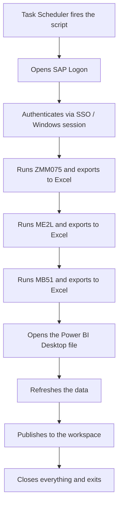

<!-- English version of pt.md. Keep the two files in sync. Source: project
     summary in data/projects.ts (description/imageCaption) + a short
     interview with the author about context and decisions, since the
     original script wasn't preserved. Python snippets below are a
     reconstruction of the described logic (PyAutoGUI: coordinates + hotkeys
     + delays), not a literal copy of the real file. -->

At CTR (Centro Tecnológico Randon), every requisition and purchase order CTR made to Randoncorp's corporate purchasing sector was logged in SAP. To track that flow, someone from the administrative sector used to log into SAP by hand, run a report across three different transactions, and rebuild a Power BI dashboard from the data. There was no set schedule: it depended on someone remembering to do it. I built a Python robot (PyAutoGUI) that took over the whole routine: it opens SAP, authenticates, runs the three transactions, exports to Excel, and refreshes and publishes the Power BI dashboard on its own, four times a day, with nobody touching the notebook.

## How it works

- A dedicated notebook, always on and always in the same state (fixed screen resolution, SAP always maximized in the same spot), is reserved just for this automation. That's critical: PyAutoGUI doesn't read the SAP interface, it only knows how to move the mouse to an `(x, y)` point and click. Any change in resolution, window position, or even a Windows notification popping up over the window breaks the coordinates.
- Windows Task Scheduler fires the script four times a day. Each run takes 9 to 12 minutes end to end, with no intervention.
- SAP opens and authenticates via SSO (the Windows session is already logged in on the dedicated machine), so the robot just needs to wait for the screen to load before typing the transaction code.
- It runs the same logic in sequence for the three transactions: `ZMM075` (a custom purchasing report, with the history of CTR's requisitions and orders to Randoncorp), `ME2L` (open purchase orders by supplier) and `MB51` (material movements). Each one is exported to an Excel file at a fixed path, using SAP GUI's own List > Export > Spreadsheet menu.
- With the three spreadsheets refreshed, the robot opens the Power BI Desktop file already configured to read those paths, refreshes the data, and publishes to the workspace, all through simulated clicks on the same buttons every time (Refresh, Publish, confirm workspace).
- The resulting dashboard is used by the administrative sector (tracking purchase progress), by unit management (an overview), and, as a welcome side effect, by engineering and sales, who started building their own reports on purchase consumption for tests straight from always-current data, instead of requesting a manual export.

## The execution flow



## A deliberately "blind" robot

Worth a note before the code: **I no longer have the original script file**. It stayed on the company's notebook and never left it; I didn't keep a personal backup before the contract ended. What follows is a faithful reconstruction of the logic and style of the script (the same sequence of actions, the same kinds of commands), rewritten from memory, not a slice of the real file.

The core idea of PyAutoGUI is simple: it doesn't "understand" the screen, it just simulates a human typing and clicking at fixed points, with pauses in between to give the interface time to respond. No screen reading, OCR or image recognition: it's all fixed coordinates and wait times calibrated by hand.

Coordinate and wait-time constants, calibrated by eye on the dedicated notebook's screen:

```python
import time
import pyautogui

# Fixed coordinates for the dedicated notebook's resolution (1366x768).
# Any change in resolution or SAP window position breaks all of this.
TRANSACTION_FIELD = (120, 45)     # transaction code bar, top of the SAP window
RUN_BUTTON = (95, 45)             # "execute" icon (same as pressing F8)
LIST_MENU = (30, 25)              # "List" menu in the top bar
EXPORT_SUBMENU = (60, 140)
SPREADSHEET_SUBMENU = (280, 155)

SHORT_WAIT = 1.5   # after a simple action (click, typing)
SCREEN_WAIT = 4     # after opening a transaction or switching screens
EXPORT_WAIT = 6      # after triggering an export to Excel

pyautogui.PAUSE = 0.3      # default pause between pyautogui commands
pyautogui.FAILSAFE = True  # moving the mouse to a screen corner aborts everything
```

Opening a transaction is always the same gesture: click the command bar, clear it, type the code, confirm.

```python
def open_transaction(transaction_code: str) -> None:
    pyautogui.click(TRANSACTION_FIELD)
    pyautogui.hotkey("ctrl", "a")
    pyautogui.typewrite(transaction_code, interval=0.05)
    pyautogui.press("enter")
    time.sleep(SCREEN_WAIT)
```

Each report has its own filters (date, plant, document type), but they all follow the same pattern: tab through the fields, type each value, then run with F8.

```python
def fill_filters_and_run(values_by_tab: list[str]) -> None:
    for value in values_by_tab:
        pyautogui.typewrite(value, interval=0.05)
        pyautogui.press("tab")
        time.sleep(0.3)

    pyautogui.press("f8")  # runs the report
    time.sleep(SCREEN_WAIT)
```

Exporting the result goes through SAP GUI's native menu (List > Export > Spreadsheet), not a direct shortcut, since not every transaction exposes the same keyboard shortcut for it:

```python
def export_to_excel(folder_path: str, file_name: str) -> None:
    pyautogui.click(LIST_MENU)
    time.sleep(SHORT_WAIT)
    pyautogui.click(EXPORT_SUBMENU)
    time.sleep(SHORT_WAIT)
    pyautogui.click(SPREADSHEET_SUBMENU)
    time.sleep(SHORT_WAIT)

    # The "Save as" dialog opens with the path field already focused
    pyautogui.hotkey("ctrl", "a")
    pyautogui.typewrite(f"{folder_path}\\{file_name}.xlsx", interval=0.03)
    pyautogui.press("enter")
    time.sleep(EXPORT_WAIT)
```

With those three functions, running all three transactions is just repeating the same recipe with different parameters:

```python
REPORTS = [
    {"transaction": "ZMM075", "filters": ["0001", "01.01.2024", "31.12.2024"], "file": "zmm075"},
    {"transaction": "ME2L", "filters": ["0001"], "file": "me2l"},
    {"transaction": "MB51", "filters": ["0001", "01.01.2024"], "file": "mb51"},
]

def run_sap_reports() -> None:
    for report in REPORTS:
        open_transaction(report["transaction"])
        fill_filters_and_run(report["filters"])
        export_to_excel(r"C:\RPA\SAP\exports", report["file"])
```

Finally, Power BI: open the file, click "Refresh" and wait (refresh time varies with data volume, hence the generous wait), publish, and confirm the target workspace.

```python
PBIX_PATH = r"C:\RPA\SAP\dashboard-compras.pbix"
REFRESH_BUTTON = (215, 90)
PUBLISH_BUTTON = (640, 90)
CONFIRM_WORKSPACE_BUTTON = (610, 430)

def refresh_and_publish_powerbi() -> None:
    import os
    os.startfile(PBIX_PATH)
    time.sleep(15)  # Power BI Desktop opening time

    pyautogui.click(REFRESH_BUTTON)
    time.sleep(90)  # refreshing all three data sources

    pyautogui.click(PUBLISH_BUTTON)
    time.sleep(SCREEN_WAIT)
    pyautogui.click(CONFIRM_WORKSPACE_BUTTON)
    time.sleep(EXPORT_WAIT)
```

And the final orchestration, called by Windows Task Scheduler:

```python
def main() -> None:
    os.startfile(r"C:\Program Files (x86)\SAP\FrontEnd\SAPgui\saplogon.exe")
    time.sleep(20)  # SAP Logon opening + SSO authenticating

    run_sap_reports()
    refresh_and_publish_powerbi()

if __name__ == "__main__":
    main()
```

## Architecture decisions

- **PyAutoGUI instead of SAP GUI's own scripting API.** With no admin access to enable SAP GUI Scripting on the machine, the viable alternative was to simulate the user from the outside: screen coordinates and keyboard shortcuts, the way a human would use it.
- **A dedicated notebook with a locked resolution.** The whole automation depends on the screen always being in the same state. Swapping the notebook, changing the resolution, or letting a notification pop up over SAP breaks the coordinates instantly.
- **No sophisticated error handling.** The script is deliberately simple: generous delays between each step, no image recognition, no automatic retries. It works because the environment is controlled (dedicated machine, nobody touches it during a run); it wouldn't be a reasonable choice in a shared or unstable environment.
- **Three transactions, three separate exports.** Each report (`ZMM075`, `ME2L`, `MB51`) exports to its own Excel file, and it's Power BI itself that consolidates the three sources on refresh, rather than the script trying to merge the data beforehand.
