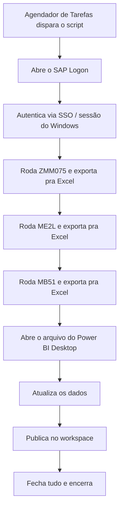

<!-- Post de portfólio. Fonte: resumo do projeto em data/projects.ts (description/
     imageCaption) + entrevista com o autor sobre contexto e decisões, já que o
     script original não foi preservado. Trechos de código Python abaixo são
     uma reconstrução da lógica descrita pelo autor (PyAutoGUI: coordenadas +
     atalhos + delays), não uma cópia literal do arquivo real. -->

No CTR (Centro Tecnológico Randon), toda requisição e pedido de compra que o CTR fazia ao setor de compras corporativas da Randoncorp ficava registrado no SAP como log. Para acompanhar esse fluxo, alguém do setor administrativo entrava manualmente no SAP, rodava um relatório em três transações diferentes e remontava um dashboard de Power BI com os dados. Não havia periodicidade definida: dependia de alguém lembrar de fazer. Criei um robô em Python (PyAutoGUI) que assumiu essa rotina inteira: abre o SAP, autentica, roda as três transações, exporta pra Excel e atualiza e publica o Power BI sozinho, quatro vezes por dia, sem ninguém tocar no notebook.

## Como funciona

- Um notebook dedicado, sempre ligado e sempre no mesmo estado (resolução de tela fixa, SAP sempre maximizado na mesma posição), fica reservado só pra essa automação. Isso é crítico: o PyAutoGUI não lê a interface do SAP, ele só sabe mover o mouse pra um ponto `(x, y)` da tela e clicar. Qualquer mudança de resolução, posição de janela ou até uma notificação do Windows aparecendo por cima quebra as coordenadas.
- O Agendador de Tarefas do Windows dispara o script quatro vezes ao dia. Cada execução leva entre 9 e 12 minutos, de ponta a ponta, sem intervenção.
- O SAP abre e autentica via SSO (sessão do Windows já logada na máquina dedicada), então o robô só precisa esperar a tela carregar antes de digitar o código da transação.
- Roda a mesma lógica em sequência pras três transações: `ZMM075` (relatório customizado de compras, com o histórico de requisições e pedidos do CTR pra Randoncorp), `ME2L` (pedidos em aberto por fornecedor) e `MB51` (movimentações de material). Cada uma é exportada pra uma planilha Excel num caminho fixo, usando o menu Lista > Exportar > Planilha do próprio SAP GUI.
- Com as três planilhas atualizadas, o robô abre o arquivo do Power BI Desktop que já está configurado pra ler esses caminhos, atualiza os dados e publica pro workspace, tudo por cliques simulados nos botões de sempre (Atualizar, Publicar, confirmar workspace).
- O dashboard resultante é usado pelo setor administrativo (acompanhamento do andamento das compras), pela gestão da unidade (visão geral) e, como efeito colateral bem-vindo, por engenharia e comercial, que passaram a montar relatórios de consumo de compras em testes com dados sempre atualizados, em vez de pedir um extrato manual.

## O fluxo de execução



## Um robô "cego", de propósito

Vale um aviso antes dos trechos de código: **não tenho mais o arquivo original desse script**. Ele ficou no notebook da empresa e nunca saiu de lá; não fiz backup pessoal antes de encerrar o contrato. O que segue abaixo é uma reconstrução fiel da lógica e do estilo do script (a mesma sequência de ações, os mesmos tipos de comando), reescrita de memória, não um recorte do arquivo de verdade.

A ideia central do PyAutoGUI é simples: ele não "entende" a tela, só simula um usuário humano digitando e clicando em pontos fixos, com pausas no meio pra dar tempo da interface responder. Nada de leitura de tela, OCR ou reconhecimento de imagem: é tudo coordenada fixa e tempo de espera calibrado na mão.

Constantes de coordenadas e tempos de espera, calibradas olhando a tela do notebook dedicado:

```python
import time
import pyautogui

# Coordenadas fixas na resolução do notebook dedicado (1366x768).
# Qualquer mudança de resolução ou de posição da janela do SAP invalida tudo isso.
CAMPO_TRANSACAO = (120, 45)      # barra de código de transação, no topo do SAP
BOTAO_EXECUTAR = (95, 45)        # ícone de "executar" (equivalente ao F8)
MENU_LISTA = (30, 25)            # menu "Lista" da barra superior
SUBMENU_EXPORTAR = (60, 140)
SUBMENU_PLANILHA = (280, 155)

ESPERA_CURTA = 1.5   # depois de uma ação simples (clique, digitar)
ESPERA_TELA = 4       # depois de abrir uma transação ou trocar de tela
ESPERA_EXPORTACAO = 6  # depois de disparar uma exportação pra Excel

pyautogui.PAUSE = 0.3     # pausa padrão entre comandos do próprio pyautogui
pyautogui.FAILSAFE = True  # mover o mouse pro canto da tela cancela tudo
```

Abrir uma transação é sempre o mesmo gesto: clicar na barra de comando, limpar, digitar o código e confirmar.

```python
def abrir_transacao(codigo_transacao: str) -> None:
    pyautogui.click(CAMPO_TRANSACAO)
    pyautogui.hotkey("ctrl", "a")
    pyautogui.typewrite(codigo_transacao, interval=0.05)
    pyautogui.press("enter")
    time.sleep(ESPERA_TELA)
```

Cada relatório tem seus próprios filtros (data, centro, tipo de documento), mas todos seguem o mesmo padrão: navegar pelos campos com Tab, digitar o valor e mandar executar com F8.

```python
def preencher_filtro_e_executar(valores_por_tab: list[str]) -> None:
    for valor in valores_por_tab:
        pyautogui.typewrite(valor, interval=0.05)
        pyautogui.press("tab")
        time.sleep(0.3)

    pyautogui.press("f8")  # executa o relatório
    time.sleep(ESPERA_TELA)
```

Exportar o resultado é feito pelo menu nativo do SAP GUI (Lista > Exportar > Planilha), não por um atalho direto, porque nem toda transação expõe o mesmo atalho de teclado pra isso:

```python
def exportar_para_excel(caminho_arquivo: str, nome_arquivo: str) -> None:
    pyautogui.click(MENU_LISTA)
    time.sleep(ESPERA_CURTA)
    pyautogui.click(SUBMENU_EXPORTAR)
    time.sleep(ESPERA_CURTA)
    pyautogui.click(SUBMENU_PLANILHA)
    time.sleep(ESPERA_CURTA)

    # A janela "Salvar como" abre com o campo de caminho já em foco
    pyautogui.hotkey("ctrl", "a")
    pyautogui.typewrite(f"{caminho_arquivo}\\{nome_arquivo}.xlsx", interval=0.03)
    pyautogui.press("enter")
    time.sleep(ESPERA_EXPORTACAO)
```

Com essas três funções, rodar as três transações é só repetir a mesma receita com parâmetros diferentes:

```python
RELATORIOS = [
    {"transacao": "ZMM075", "filtros": ["0001", "01.01.2024", "31.12.2024"], "arquivo": "zmm075"},
    {"transacao": "ME2L", "filtros": ["0001"], "arquivo": "me2l"},
    {"transacao": "MB51", "filtros": ["0001", "01.01.2024"], "arquivo": "mb51"},
]

def rodar_relatorios_sap() -> None:
    for relatorio in RELATORIOS:
        abrir_transacao(relatorio["transacao"])
        preencher_filtro_e_executar(relatorio["filtros"])
        exportar_para_excel(r"C:\RPA\SAP\exports", relatorio["arquivo"])
```

Por fim, o Power BI: abrir o arquivo, clicar em "Atualizar" e esperar (o tempo de atualização varia com o volume de dados, por isso a espera é generosa), publicar e confirmar o workspace de destino.

```python
CAMINHO_PBIX = r"C:\RPA\SAP\dashboard-compras.pbix"
BOTAO_ATUALIZAR = (215, 90)
BOTAO_PUBLICAR = (640, 90)
BOTAO_CONFIRMAR_WORKSPACE = (610, 430)

def atualizar_e_publicar_powerbi() -> None:
    import os
    os.startfile(CAMINHO_PBIX)
    time.sleep(15)  # tempo de abertura do Power BI Desktop

    pyautogui.click(BOTAO_ATUALIZAR)
    time.sleep(90)  # atualização das três fontes de dados

    pyautogui.click(BOTAO_PUBLICAR)
    time.sleep(ESPERA_TELA)
    pyautogui.click(BOTAO_CONFIRMAR_WORKSPACE)
    time.sleep(ESPERA_EXPORTACAO)
```

E a orquestração final, chamada pelo Agendador de Tarefas do Windows:

```python
def main() -> None:
    os.startfile(r"C:\Program Files (x86)\SAP\FrontEnd\SAPgui\saplogon.exe")
    time.sleep(20)  # SAP Logon abrindo + SSO autenticando

    rodar_relatorios_sap()
    atualizar_e_publicar_powerbi()

if __name__ == "__main__":
    main()
```

## Decisões de arquitetura

- **PyAutoGUI em vez da API de scripting do SAP GUI.** Sem acesso de administrador pra habilitar o SAP GUI Scripting na máquina, a alternativa viável foi simular o usuário por fora: coordenadas de tela e atalhos de teclado, do jeito que um humano usaria.
- **Notebook dedicado com resolução travada.** Toda a automação depende de a tela estar sempre no mesmo estado. Trocar o notebook, mudar a resolução ou deixar uma notificação abrir por cima do SAP quebra as coordenadas na hora.
- **Sem tratamento de erro sofisticado.** O script é deliberadamente simples: delays generosos entre cada passo, sem reconhecimento de imagem nem retry automático. Funciona porque o ambiente é controlado (máquina dedicada, ninguém mexe nela durante a execução); não seria uma escolha razoável num ambiente compartilhado ou instável.
- **Três transações, três exportações separadas.** Cada relatório (`ZMM075`, `ME2L`, `MB51`) exporta pro seu próprio arquivo Excel, e é o próprio Power BI que consolida as três fontes no refresh, em vez do script tentar juntar os dados antes.
